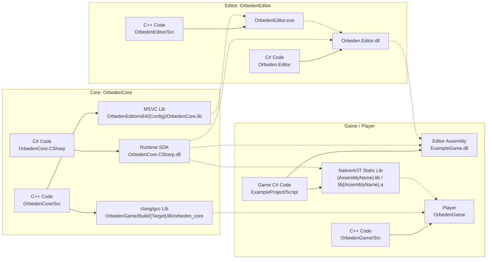
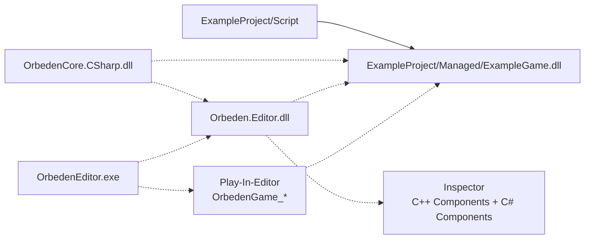

# Orbeden 构建与打包说明

本文说明 Orbeden 的 C++ / C# 构建关系，以及 Core、Editor、Game 在开发测试和发布打包时的职责边界。

## 总体原则

- **Editor** 使用 Windows 工具链：`OrbedenEditor + OrbedenCore` 由 VS/MSBuild/MSVC 构建。
- **Player** 使用 clang/gcc 工具链：`OrbedenGame + OrbedenCore + Game NativeAOT` 由 CMake/Ninja 构建。
- **Editor C#** 使用 CLR Assembly：用于 Inspector、Gizmos、Play-In-Editor。
- **Game C# 测试版** 使用 CLR Assembly：用于 Editor 里反射脚本和 PIE。
- **Game C# 发布版** 使用 NativeAOT Static：生成静态库并链接进 Player。
- **Core C++** 不感知 C# 类型系统，不加载程序集，不依赖 hostfxr/nethost/runtimeconfig。

## 工程、产物与依赖

图中约定：

- 实线箭头 `-->` 表示“构建生成”。
- 虚线箭头 `-.->` 表示“依赖、引用、链接或运行时加载”。



## 构建入口与输出

| 目标 | 构建方式 | 入口 | 输出 |
| --- | --- | --- | --- |
| Core C++ for Editor | MSVC Static Library | VS 解决方案 / Core 工程 | `OrbedenEditor/{Platform}/{Configuration}/OrbedenCore.lib` |
| Core C++ for Player | CMake clang/gcc Static Library | Editor `Build Player` | `OrbedenGame/Build/{Target}/lib/orbeden_core.*` |
| Core C# SDK | Assembly Build | VS 解决方案 / Core C# 工程 | `OrbedenEditor/Sdk/Managed/OrbedenCore.CSharp/OrbedenCore.CSharp.dll`，并同步到 `OrbedenGame/Sdk/Managed/OrbedenCore.CSharp/` |
| Editor C++ | MSVC Executable | VS 解决方案 / Editor 工程 | `OrbedenEditor/x64/{Configuration}/OrbedenEditor.exe` |
| Editor C# | Assembly Build | Editor 工程构建时自动构建 | `OrbedenEditor/x64/{Configuration}/Managed/Orbeden.Editor.dll` |
| Game C# 测试版 | Assembly Build | Editor `Build C#` | `ExampleProject/Managed/ExampleGame.dll` |
| Game C# 发布版 | NativeAOT Static Build | Editor `Build Player` | `{ProjectRoot}/Aot/{Target}/{Configuration}/{AssemblyName}.lib` 或 `lib{AssemblyName}.a` |
| Player | CMake clang/gcc Executable | Editor `Build Player` | `OrbedenGame/Build/{Target}/bin/OrbedenGame` |

## Editor 的 Player 目标平台

`ProjectPanel` 的 `Build Player` 按钮前有 `Target Platform` 下拉框。该选项只影响发布版 Player，不影响 Editor 的 PIE。

| Target Platform | Game C# AOT 目标 | Player CMake preset | 状态 |
| --- | --- | --- | --- |
| Windows x64 | `windows-x64` / `{AssemblyName}.lib` | `player-windows-x64-clang-cl` | 默认验证目标 |
| Linux x64 | `linux-x64-clang` / `lib{AssemblyName}.a` | `player-linux-x64-clang` | 需要本机或交叉 clang/GLFW |
| Linux x64 GCC | `linux-x64-gcc` / `lib{AssemblyName}.a` | `player-linux-x64-gcc` | 需要本机或交叉 gcc/GLFW |
| FreeBSD x64 | `freebsd-x64` / `lib{AssemblyName}.a` | `player-freebsd-x64-clang` | 预留骨架，依赖本机 NativeAOT 和交叉工具链支持 |
| Switch | `switch` | `player-switch` | 预留骨架，需要接入厂商 SDK |

`Build Player` 的流程固定为：

1. 根据下拉框选择 NativeAOT 目标并生成 Game C# 静态库。
2. 使用对应 CMake preset 构建 Player 版本的 `OrbedenCore`。
3. 链接 `OrbedenGame`、Player 版 `OrbedenCore` 和 Game C# AOT 静态库。

失败时不会回退到 DLL 或 CLR 工作流。

## Editor 测试流程

Editor 里的测试不使用 NativeAOT 静态库，而是使用 CLR Assembly。



- 非 Play 状态下，Inspector 使用用户 Game Assembly 反射脚本类型，并通过 world sidecar 显示和编辑挂载的 C# 脚本组件。
- Play 状态下，Editor 绑定用户 Game Assembly 的 `OrbedenGame_Initialize`、`OrbedenGame_Update`、`OrbedenGame_DrawGui`、`OrbedenGame_Shutdown`。
- Inspector 同时显示原生 C++ 组件块和用户 C# 组件块。

## 发布版 Player 内容

发布版 Player 携带：

- `OrbedenGame`
- Player 资源文件
- world / 项目配置
- 平台需要的原生依赖

发布版 Player 不携带：

- `ExampleGame.dll`
- `OrbedenCore.CSharp.dll`
- `Orbeden.Editor.dll`
- `hostfxr`
- `nethost`
- `runtimeconfig.json`

## 修改代码后的流程

### 修改 Core C++ 后

如果验证 Editor：构建 VS 解决方案或 `OrbedenEditor`，得到新的 Editor 版 `OrbedenCore.lib`，然后重启 Editor。

如果验证 Player：在 Editor 里选择目标平台并点击 `Build Player`，CMake 会重新构建 Player 版 `OrbedenCore` 并重新链接 Player。

如果修改了暴露给 C# 的 Native API：同步修改 `OrbedenCore.CSharp` 的 delegate / wrapper，然后构建 Core C#、Editor C#、Game C#，最后再测试 Editor 或打包 Player。

### 修改 Core C# 后

构建 `OrbedenCore.CSharp`，更新 Editor SDK 和 Game SDK 中的 `OrbedenCore.CSharp.dll`。

如果要在 Editor 测试：再点击 `Build C#`，让用户 Game Assembly 引用新的 SDK。

如果要发布 Player：再点击 `Build Player`，重新生成 Game NativeAOT 静态库并重新链接 Player。

### 修改 Editor C++ 后

构建 `OrbedenEditor`，得到新的 `OrbedenEditor.exe`，然后重启 Editor。

### 修改 Editor C# 后

构建 `OrbedenEditor` 或单独构建 `Orbeden.Editor`，更新 `Managed/Orbeden.Editor.dll`，然后重启 Editor。

### 修改 ExampleGame C# 后

如果要在 Editor 测试：停止 Play，点击 `Build C#`，再点击 `Play`。

如果要发布 Player：选择 `Target Platform`，点击 `Build Player`。

### 修改脚本挂载或 Inspector 字段后

脚本挂载和默认序列化字段保存在 world sidecar，例如：

```text
ExampleProject/World/example_world.world.scripts.json
```

只改字段值不需要重新构建 C++ 或 C#。新增、删除或重命名脚本类型后，需要先 `Build C#`，让 Editor 重新反射最新的 Game Assembly。
