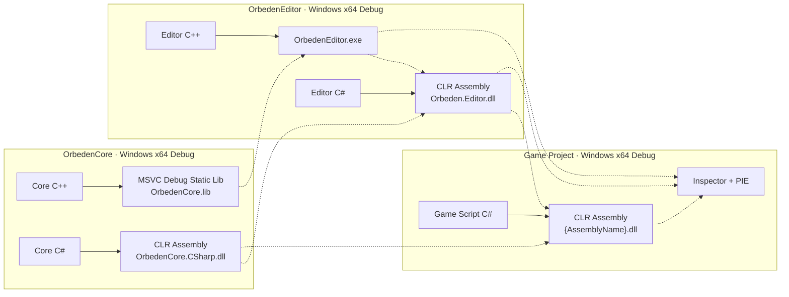
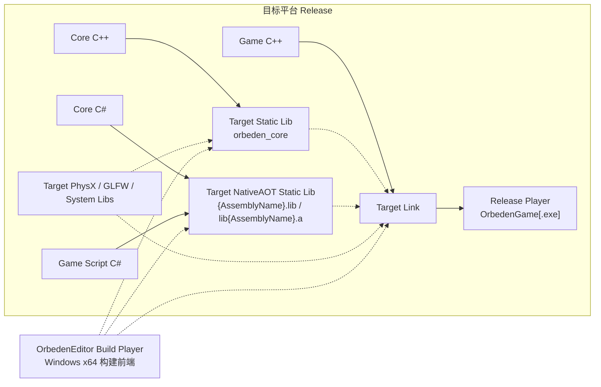
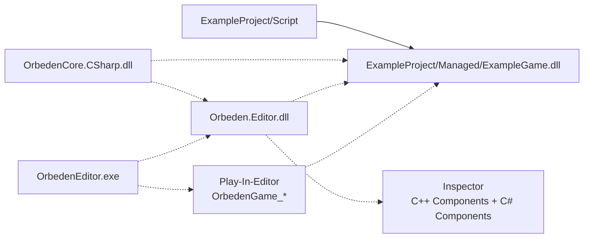

# Orbeden 构建与打包说明

本文说明 Orbeden 的 C++ / C# 构建关系，以及 Core、Editor、Game 在开发测试和发布打包时的职责边界。

## 总体原则

- **Debug 是 Windows x64 开发链路**：Core C#、Editor C# 和游戏脚本 C# 全部使用普通 CLR Assembly，不使用 NativeAOT。
- **Release 是跨平台 Player 发布链路**：进入最终 Player 的 Core C# 与游戏脚本 C# 一起执行目标平台 NativeAOT，生成静态库并链接进 Player。
- **Editor 仅支持 Windows x64**：Debug 和 Release 配置都由 VS/MSBuild/MSVC 构建，不提供 Linux、FreeBSD 或 Switch Editor。
- **Core 和 Game 的 Release 产物需要跨平台**：不同目标分别选择 C++ 工具链、NativeAOT RID、PhysX/GLFW 等平台库，产物不能跨平台复用。
- **Editor 是构建工具而不是 Player 组成部分**：当前 `Orbeden.Editor.dll` 是 Windows Editor 的 CLR 工具程序集，不进入 Release Player；“Release 全部 C# AOT”指最终 Player 携带的全部 C# 代码。
- **Core C++** 不感知 C# 类型系统，不加载程序集，不依赖 hostfxr/nethost/runtimeconfig。
- **Physics** 固定使用 PhysX 5.9 CPU-only 静态库；不生成或链接 CUDA、PhysXGpu、NVTX、DLL/so。

## 模块性质与平台范围

| 模块 | 性质 | Debug | Release |
| --- | --- | --- | --- |
| `OrbedenCore` | 引擎运行时核心；包含文件系统、资源、渲染、物理、World 与 C# Native API | Windows x64；Editor/PIE 使用 MSVC `OrbedenCore.lib`，Core C# 使用 CLR DLL | 跨平台；随目标 Player 重新编译 C++ 静态库，Core C# 随游戏脚本进入目标平台 NativeAOT |
| `OrbedenGame` | 独立 Player 外壳和游戏项目运行入口 | Windows x64 开发测试主要通过 Editor/PIE，游戏脚本使用 CLR DLL | 跨平台；按目标平台编译 Player C++，并静态链接 Core、第三方库与游戏 NativeAOT |
| `OrbedenEditor` | 项目制作、Inspector、PIE 与 Build Player 前端 | 仅 Windows x64；C++ Debug + Editor/Core/Game CLR Assembly | 仅 Windows x64；作为发布构建工具，不进入目标 Player |

跨平台表示 Core/Game 的 Release 架构和构建入口按目标平台区分，不表示仓库中的每个预留目标都已经可用。当前 Windows x64 是默认验证目标，Linux x64 需要对应环境和平台库；FreeBSD 与 Switch 仍受后文所列工具链、PhysX 和厂商 SDK 限制。

## 工程、产物与依赖

两张图均使用以下约定：

- 实线箭头 `-->` 表示“构建生成”。
- 虚线箭头 `-.->` 表示“依赖、引用、链接或运行时加载”。

### Debug：Windows x64 非 AOT 开发链路

Debug 只描述 Windows x64 Editor、Inspector 和 Play-In-Editor。Core C#、Editor C#、游戏脚本 C# 都构建为 CLR Assembly，不生成 NativeAOT 静态库，也不构建跨平台独立 Player。



### Release：目标平台 NativeAOT Player 链路

Release 图只描述最终 Player。Core C# 和游戏脚本 C# 会作为同一发布闭包按目标 RID 执行 NativeAOT；最终包中没有 Core/Game CLR DLL。Editor 只在 Windows x64 上发起构建，不会被链接或复制进 Player。



## 构建入口与输出

| 目标 | 构建方式 | 入口 | 输出 |
| --- | --- | --- | --- |
| Core C++/C# SDK for Editor | MSVC Static Library + CLR Assembly | Visual Studio `OrbedenCore.vcxproj` | Native SDK `OrbedenCore.lib`，并自动生成和同步 `OrbedenCore.CSharp.dll` |
| Core C++ for Player | CMake clang-cl/Clang/GCC Static Library | Release Editor `Build Player` | `OrbedenGame/Build/{Target}/lib/orbeden_core.*` |
| PhysX CPU SDK | CMake/Ninja Static Libraries | `Build/BuildPhysX.ps1` / `Build/BuildPhysXLinux.sh` | `OrbedenCore/Src/ThirdParty/PhysX/lib/{Platform}/{Compiler?}/{Configuration}` |
| Core C# SDK | Debug CLR / Release AOT 输入 | 构建 `OrbedenCore.vcxproj` 时自动执行 | Debug 为 `OrbedenCore.CSharp.dll`；Release 发布时作为 Game NativeAOT 的引用输入，不单独进入 Player |
| Editor C++ | MSVC Executable | VS 解决方案 / Editor 工程 | `OrbedenEditor/x64/{Configuration}/OrbedenEditor.exe`，链接 `OrbedenEditor/Sdk/Native/WindowsX64/{Configuration}/OrbedenCore.lib` |
| Editor C# | Windows Editor CLR 工具程序集 | Editor 工程构建时自动构建 | `OrbedenEditor/x64/{Configuration}/Managed/Orbeden.Editor.dll`；不进入 Player |
| Game C# Debug | CLR Assembly Build | Debug Editor `Build Game C#` | `{ProjectRoot}/Managed/{AssemblyName}.dll` |
| Core + Game C# Release | 目标平台 NativeAOT Static Build | Release Editor `Build Player` | `{ProjectRoot}/Aot/{Target}/Release/{AssemblyName}.lib` 或 `lib{AssemblyName}.a` |
| Player | CMake clang-cl/Clang/GCC Executable | Release Editor `Build Player` | `OrbedenGame/Build/{Target}/bin/OrbedenGame` |

## 完整打包流程

Debug 仅用于 Windows x64 Editor/PIE，C# 使用 CLR；正式发布从 Windows x64 Release Editor 发起，进入 Player 的 Core/Game C# 使用目标平台 NativeAOT。

0. **构建第三方库**：PhysX 未生成或有改动时运行 `.\Build\BuildPhysX.ps1 -Configuration Debug`（或 `Release`）；Linux 目标改用 `BuildPhysXLinux.sh`。`cgltf`、`stb`、`glad`、`imgui` 无需单独构建。

1. **构建 Core SDK**：在 Visual Studio 中构建 `OrbedenCore.vcxproj` 的 `x64|Debug` 或 `x64|Release`，一次生成 `OrbedenCore.lib`，并自动生成、同步 `OrbedenCore.CSharp.dll`。

2. **构建 Editor**：构建同配置的 `OrbedenEditor.vcxproj`，生成 `OrbedenEditor.exe` 与 `Managed/Orbeden.Editor.dll`，同时复制 GLFW、nethost 和 runtimeconfig。Editor 仅支持 Windows x64。

3. **Debug 验证（可选）**：用 Debug Editor 打开 `.oeproj`；最新 Core C# DLL 会覆盖到 `{ProjectRoot}/Script/Lib/`。点击 `Build Game C#` 生成 `{ProjectRoot}/Managed/{AssemblyName}.dll`，用于 Inspector 和 PIE。

4. **Release Player**：用 Release Editor 选择 `Target Platform` 并点击 `Build Player`。Editor 先将 Core/Game C# 发布为目标平台 NativeAOT 静态库，再由 CMake 重编 Player 版 Core C++ 并链接 `OrbedenGame`，输出到 `OrbedenGame/Build/{Target}/bin/`。

5. **整理发布目录**：保留 Player 可执行文件以及项目的 `.oeproj`、`Resource/`、`World/`。CLR DLL、hostfxr、nethost 和 Editor 文件不进入发布包。

> 当前 `Build Player` 尚未自动复制项目文件和资源，`game_main.cpp` 仍固定加载 ExampleProject；真正的一键项目打包仍需接入 `ORBEDEN_PROJECT_DIR` 和资源复制。

## 核心工程文件职责

`OrbedenEditor.CSharp.csproj` 对应的实际工程文件为 `Orbeden.Editor.csproj`。

| 工程 | 主要操作 | 主要产物或后续动作 |
| --- | --- | --- |
| `OrbedenCore/OrbedenCore.vcxproj` | 以 MSVC/C++20 编译 Core、glad 和 imgui；引用 PhysX、GLFW、cgltf 等头文件；x64 构建后自动执行同配置的 Core C# 工程 | `Sdk/Native/WindowsX64/{Configuration}/OrbedenCore.lib` |
| `OrbedenCore/Managed/OrbedenCore.CSharp/OrbedenCore.CSharp.csproj` | 构建 `net10.0` CLR SDK并允许 unsafe；构建后把 DLL、PDB、`.deps.json`（存在时）同步到 Game SDK | Editor 与 Game 的 `Sdk/Managed/OrbedenCore.CSharp/` |
| `OrbedenEditor/OrbedenEditor.vcxproj` | 编译并链接 Editor C++、Core、PhysX、GLFW、nethost 和系统库；构建后复制运行库并自动执行同配置的 Editor C# 工程 | `x64/{Configuration}/OrbedenEditor.exe`、运行库与 `Managed/` |
| `OrbedenEditor/Managed/Orbeden.Editor/Orbeden.Editor.csproj` | 构建 `net10.0` Editor CLR 程序集；引用并复制 Core C# SDK；不执行 NativeAOT | `x64/{Configuration}/Managed/Orbeden.Editor.dll`（由 Editor C++ 工程指定输出目录） |

## 第三方库构建脚本

以下命令均从仓库根目录执行。PowerShell 脚本只负责预构建第三方库；Core C++ 与 Core C# SDK 统一通过 Visual Studio 构建 `OrbedenCore.vcxproj`。脚本内部根据 `$PSScriptRoot` 推导仓库和输出目录，不依赖仓库所在盘符。

构建并打包 Windows CPU-only PhysX。默认源码目录是仓库同级的 `PhysX-110.1-omni-and-physx-5.9.0`，也可传入相对仓库根目录的其他位置：

```powershell
.\Build\BuildPhysX.ps1 -Configuration Debug
.\Build\BuildPhysX.ps1 -Configuration Release
.\Build\BuildPhysX.ps1 -Configuration Release -PhysXSource "..\PhysX-110.1-omni-and-physx-5.9.0"
```

Game C# NativeAOT 发布不是 PowerShell 脚本入口。Editor 的 `Build Player` 会调用 `Orbeden.Editor` 内建的 C# `PlayerBuildPipeline`，发布后的 Editor 不需要携带额外 `.ps1`。

## Editor 版 Core 静态库

Editor 不直接引用 `OrbedenCore.vcxproj`，只链接已经构建好的 WindowsX64 静态库。修改 Editor C++ 时，构建 `OrbedenEditor` 不会重新编译 Core。

修改 Core C++ 或 Core C# 后，在 Visual Studio 中构建对应配置的 `OrbedenCore.vcxproj`。该工程会同时刷新 Core C++ 静态库和 Core C# SDK。

输出目录固定为：

```text
OrbedenEditor/Sdk/Native/WindowsX64/{Configuration}/OrbedenCore.lib
```

`OrbedenEditor.vcxproj` 只消费 Windows x64 版本；Editor 的 Debug 和 Release 都不提供其他宿主平台或架构。

## PhysX 5.9 CPU-only 静态包

PhysX 源码位置默认为仓库同级目录：

```text
../PhysX-110.1-omni-and-physx-5.9.0
```

引擎只使用其中的官方 `physx` SDK。`blast`、`flow`、`omni`、`ovphysx` 不进入 Orbeden。构建固定开启/关闭以下选项：

```text
PX_GENERATE_STATIC_LIBRARIES=ON
PX_GENERATE_GPU_PROJECTS=OFF
PX_GENERATE_GPU_STATIC_LIBRARIES=OFF
PX_USE_NVTX=OFF
PX_BUILDSNIPPETS=OFF
PX_BUILDPVDRUNTIME=OFF
```

这不是 PhysX 4，而是 PhysX 5.9 的 CPU 功能子集。CPU 刚体、场景查询、Cooking、CCT、joints、articulations 和 vehicle 仍来自 5.9；被禁用的是 GPU rigid pipeline、CUDA broadphase、PBD 粒子以及 GPU deformable surface/volume 等必须依赖 NVIDIA CUDA 的路径。官方公共头文件仍保留部分 GPU ABI 声明，但引擎统一定义 `DISABLE_CUDA_PHYSX`，因此 `PX_SUPPORT_GPU_PHYSX=0`，不会编译或调用这些功能。

完整 CPU 包包含 8 个静态模块：

```text
PhysX
PhysXCommon
PhysXFoundation
PhysXExtensions
PhysXPvdSDK
PhysXCooking
PhysXCharacterKinematic
PhysXVehicle
```

头文件、版本和 BSD-3-Clause 许可证位于：

```text
OrbedenCore/Src/ThirdParty/PhysX/
```

### Windows x64

Debug 和 Release 使用上节的 `BuildPhysX.ps1` 构建。

输出会自动安装并复制到：

```text
OrbedenCore/Src/ThirdParty/PhysX/lib/WindowsX64/{Configuration}/
```

Windows 库采用 MSVC ABI，可同时由 MSVC 和 clang-cl 消费，不重复保存两份相同 ABI 的大体积归档。Windows CRT 与引擎一致使用 `/MD` 或 `/MDd`。

### Linux x64

Linux 静态库必须在 x86_64 Linux 环境中构建。推荐使用一台原生 Linux 电脑；WSL 也可以使用同一脚本，但不是必需条件。

Ubuntu / Debian 安装 PhysX 构建工具：

```bash
sudo apt update
sudo apt install -y build-essential clang cmake ninja-build
```

Fedora 安装对应工具：

```bash
sudo dnf install -y gcc gcc-c++ clang cmake ninja-build
```

如果随后还要在该电脑上链接完整 Orbeden Player，Ubuntu / Debian 另外安装 `libglfw3-dev libgl1-mesa-dev`，Fedora 安装 `glfw-devel mesa-libGL-devel`。

默认目录布局如下。PhysX 源码目录与 Orbeden 仓库同级，因此仓库移动到其他位置后不需要修改脚本：

```text
workspace/
├── orbeden/
└── PhysX-110.1-omni-and-physx-5.9.0/
    └── physx/
        └── CMakeLists.txt
```

进入仓库根目录，分别构建 Clang/GCC 的 Debug/Release 四套静态库：

```bash
cd orbeden
bash ./Build/BuildPhysXLinux.sh Debug Clang
bash ./Build/BuildPhysXLinux.sh Release Clang
bash ./Build/BuildPhysXLinux.sh Debug GCC
bash ./Build/BuildPhysXLinux.sh Release GCC
```

如果 PhysX 不在默认同级目录，第三个参数可传入相对仓库根目录的源码位置。参数既可以指向包含 `physx/` 的源码包根目录，也可以直接指向 `physx/`：

```bash
bash ./Build/BuildPhysXLinux.sh Release Clang ../vendor/PhysX-110.1-omni-and-physx-5.9.0
bash ./Build/BuildPhysXLinux.sh Release GCC ../vendor/PhysX-110.1-omni-and-physx-5.9.0/physx
```

脚本会把源码复制到 `Build/.cache/PhysX-5.9.0/physx-linux` 后配置，避免 CMake 生成文件污染下载的 PhysX 源码。安装结果先进入 `Build/.cache/PhysX-5.9.0/stage`，随后自动复制头文件和静态库到引擎第三方目录：

```text
OrbedenCore/Src/ThirdParty/PhysX/include/
OrbedenCore/Src/ThirdParty/PhysX/lib/LinuxX64/{Clang|GCC}/{Configuration}/
```

每个配置应包含 8 个 `.a`。脚本会自动拒绝 `PhysXGpu`、CUDA 和 `.so` 产物；构建后可再手动检查数量与目标格式：

```bash
find OrbedenCore/Src/ThirdParty/PhysX/lib/LinuxX64 -type f -name '*.a' -print | sort
file OrbedenCore/Src/ThirdParty/PhysX/lib/LinuxX64/Clang/Release/libPhysX_static_64.a
file OrbedenCore/Src/ThirdParty/PhysX/lib/LinuxX64/GCC/Release/libPhysX_static_64.a
```

四套全部生成时共有 32 个归档文件。`file` 应报告当前 x86-64 Linux 工具链生成的 archive，目录中不应出现 `.lib`、`.dll`、`.so` 或 `PhysXGpu`。Windows 只有在配置完整 Linux sysroot 和交叉工具链时才能交叉编译，Windows `.lib` 不能当作 Linux `.a` 使用。

FreeBSD 和 Switch 当前明确不支持 PhysX：仓库没有经过验证的上游平台端口，也没有 Switch 厂商 SDK。对应 Player preset 会在 CMake 配置阶段失败，不会回退到无物理或其他实现。

### 原生物理接口

`Application::GetPhysicsSystem()` 返回内建 `PhysicsSystem`。C++ 端现有高层能力包括：

- `RigidBodyComponent`：Static、Dynamic、Kinematic、质量、阻尼、重力、CCD 和轴锁定。
- `ColliderComponent`：Box、Sphere、Capsule、ConvexMesh、TriangleMesh、Trigger、材质和 layer/mask。
- `CharacterControllerComponent`：Capsule/Box CCT、step/contact/slope 和 layer/mask。
- `Raycast`、`SweepSphere`、`OverlapSphere`、接触/Trigger 事件与 CCT 移动/传送。

Dynamic 刚体和 CCT 必须是根实体。TriangleMesh 不允许用于 Dynamic 刚体，应改用 ConvexMesh。静态和 Kinematic Actor 会读取层级后的世界变换；Dynamic Actor 将模拟结果写回根实体局部变换。

高级 C++ 模块可通过 `GetPhysics()`、`GetScene()`、`GetCookingParams()`、`GetRigidActor()` 等原生句柄自行创建 joints、articulations 和 vehicle。PhysX 5.9 Cooking 已改为无状态函数，因此暴露的是 `PxCookingParams`，不是旧版 `PxCooking*` 对象。

### C# 物理组件绑定

Core C# SDK 提供 `RigidBody`、`Collider` 和 `CharacterController` 包装，可通过 `Ens` 添加、判断和获取：

```csharp
Ens bodyEns = Ens.Create("Body");
Collider collider = bodyEns.AddCollider()!;
collider.shape = ColliderShape.Box;
collider.halfExtents = new vector3(0.5f, 0.5f, 0.5f);

RigidBody body = bodyEns.AddRigidBody()!;
body.bodyType = PhysicsBodyType.Dynamic;
body.mass = 2.0f;
body.lockFlags = PhysicsLockFlags.RotationX | PhysicsLockFlags.RotationZ;

RigidBody? sameBody = bodyEns.GetComponent<RigidBody>();
```

组件绑定覆盖所有可序列化配置字段和刚体速度。物理查询、事件、CCT `Move`/`Teleport` 属于后续 `PhysicsSystem` 托管绑定，不包含在本组件绑定中。

## Editor 的 Player 目标平台

`ProjectPanel` 的 `Build Player` 按钮前有 `Target Platform` 下拉框。该选项只影响 Release Player，不影响 Windows x64 Debug Editor/PIE。每个目标都有独立的 NativeAOT RID、CMake preset、C++ 工具链和平台静态库。

| Target Platform | Game C# AOT 目标 | Player CMake preset | 状态 |
| --- | --- | --- | --- |
| Windows x64 | `windows-x64` / `{AssemblyName}.lib` | `player-windows-x64-clang-cl` | 默认验证目标 |
| Linux x64 | `linux-x64-clang` / `lib{AssemblyName}.a` | `player-linux-x64-clang` | 需要本机或交叉 clang/GLFW |
| Linux x64 GCC | `linux-x64-gcc` / `lib{AssemblyName}.a` | `player-linux-x64-gcc` | 需要本机或交叉 gcc/GLFW |
| FreeBSD x64 | `freebsd-x64` / `lib{AssemblyName}.a` | `player-freebsd-x64-clang` | 预留骨架，依赖本机 NativeAOT 和交叉工具链支持 |
| Switch | `switch` | `player-switch` | 预留骨架，需要接入厂商 SDK |

`Build Player` 的流程固定为：

1. C++ Editor 将项目、配置和目标传给 `Orbeden.Editor`，由 C# `PlayerBuildPipeline` 直接执行 `dotnet restore/publish` 并校验 Game NativeAOT 静态库。
2. 使用对应 CMake preset 构建 Player 版本的 `OrbedenCore`。
3. 链接 `OrbedenGame`、Player 版 `OrbedenCore` 和 Game C# AOT 静态库。

NativeAOT 命令参数、RID 和输出目录集中在 `OrbedenEditor/Managed/Orbeden.Editor/PlayerBuildPipeline.cs`，可直接随 Editor C# 代码定制。失败时不会回退到 PowerShell、DLL 或 CLR 工作流。

## Debug Editor 测试流程

Debug Editor 仅支持 Windows x64，测试流程不使用 NativeAOT 静态库。Core C#、Editor C# 和游戏脚本 C# 全部使用 CLR Assembly。



- 非 Play 状态下，Inspector 使用用户 Game Assembly 反射脚本类型，并通过 world sidecar 显示和编辑挂载的 C# 脚本组件。
- Play 状态下，Editor 绑定用户 Game Assembly 的 `OrbedenGame_Initialize`、`OrbedenGame_Update`、`OrbedenGame_DrawGui`、`OrbedenGame_Shutdown`。
- Inspector 同时显示原生 C++ 组件块和用户 C# 组件块。

## Release Player 内容

发布版 Player 携带：

- `OrbedenGame`
- Player 资源文件
- world / 项目配置
- 平台需要的原生依赖

Core C# 和游戏脚本 C# 已按目标平台编译进 NativeAOT 静态库并静态链接到 Player，不再以托管 DLL 形式部署。不同平台的 NativeAOT 静态库、Core C++ 静态库和第三方平台库不能混用。

发布版 Player 不携带：

- `ExampleGame.dll`
- `OrbedenCore.CSharp.dll`
- `Orbeden.Editor.dll`
- `hostfxr`
- `nethost`
- `runtimeconfig.json`

## 修改代码后的流程

### 修改 Core C++ 后

如果验证 Editor：先在 Visual Studio 中构建对应配置的 `OrbedenCore.vcxproj`，同时生成新的 Editor 版 `OrbedenCore.lib` 与 `OrbedenCore.CSharp.dll`；再构建或启动 `OrbedenEditor`，然后重启 Editor。

如果验证 Player：在 Editor 里选择目标平台并点击 `Build Player`，CMake 会重新构建 Player 版 `OrbedenCore` 并重新链接 Player。

如果修改了暴露给 C# 的 Native API：同步修改 `OrbedenCore.CSharp` 的 delegate / wrapper，然后构建 `OrbedenCore.vcxproj`、Editor C#、Game C#，最后再测试 Editor 或打包 Player。

### 修改 Core C# 后

构建对应配置的 `OrbedenCore.vcxproj`，由其自动构建 `OrbedenCore.CSharp`，更新 Editor SDK 和 Game SDK 中的 `OrbedenCore.CSharp.dll`。

如果要在 Editor 测试：再点击 `Build Game C#`，让用户 Game Assembly 引用新的 SDK。

如果要发布 Player：再点击 `Build Player`，重新生成 Game NativeAOT 静态库并重新链接 Player。

### 修改 Editor C++ 后

构建 `OrbedenEditor`，得到新的 `OrbedenEditor.exe`，然后重启 Editor。该流程只链接已有的 Editor 版 `OrbedenCore.lib`，不会自动重编 `OrbedenCore`。

### 修改 Editor C# 后

构建 `OrbedenEditor` 或单独构建 `Orbeden.Editor`，更新 `Managed/Orbeden.Editor.dll`，然后重启 Editor。

### 修改 ExampleGame C# 后

如果要在 Editor 测试：停止 Play，点击 `Build Game C#`，再点击 `Play`。

如果要发布 Player：选择 `Target Platform`，点击 `Build Player`。

### 修改脚本挂载或 Inspector 字段后

脚本挂载和默认序列化字段保存在 world sidecar，例如：

```text
ExampleProject/World/example_world.world.scripts.json
```

只改字段值不需要重新构建 C++ 或 C#。新增、删除或重命名脚本类型后，需要先 `Build Game C#`，让 Editor 重新反射最新的 Game Assembly。
