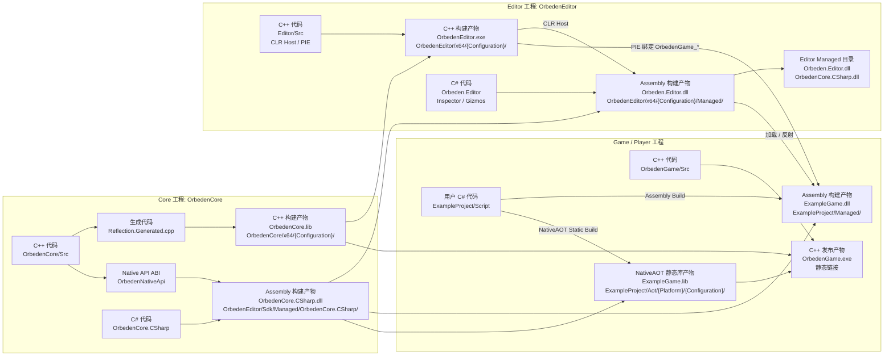
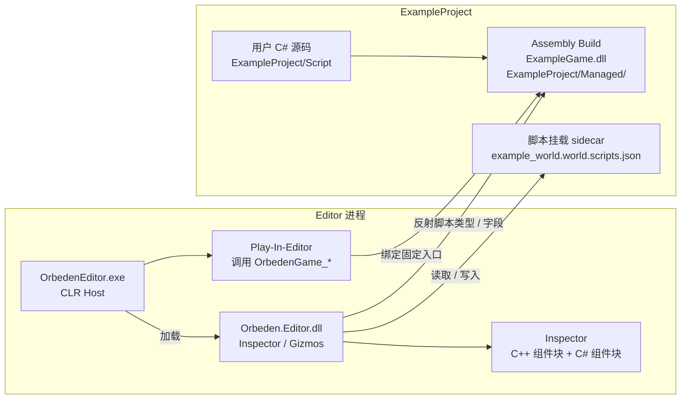
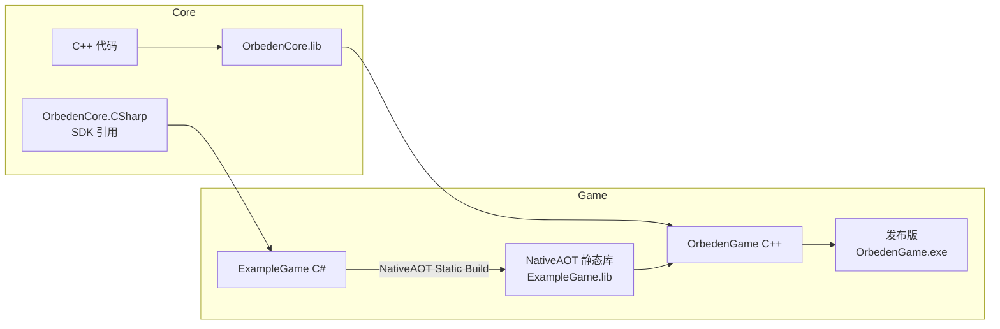

# Orbeden C++ / C# 构建与打包说明

本文说明 Orbeden 当前的 C++ / C# 代码关系、构建产物关系、Editor 测试流程，以及发布版 Game 的打包原则。

## 1. 总体原则

Orbeden 当前采用双环境：

- **Editor 环境**：使用 CLR，加载 `Orbeden.Editor.dll` 和用户游戏 `ExampleGame.dll`，支持 Inspector、脚本反射、Play-In-Editor。
- **Player 环境**：使用 NativeAOT 静态链接，用户游戏 C# 编译成 `ExampleGame.lib`，最终链接进 `OrbedenGame.exe`，不携带 CLR、不加载 C# DLL。
- **Core C++**：不感知 C# 类型系统，不加载程序集，不保存 C# 类型信息。
- **Core C#**：作为 Runtime SDK，提供 `Ens`、`Component`、`ScriptBehaviour`、GUI、Native API 代理，同时服务 Editor Assembly 构建和 Player AOT 构建。

## 2. 工程与产物流图



这张图里有两种箭头：

- **构建产物箭头**：代码生成对应的 `.lib`、`.dll`、`.exe`。
- **依赖箭头**：一个工程构建或运行时需要另一个工程的产物。

## 3. 模块职责

| 模块 | 代码 | 主要产物 | 职责 |
| --- | --- | --- | --- |
| Core C++ | `OrbedenCore/Src` | `OrbedenCore.lib` | World、Ens、原生组件、渲染、资源、Native API。 |
| Core C# | `OrbedenCore/Managed/OrbedenCore.CSharp` | `OrbedenCore.CSharp.dll` | Runtime SDK，供 Editor CLR 和 Game C# 编译引用。 |
| Editor C++ | `OrbedenEditor/Src` | `OrbedenEditor.exe` | 编辑器主程序、CLR Host、Play-In-Editor 调用固定入口。 |
| Editor C# | `OrbedenEditor/Managed/Orbeden.Editor` | `Orbeden.Editor.dll` | Inspector、Gizmos、用户 Game DLL 加载和脚本反射。 |
| Game C# | `ExampleProject/Script` | `ExampleGame.dll` / `ExampleGame.lib` | 用户脚本逻辑。Editor 使用 Assembly，Player 使用 NativeAOT 静态库。 |
| Game C++ | `OrbedenGame/Src` | `OrbedenGame.exe` | 发布版 Player 壳，静态链接 Core 和 Game AOT 产物。 |

## 4. 构建方式与输出目录

构建方式只分两类：

- **Assembly Build**：生成 CLR 可加载的 `.dll`，用于 Editor、Inspector、Play-In-Editor。
- **NativeAOT Static Build**：生成原生静态库 `.lib`，用于发布版 Player 静态链接。

| 目标 | 构建类型 | 常用入口 | 输出目录 / 产物 |
| --- | --- | --- | --- |
| Core C++ | C++ 静态库构建 | VS 解决方案或 Core 工程构建 | `OrbedenCore/x64/{Configuration}/OrbedenCore.lib` |
| Core C# | Assembly Build | VS 解决方案或 Core C# 工程构建 | `OrbedenEditor/Sdk/Managed/OrbedenCore.CSharp/OrbedenCore.CSharp.dll` |
| Editor C++ | C++ 可执行文件构建 | VS 解决方案或 Editor 工程构建 | `OrbedenEditor/x64/{Configuration}/OrbedenEditor.exe` |
| Editor C# | Assembly Build | Editor 工程构建时自动构建，或 VS 中单独构建 | `OrbedenEditor/x64/{Configuration}/Managed/Orbeden.Editor.dll` |
| Game C# 测试版 | Assembly Build | Editor 的 `Build C#` 按钮 | `ExampleProject/Managed/ExampleGame.dll` |
| Game C# 发布版 | NativeAOT Static Build | Editor 的 `Build Player` 按钮 | `ExampleProject/Aot/{Platform}/{Configuration}/ExampleGame.lib` |
| Game Player | C++ 可执行文件构建 | Editor 的 `Build Player` 按钮或 Game 工程构建 | `OrbedenGame/x64/{Configuration}/OrbedenGame.exe` |

注意：

- `OrbedenCore.CSharp.dll` 是 SDK / 编译引用产物，不是发布版 Player 要携带的运行时 DLL。
- `ExampleGame.dll` 只给 Editor 测试和 Inspector 反射使用。
- `ExampleGame.lib` 才是发布版 Player 要链接的用户 C# 产物。

## 5. Editor 测试流程

Editor 测试使用 Assembly Build，不使用 NativeAOT 静态库。



Editor 中的 Inspector 分两类组件块：

- **原生 C++ 组件块**：例如 `C++ SpaceComponent`、`C++ StaticMeshRenderer`，通过 `OrbedenCore.CSharp` 的 Native API 代理访问 Core C++ 对象。
- **用户 C# 组件块**：例如 `C# SampleBehaviour`，挂载关系和默认字段值来自 world sidecar。

非 Play 状态下，Inspector 仍然可以显示、添加、删除、编辑 C# 脚本组件，因为这些数据存放在 sidecar 中，不依赖运行态脚本实例。

Play 状态下，Editor 会额外绑定用户 Game DLL 的固定入口：

```text
OrbedenGame_Initialize
OrbedenGame_Shutdown
OrbedenGame_Update
OrbedenGame_DrawGui
```

运行时创建出来的 `ScriptBehaviour` 实例会进入 `ScriptRuntimeRegistry`，Inspector 会把运行态字段显示在对应的 C# 组件块里。

## 6. 发布版 Player 打包流程

发布版使用 NativeAOT Static Build，不使用 Editor CLR 工作流。



发布版 Player 最终应该携带：

- `OrbedenGame.exe`
- 资源文件
- world / 项目配置
- 平台需要的原生依赖

发布版 Player 不携带：

- `ExampleGame.dll`
- `OrbedenCore.CSharp.dll`
- `Orbeden.Editor.dll`
- `hostfxr`
- `nethost`
- `runtimeconfig.json`

也就是说，Editor 是 CLR 工作流；Player 是纯 Native 静态链接工作流。

## 7. 修改代码后的开发流程

### 7.1 修改 Core C++ 后

如果只是普通 C++ 实现修改：

1. 构建 Core C++，生成新的 `OrbedenCore.lib`。
2. 如果要在 Editor 验证，构建并重启 Editor。
3. 如果要验证发布版 Player，执行 Player 构建，让 `OrbedenGame.exe` 重新链接新的 `OrbedenCore.lib`。

如果修改了反射、序列化或 Inspector 需要读取的 C++ 类型/字段：

1. 先执行 Core C++ 反射代码生成，更新 `Reflection.Generated.cpp`。
2. 再构建 Core C++。
3. 再构建需要验证的 Editor 或 Player。

如果修改了 Core C++ 暴露给 C# 的 Native API：

1. 同步修改 C++ 函数表和绑定实现。
2. 同步修改 `OrbedenCore.CSharp` 中对应的 delegate / struct / wrapper。
3. 构建 Core C#，生成新的 `OrbedenCore.CSharp.dll`。
4. 构建受影响的 Editor C# 和 Game C#。
5. 构建受影响的 Editor 或 Player。

### 7.2 修改 Core C# 后

Core C# 指：

```text
OrbedenCore/Managed/OrbedenCore.CSharp
```

修改后需要：

1. 构建 Core C#，更新 SDK 输出目录里的 `OrbedenCore.CSharp.dll`。
2. 如果要在 Editor 测试，构建 Editor C#，并通过 Editor 的 `Build C#` 重新构建用户 Game Assembly。
3. 如果要发布 Player，通过 `Build Player` 重新生成 `ExampleGame.lib` 并重新链接 `OrbedenGame.exe`。

### 7.3 修改 Editor C++ 后

Editor C++ 指：

```text
OrbedenEditor/Src
```

修改后需要：

1. 构建 Editor C++，生成新的 `OrbedenEditor.exe`。
2. 重启 Editor。
3. 如果修改了 C++ / C# 托管入口 ABI，同步修改 `Orbeden.Editor` 里的 `[UnmanagedCallersOnly]` 入口签名。

### 7.4 修改 Editor C# 后

Editor C# 指：

```text
OrbedenEditor/Managed/Orbeden.Editor
```

修改后需要：

1. 构建 Editor C#，更新 `OrbedenEditor/x64/{Configuration}/Managed/Orbeden.Editor.dll`。
2. 重启 Editor。
3. 如果改动依赖了新的 Core C# API，先构建 Core C#，再构建 Editor C#。

### 7.5 修改 ExampleGame C# 后

ExampleGame C# 指：

```text
ExampleProject/Script
```

如果目标是在 Editor 里测试：

1. 如果正在 Play，先 `Stop`。
2. 点击 Editor 的 `Build C#`，生成新的 `ExampleProject/Managed/ExampleGame.dll`。
3. 点击 `Play`。

如果目标是发布版游戏：

1. 点击 Editor 的 `Build Player`。
2. 该流程会先执行 Game C# NativeAOT Static Build，生成 `ExampleGame.lib`。
3. 然后构建 / 链接 Player，生成发布版 `OrbedenGame.exe`。

### 7.6 修改脚本挂载或 Inspector 字段后

脚本挂载和默认序列化字段保存在 world sidecar 中，例如：

```text
ExampleProject/World/example_world.world.scripts.json
```

修改这些数据后：

- 非 Play 状态下不需要重新构建 C++。
- 如果只是改字段值，不需要重新构建 C#。
- 如果新增或删除脚本类型本身，需要先 `Build C#`，让 Editor 重新反射最新的 Game Assembly。

## 8. 关键边界

- Core C++ 不保存 C# 脚本类型，不依赖 C# 反射系统。
- Editor C# 负责用户脚本反射、Inspector 字段显示、sidecar 读写。
- Editor Play-In-Editor 使用 `ExampleGame.dll`。
- 发布版 Player 使用 `ExampleGame.lib`。
- `OrbedenGame_*` 是 Game C# 和 C++ Player / PIE 之间的固定 ABI。
- Switch、iOS 等不适合动态加载托管 DLL 的平台，走 NativeAOT Static Build + C++ 静态链接路线。
