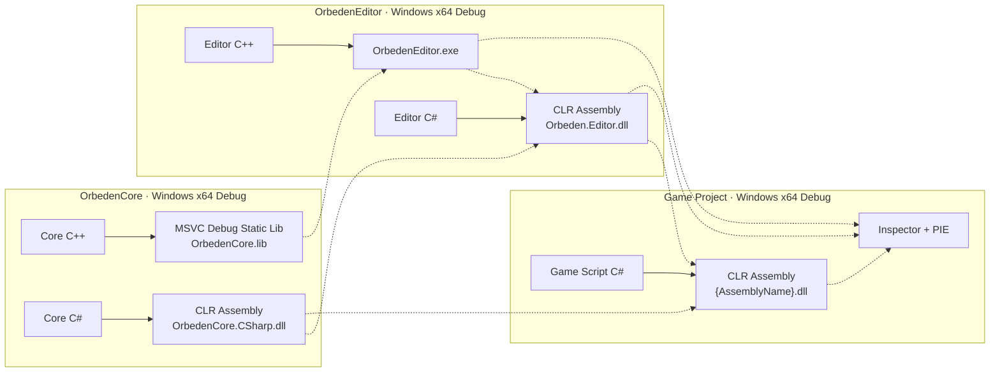
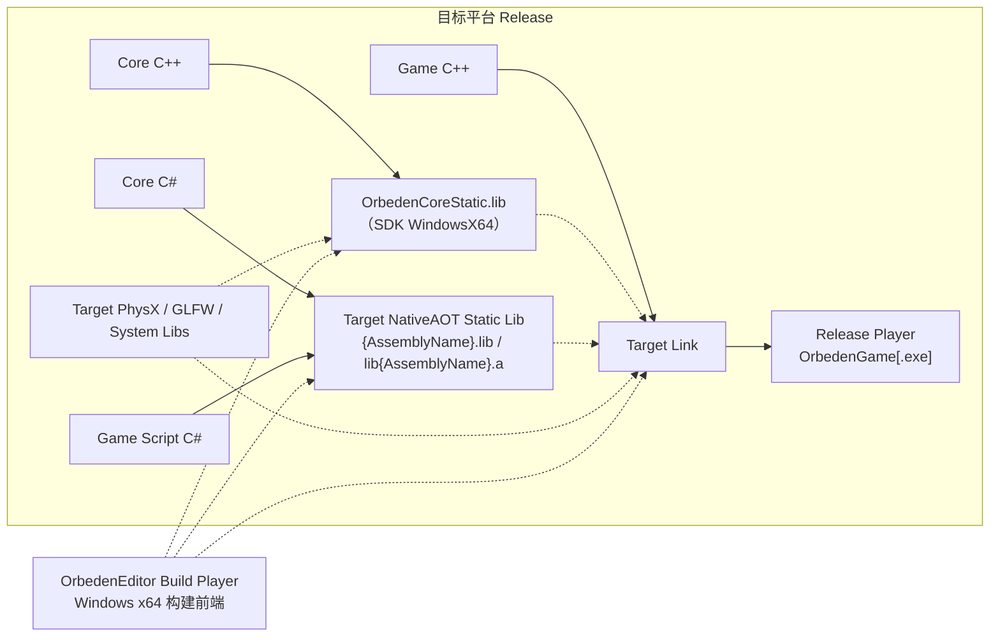
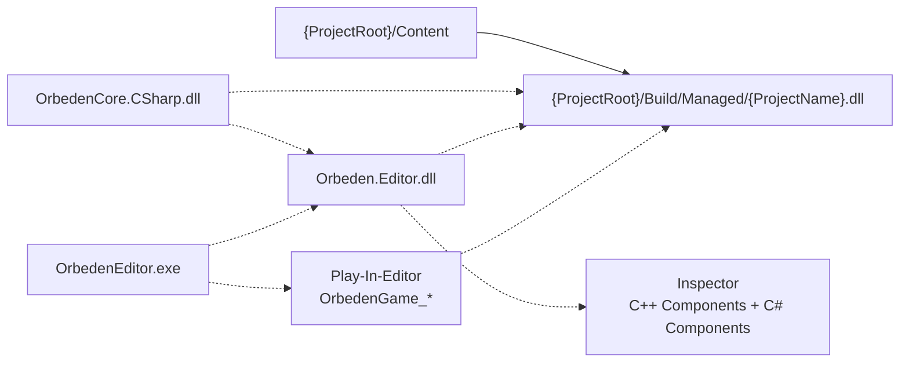

# Orbeden 构建与打包说明

本文说明 Orbeden 的 C++ / C# 构建关系，以及 Core、Editor、Game 在开发测试和发布打包时的职责边界。

## 总体原则

- **Debug 是 Windows x64 开发链路**：Core C#、Editor C# 和游戏脚本 C# 全部使用普通 CLR Assembly，不使用 NativeAOT。
- **Release 是跨平台 Player 发布链路**：进入最终 Player 的 Core C# 与游戏脚本 C# 一起执行目标平台 NativeAOT，生成静态库并链接进 Player。
- **Editor 仅支持 Windows x64**：Debug 和 Release 配置都由 VS/MSBuild/MSVC 构建，不提供 Linux、FreeBSD 或 Switch Editor。
- **Core 和 Game 的 Release 产物需要跨平台**：不同目标分别选择 C++ 工具链、NativeAOT RID、PhysX/GLFW 等平台库，产物不能跨平台复用。
- **Editor 是构建工具而不是 Player 组成部分**：当前 `Orbeden.Editor.dll` 是 Windows Editor 的 CLR 工具程序集，不进入 Release Player；“Release 全部 C# AOT”指最终 Player 携带的全部 C# 代码。
- **Core C++** 不感知 C# 类型系统，不加载程序集，不依赖 hostfxr/nethost/runtimeconfig。
- **Physics** 固定使用 PhysX 5.9 CPU-only 静态库；不生成或链接 CUDA、PhysXGpu、NVTX、DLL/so。

## 模块性质与平台范围

| 模块 | 性质 | Debug | Release |
| --- | --- | --- | --- |
| `OrbedenCore` | 引擎运行时核心；包含文件系统、资源、渲染、物理、World 与 C# Native API | Windows x64；Editor/PIE 使用 MSVC `OrbedenCore.lib`，Core C# 使用 CLR DLL | 跨平台；随目标 Player 重新编译 C++ 静态库，Core C# 随游戏脚本进入目标平台 NativeAOT |
| `OrbedenGame` | 独立 Player 外壳和游戏项目运行入口 | Windows x64 开发测试主要通过 Editor/PIE，游戏脚本使用 CLR DLL | 跨平台；按目标平台编译 Player C++，并静态链接 Core、第三方库与游戏 NativeAOT |
| `OrbedenEditor` | 项目制作、Inspector、PIE 与 Build Player 前端 | 仅 Windows x64；C++ Debug + Editor/Core/Game CLR Assembly | 仅 Windows x64；作为发布构建工具，不进入目标 Player |

跨平台表示 Core/Game 的 Release 架构和构建入口按目标平台区分，不表示仓库中的每个预留目标都已经可用。当前 Windows x64 是默认验证目标，Linux x64 需要对应环境和平台库；FreeBSD 与 Switch 仍受后文所列工具链、PhysX 和厂商 SDK 限制。

## 工程、产物与依赖

两张图均使用以下约定：

- 实线箭头 `-->` 表示“构建生成”。
- 虚线箭头 `-.->` 表示“依赖、引用、链接或运行时加载”。

### Debug：Windows x64 非 AOT 开发链路

Debug 只描述 Windows x64 Editor、Inspector 和 Play-In-Editor。Core C#、Editor C#、游戏脚本 C# 都构建为 CLR Assembly，不生成 NativeAOT 静态库，也不构建跨平台独立 Player。


```mermaid
flowchart LR
    subgraph Core["OrbedenCore · Windows x64 Debug"]
        CoreCpp["Core C++"] --> CoreLib["MSVC Debug Static Lib\nOrbedenCore.lib"]
        CoreCs["Core C#"] --> CoreDll["CLR Assembly\nOrbedenCore.CSharp.dll"]
    end

    subgraph Editor["OrbedenEditor · Windows x64 Debug"]
        EditorCpp["Editor C++"] --> EditorExe["OrbedenEditor.exe"]
        EditorCs["Editor C#"] --> EditorDll["CLR Assembly\nOrbeden.Editor.dll"]
    end

    subgraph Game["Game Project · Windows x64 Debug"]
        GameCs["Game Script C#"] --> GameDll["CLR Assembly\n{AssemblyName}.dll"]
        PIE["Inspector + PIE"]
    end

    CoreLib -.-> EditorExe
    CoreDll -.-> EditorDll
    CoreDll -.-> GameDll
    EditorExe -.-> EditorDll
    EditorDll -.-> GameDll
    EditorExe -.-> PIE
    EditorDll -.-> PIE
    GameDll -.-> PIE
```

### Release：目标平台 NativeAOT Player 链路

Release 图只描述最终 Player。Core C# 和游戏脚本 C# 会作为同一发布闭包按目标 RID 执行 NativeAOT；最终包中没有 Core/Game CLR DLL。Editor 只在 Windows x64 上发起构建，不会被链接或复制进 Player。


```mermaid
flowchart LR
    Editor["OrbedenEditor Build Player\nWindows x64 构建前端"]

    subgraph Target["目标平台 Release"]
        CoreCpp["Core C++"] --> CoreLib["OrbedenCoreStatic.lib\n（SDK WindowsX64）"]
        GameCpp["Game C++"] --> Link["Target Link"]
        CoreCs["Core C#"] --> Aot["Target NativeAOT Static Lib\n{AssemblyName}.lib / lib{AssemblyName}.a"]
        GameCs["Game Script C#"] --> Aot
        PlatformLibs["Target PhysX / GLFW / System Libs"] -.-> CoreLib
        CoreLib -.-> Link
        Aot -.-> Link
        PlatformLibs -.-> Link
        Link --> Player["Release Player\nOrbedenGame[.exe]"]
    end

    Editor -.-> Aot
    Editor -.-> CoreLib
    Editor -.-> Link
```

## 构建入口与输出

| 目标 | 构建方式 | 入口 | 输出 |
| --- | --- | --- | --- |
| Core C++/C# SDK for Editor | MSVC Static Library + CLR Assembly | Visual Studio `OrbedenCore.vcxproj` | Native SDK `OrbedenCore.lib`，并自动生成和同步 `OrbedenCore.CSharp.dll` |
| Core C++ for Player | MSVC Static Library（`ArchiveCoreStaticLibrary`，归档同一批 obj） | 构建 `OrbedenCore.vcxproj` 时自动归档（x64） | `OrbedenEditor/Sdk/Native/WindowsX64/{Configuration}/OrbedenCoreStatic.lib` |
| PhysX CPU SDK | CMake/Ninja Static Libraries | `Build/BuildPhysX.ps1` / `Build/BuildPhysXLinux.sh` | `OrbedenCore/Src/ThirdParty/PhysX/lib/{Platform}/{Compiler?}/{Configuration}` |
| Core C# SDK | Debug CLR / Release AOT 输入 | 构建 `OrbedenCore.vcxproj` 时自动执行 | Debug 为 `OrbedenCore.CSharp.dll`；Release 发布时作为 Game NativeAOT 的引用输入，不单独进入 Player |
| Editor C++ | MSVC Executable | VS 解决方案 / Editor 工程 | `OrbedenEditor/x64/{Configuration}/OrbedenEditor.exe`，链接 `OrbedenEditor/Sdk/Native/WindowsX64/{Configuration}/OrbedenCore.lib` |
| Editor C# | Windows Editor CLR 工具程序集 | Editor 工程构建时自动构建 | `OrbedenEditor/x64/{Configuration}/Managed/Orbeden.Editor.dll`；不进入 Player |
| Game C# Debug | CLR Assembly Build | Debug Editor `Ctrl+R` 或 `Build Game C#` | `{ProjectRoot}/Build/Managed/{AssemblyName}.dll` |
| Core + Game C# Release | 目标平台 NativeAOT Static Build | Release Editor `Build Player` | `{ProjectRoot}/Build/Aot/{Target}/Release/{AssemblyName}.lib` 或 `lib{AssemblyName}.a` |
| Player | MSVC Executable（`OrbedenGame.vcxproj`）+ 资源打包 | Release Editor `Build Player` | `{ProjectRoot}/Build/windows-x64/bin/`，自包含发布目录：`OrbedenGame.exe`、`.oeproj`、`Content/` |

### MSBuild 的定位

Editor 与 `Build/` 下的脚本都不写死 Visual Studio 的安装路径。Editor 的查找顺序为：`ORBEDEN_MSBUILD` 环境变量（显式指定，指向不存在的文件时直接报错，不静默改换工具链）→ `vswhere.exe` 查询（固定位于 `%ProgramFiles(x86)%\Microsoft Visual Studio\Installer\`，先只接受装了 x64 C++ 生成工具的实例，查不到再放宽条件）→ PATH 上的 `MSBuild.exe`（从 Developer Command Prompt 启动编辑器时命中）。三者都没有时 `Build Game C++` / `Build Player` 直接报错要求安装带 C++ 工作负载的 Visual Studio，不拼出一条注定失败的命令行。PowerShell 脚本点源 `Build/FindMSBuild.ps1`，走 vswhere → PATH 的顺序。

vswhere 给出实例后还要校验它自带的平台工具集：`Sdk/Native/Orbeden.Native.props` 里声明的 `PlatformToolset`（当前 v145）必须在该实例的 `MSBuild\Microsoft\VC\*\Platforms\x64\PlatformToolsets\` 下存在，缺了就报出实例路径，而不是等到 MSB8020。**工具集号与 VCTargets 目录号不是一回事**：VS 2026 的 v145 工具集位于 `MSBuild\Microsoft\VC\v180` 下，`v170` 下只有 v143。工具集随 VS 版本单调递增，因此最新实例没有目标工具集时，别的实例也不会有。

因此 Visual Studio 可以装在任意盘符，版本与版本号也不必是默认值。

## 完整打包流程

Debug 仅用于 Windows x64 Editor/PIE，C# 使用 CLR；正式发布从 Windows x64 Release Editor 发起，进入 Player 的 Core/Game C# 使用目标平台 NativeAOT。

0. **构建第三方库**：PhysX 未生成或有改动时运行 `.\Build\BuildPhysX.ps1 -Configuration Debug`（或 `Release`）；Linux 目标改用 `BuildPhysXLinux.sh`。`cgltf`、`stb`、`glad`、`imgui` 无需单独构建。

1. **构建 Core SDK**：在 Visual Studio 中构建 `OrbedenCore.vcxproj` 的 `x64|Debug` 或 `x64|Release`，一次生成 `OrbedenCore.lib`，并自动生成、同步 `OrbedenCore.CSharp.dll`。

2. **构建 Editor**：构建同配置的 `OrbedenEditor.vcxproj`，生成 `OrbedenEditor.exe` 与 `Managed/Orbeden.Editor.dll`，同时复制 GLFW、nethost 和 runtimeconfig。Editor 仅支持 Windows x64。

3. **Debug 验证（可选）**：用 Debug Editor 打开 `.oeproj`；最新 Core C# DLL 会覆盖到 `{ProjectRoot}/Lib/`。按 `Ctrl+R` 或点击 `Build Game C#` 生成 `{ProjectRoot}/Build/Managed/{AssemblyName}.dll`，用于 Inspector 和 PIE。脚本构建在后台进程里跑，构建期间编辑器不冻结。

4. **Release Player**：用 Release Editor 选择 `Target Platform` 并点击 `Build Player`。Editor 先将 Core/Game C# 发布为目标平台 NativeAOT 库，再以 MSBuild 构建 `OrbedenGame.vcxproj`：该工程编译游戏 C++ 源码，链接 SDK 预编译的 `OrbedenCoreStatic.lib`、第三方静态库与 AOT 导入库，并把 AOT DLL、`glfw3.dll` 拷贝到输出目录 `{ProjectRoot}/Build/windows-x64/bin/`。**Player 不编译 Core 源码**：SDK 静态库缺失时构建直接失败并提示重新构建 `OrbedenCore.vcxproj`，不会回退到源码编译。

5. **打包资源**：Player 构建成功后，Editor 接着把内容根内的资源打成发布产物，`Build Player` 结束即得到完整发布目录。
   - 内容根内每个可导入的源文件经 `AssetPipeline` 导入，产生的**每个资源对象**序列化为一个 `.orbo`（`Orbeden::Object` 二进制），先写入 `{ProjectRoot}/ResourceCache/Player/`，再整体同步到 `{ProjectRoot}/Build/windows-x64/bin/Content/`。
   - `.world` 场景**不 cook**，保持 XML 原样复制，并保留其相对内容根的目录结构。
   - `.oeproj` 复制到包根，供 Player 读取启动场景；没有导入器的文件（脚本、C++ 源码、`.mtl`、`.orbinc`）不进入发布包。
   - 打包会把内容根内全部资源导入当前进程，因此 `Build Player` 会保存并**重载一次当前场景**。`ResourceCache/Player/` 是本次 cook 重建的暂存区；`ResourceCache/Imported/` 保存编辑器导入产物。整个 ResourceCache（含 `.resinfo`）可删除重建，不纳入版本管理。

> Player 以**可执行文件所在目录**为根解析内容，发布目录整体拷到别的路径或别的机器都能运行。CLR DLL、hostfxr、nethost 和 Editor 文件不进入发布包。

## 核心工程文件职责

`OrbedenEditor.CSharp.csproj` 对应的实际工程文件为 `Orbeden.Editor.csproj`。

| 工程 | 主要操作 | 主要产物或后续动作 |
| --- | --- | --- |
| `OrbedenCore/OrbedenCore.vcxproj` | 以 MSVC/C++20 编译 Core、glad 和 imgui；引用 PhysX、GLFW、cgltf 等头文件；x64 构建后自动执行同配置的 Core C# 工程 | `Sdk/Native/WindowsX64/{Configuration}/OrbedenCore.lib` |
| `OrbedenCore/Managed/OrbedenCore.CSharp/OrbedenCore.CSharp.csproj` | 构建 `net10.0` CLR SDK并允许 unsafe；构建后把 DLL、PDB、`.deps.json`（存在时）同步到 Game SDK | Editor 与 Game 的 `Sdk/Managed/OrbedenCore.CSharp/` |
| `OrbedenEditor/OrbedenEditor.vcxproj` | 编译并链接 Editor C++、Core、PhysX、GLFW、nethost 和系统库；构建后复制运行库并自动执行同配置的 Editor C# 工程 | `x64/{Configuration}/OrbedenEditor.exe`、运行库与 `Managed/` |
| `OrbedenEditor/Managed/Orbeden.Editor/Orbeden.Editor.csproj` | 构建 `net10.0` Editor CLR 程序集；引用并复制 Core C# SDK；不执行 NativeAOT | `x64/{Configuration}/Managed/Orbeden.Editor.dll`（由 Editor C++ 工程指定输出目录） |

## 第三方库构建脚本

以下命令均从仓库根目录执行。PowerShell 脚本只负责预构建第三方库；Core C++ 与 Core C# SDK 统一通过 Visual Studio 构建 `OrbedenCore.vcxproj`。脚本内部根据 `$PSScriptRoot` 推导仓库和输出目录，不依赖仓库所在盘符。

构建并打包 Windows CPU-only PhysX。默认源码目录是仓库同级的 `PhysX-110.1-omni-and-physx-5.9.0`，也可传入相对仓库根目录的其他位置：

```powershell
.\Build\BuildPhysX.ps1 -Configuration Debug
.\Build\BuildPhysX.ps1 -Configuration Release
.\Build\BuildPhysX.ps1 -Configuration Release -PhysXSource "..\PhysX-110.1-omni-and-physx-5.9.0"
```

Game C# NativeAOT 发布不是 PowerShell 脚本入口。Editor 的 `Build Player` 会调用 `Orbeden.Editor` 内建的 C# `PlayerBuildPipeline`，发布后的 Editor 不需要携带额外 `.ps1`。

## Editor 版 Core 静态库

Editor 不直接引用 `OrbedenCore.vcxproj`，只链接已经构建好的 WindowsX64 静态库。修改 Editor C++ 时，构建 `OrbedenEditor` 不会重新编译 Core。

修改 Core C++ 或 Core C# 后，在 Visual Studio 中构建对应配置的 `OrbedenCore.vcxproj`。该工程会同时刷新 Core C++ 静态库和 Core C# SDK。

## Player 版 Core 静态库与分层

`OrbedenCore.vcxproj` 构建后自动把本次编译产出的 obj 归档为 `OrbedenCoreStatic.lib`（同一批对象，不重复编译）。DLL 与静态库共享一次编译的前提是 Core 不引用用户层符号：

- Core 是底层 SDK，**不引用 `OrbedenGame`（Player）的任何符号**，也不引用游戏程序集的 AOT 导出。
- 脚本入口由宿主在运行前注入：Editor 走 `SetClrEntryPoints`，Player 在 `game_main.cpp` 里声明 AOT 导出并调用 `SetAotEntryPoints`。
- 因此 `ORBEDEN_PLAYER` 编译分支已移除，两个消费者使用完全相同的 Core 对象；静态库缺失时 Player 构建直接报错。

输出目录固定为：

```text
OrbedenEditor/Sdk/Native/WindowsX64/{Configuration}/OrbedenCore.lib
```

`OrbedenEditor.vcxproj` 只消费 Windows x64 版本；Editor 的 Debug 和 Release 都不提供其他宿主平台或架构。

## PhysX 5.9 CPU-only 静态包

PhysX 源码位置默认为仓库同级目录：

```text
../PhysX-110.1-omni-and-physx-5.9.0
```

引擎只使用其中的官方 `physx` SDK。`blast`、`flow`、`omni`、`ovphysx` 不进入 Orbeden。构建固定开启/关闭以下选项：

```text
PX_GENERATE_STATIC_LIBRARIES=ON
PX_GENERATE_GPU_PROJECTS=OFF
PX_GENERATE_GPU_STATIC_LIBRARIES=OFF
PX_USE_NVTX=OFF
PX_BUILDSNIPPETS=OFF
PX_BUILDPVDRUNTIME=OFF
```

这不是 PhysX 4，而是 PhysX 5.9 的 CPU 功能子集。CPU 刚体、场景查询、Cooking、CCT、joints、articulations 和 vehicle 仍来自 5.9；被禁用的是 GPU rigid pipeline、CUDA broadphase、PBD 粒子以及 GPU deformable surface/volume 等必须依赖 NVIDIA CUDA 的路径。官方公共头文件仍保留部分 GPU ABI 声明，但引擎统一定义 `DISABLE_CUDA_PHYSX`，因此 `PX_SUPPORT_GPU_PHYSX=0`，不会编译或调用这些功能。

完整 CPU 包包含 8 个静态模块：

```text
PhysX
PhysXCommon
PhysXFoundation
PhysXExtensions
PhysXPvdSDK
PhysXCooking
PhysXCharacterKinematic
PhysXVehicle
```

头文件、版本和 BSD-3-Clause 许可证位于：

```text
OrbedenCore/Src/ThirdParty/PhysX/
```

### Windows x64

Debug 和 Release 使用上节的 `BuildPhysX.ps1` 构建。

输出会自动安装并复制到：

```text
OrbedenCore/Src/ThirdParty/PhysX/lib/WindowsX64/{Configuration}/
```

Windows 库采用 MSVC ABI，可同时由 MSVC 和 clang-cl 消费，不重复保存两份相同 ABI 的大体积归档。Windows CRT 与引擎一致使用 `/MD` 或 `/MDd`。

### Linux x64

Linux 静态库必须在 x86_64 Linux 环境中构建。推荐使用一台原生 Linux 电脑；WSL 也可以使用同一脚本，但不是必需条件。

Ubuntu / Debian 安装 PhysX 构建工具：

```bash
sudo apt update
sudo apt install -y build-essential clang cmake ninja-build
```

Fedora 安装对应工具：

```bash
sudo dnf install -y gcc gcc-c++ clang cmake ninja-build
```

如果随后还要在该电脑上链接完整 Orbeden Player，Ubuntu / Debian 另外安装 `libglfw3-dev libgl1-mesa-dev`，Fedora 安装 `glfw-devel mesa-libGL-devel`。

默认目录布局如下。PhysX 源码目录与 Orbeden 仓库同级，因此仓库移动到其他位置后不需要修改脚本：

```text
workspace/
├── orbeden/
└── PhysX-110.1-omni-and-physx-5.9.0/
    └── physx/
        └── CMakeLists.txt
```

进入仓库根目录，分别构建 Clang/GCC 的 Debug/Release 四套静态库：

```bash
cd orbeden
bash ./Build/BuildPhysXLinux.sh Debug Clang
bash ./Build/BuildPhysXLinux.sh Release Clang
bash ./Build/BuildPhysXLinux.sh Debug GCC
bash ./Build/BuildPhysXLinux.sh Release GCC
```

如果 PhysX 不在默认同级目录，第三个参数可传入相对仓库根目录的源码位置。参数既可以指向包含 `physx/` 的源码包根目录，也可以直接指向 `physx/`：

```bash
bash ./Build/BuildPhysXLinux.sh Release Clang ../vendor/PhysX-110.1-omni-and-physx-5.9.0
bash ./Build/BuildPhysXLinux.sh Release GCC ../vendor/PhysX-110.1-omni-and-physx-5.9.0/physx
```

脚本会把源码复制到 `Build/.cache/PhysX-5.9.0/physx-linux` 后配置，避免 CMake 生成文件污染下载的 PhysX 源码。安装结果先进入 `Build/.cache/PhysX-5.9.0/stage`，随后自动复制头文件和静态库到引擎第三方目录：

```text
OrbedenCore/Src/ThirdParty/PhysX/include/
OrbedenCore/Src/ThirdParty/PhysX/lib/LinuxX64/{Clang|GCC}/{Configuration}/
```

每个配置应包含 8 个 `.a`。脚本会自动拒绝 `PhysXGpu`、CUDA 和 `.so` 产物；构建后可再手动检查数量与目标格式：

```bash
find OrbedenCore/Src/ThirdParty/PhysX/lib/LinuxX64 -type f -name '*.a' -print | sort
file OrbedenCore/Src/ThirdParty/PhysX/lib/LinuxX64/Clang/Release/libPhysX_static_64.a
file OrbedenCore/Src/ThirdParty/PhysX/lib/LinuxX64/GCC/Release/libPhysX_static_64.a
```

四套全部生成时共有 32 个归档文件。`file` 应报告当前 x86-64 Linux 工具链生成的 archive，目录中不应出现 `.lib`、`.dll`、`.so` 或 `PhysXGpu`。Windows 只有在配置完整 Linux sysroot 和交叉工具链时才能交叉编译，Windows `.lib` 不能当作 Linux `.a` 使用。

FreeBSD 和 Switch 当前明确不支持 PhysX：仓库没有经过验证的上游平台端口，也没有 Switch 厂商 SDK。对应目标在打包下拉框中置灰，不会进入发布流程，也不会回退到无物理或其他实现。

### 原生物理接口

`Application::GetSystem<PhysicsSystem>()` 返回内建 `PhysicsSystem`。C++ 端现有高层能力包括：

- `RigidBody`：Static、Dynamic、Kinematic、质量、阻尼、重力、CCD 和轴锁定。
- `Collider`：Box、Sphere、Capsule、ConvexMesh、TriangleMesh、Trigger、材质和 layer/mask。
- `CharacterController`：Capsule/Box CCT、step/contact/slope 和 layer/mask。
- `Raycast`、`SweepSphere`、`OverlapSphere`、接触/Trigger 事件与 CCT 移动/传送。

Dynamic 刚体和 CCT 必须是根实体。TriangleMesh 不允许用于 Dynamic 刚体，应改用 ConvexMesh。静态和 Kinematic Actor 会读取层级后的世界变换；Dynamic Actor 将模拟结果写回根实体局部变换。

高级 C++ 模块可通过 `GetPhysics()`、`GetScene()`、`GetCookingParams()`、`GetRigidActor()` 等原生句柄自行创建 joints、articulations 和 vehicle。PhysX 5.9 Cooking 已改为无状态函数，因此暴露的是 `PxCookingParams`，不是旧版 `PxCooking*` 对象。

### C# 物理组件绑定

Core C# SDK 提供 `RigidBody`、`Collider` 和 `CharacterController` 包装，可通过 `Ens` 添加、判断和获取：

```csharp
Ens bodyEns = Ens.Create("Body");
Collider collider = bodyEns.AddCollider()!;
collider.shape = ColliderShape.Box;
collider.halfExtents = new vector3(0.5f, 0.5f, 0.5f);

RigidBody body = bodyEns.AddRigidBody()!;
body.bodyType = PhysicsBodyType.Dynamic;
body.mass = 2.0f;
body.lockFlags = PhysicsLockFlags.RotationX | PhysicsLockFlags.RotationZ;

RigidBody? sameBody = bodyEns.GetComponent<RigidBody>();
```

组件绑定覆盖所有可序列化配置字段和刚体速度。物理查询、事件、CCT `Move`/`Teleport` 属于后续 `PhysicsSystem` 托管绑定，不包含在本组件绑定中。

## Editor 的 Player 目标平台

`Build Game` 面板的 `Build Player` 按钮前有 `Target Platform` 下拉框。该选项只影响 Player，不影响 Windows x64 Debug Editor/PIE。

| Target Platform | Game C# AOT 目标 | 状态 |
| --- | --- | --- |
| Windows x64 | `windows-x64` / `{AssemblyName}.lib`（NativeLib=Shared，DLL 随 Player 分发） | 默认验证目标 |
| Linux x64 / Linux x64 GCC / FreeBSD x64 / Switch | — | 下拉框置灰；需要目标机或厂商工具链，不在 Windows Editor 中发起 |

`Build Player` 的流程固定为：

1. C++ Editor 将项目、配置和目标传给 `Orbeden.Editor`，由 C# `PlayerBuildPipeline` 直接执行 `dotnet restore/publish` 并校验 Game NativeAOT 库。
2. 以 MSBuild 构建 `OrbedenGame/OrbedenGame.vcxproj`：编译游戏 C++ 源码，链接 SDK 预编译的 `OrbedenCoreStatic.lib`、第三方库与 AOT 导入库，最后拷贝 AOT DLL 与 `glfw3.dll` 到输出目录。Core 静态库缺失时构建失败并提示先构建 `OrbedenCore.vcxproj`。
3. C++ Editor 调 `PlayerContentCooker` 把内容根内的资源导入并序列化为 `.orbo` 写入 `ResourceCache/Player/`，再同步到包内 `Content/`、复制 `.oeproj` 到包根；随后保存并重载一次当前场景。

NativeAOT 命令参数、RID 和输出目录集中在 `OrbedenEditor/Managed/Orbeden.Editor/PlayerBuildPipeline.cs`，可直接随 Editor C# 代码定制。失败时不会回退到 PowerShell、DLL 或 CLR 工作流。

## Debug Editor 测试流程

Debug Editor 仅支持 Windows x64，测试流程不使用 NativeAOT 静态库。Core C#、Editor C# 和游戏脚本 C# 全部使用 CLR Assembly。


```mermaid
flowchart LR
    GameCs["{ProjectRoot}/Content"] --> GameDll["{ProjectRoot}/Build/Managed/{ProjectName}.dll"]
    CoreSdk["OrbedenCore.CSharp.dll"] -.-> GameDll
    CoreSdk -.-> EditorDll["Orbeden.Editor.dll"]
    EditorExe["OrbedenEditor.exe"] -.-> EditorDll
    EditorDll -.-> Inspector["Inspector\nC++ Components + C# Components"]
    EditorDll -.-> GameDll
    EditorExe -.-> PIE["Play-In-Editor\nOrbedenGame_*"]
    PIE -.-> GameDll
```

- 非 Play 状态下，Inspector 使用用户 Game Assembly 反射脚本类型，并通过 `.world` 中的原生 `Script` 宿主显示和编辑 C# 脚本组件。
- Play 状态下，Editor 绑定用户 Game Assembly 的 `OrbedenGame_Initialize`、`OrbedenGame_Update`、`OrbedenGame_DrawGui`、`OrbedenGame_Shutdown`。
- Inspector 同时显示原生 C++ 组件块和用户 C# 组件块。

## Release Player 内容

发布版 Player 携带：

- `OrbedenGame`
- `Content/` 下的资源产物 `.orbo`（`Orbeden::Object` 二进制）与清单 `cooked.index`
- `Content/` 下原样复制的 `.world` 场景
- 包根的 `.oeproj` 项目配置
- 平台需要的原生依赖

发布目录里**没有**原始资源文件（`.obj` / `.png` / `.mtl` / `.orbshader`）与脚本源码——它们已经在打包时转换进 `.orbo` 或编译进 Player。

Core C# 和游戏脚本 C# 已按目标平台编译进 NativeAOT 静态库并静态链接到 Player，不再以托管 DLL 形式部署。不同平台的 NativeAOT 静态库、Core C++ 静态库和第三方平台库不能混用。

发布版 Player 不携带：

- `ExampleGame.dll`
- `OrbedenCore.CSharp.dll`
- `Orbeden.Editor.dll`
- `hostfxr`
- `nethost`
- `runtimeconfig.json`

## 资源产物与解析规则

### `.orbo` 格式

一个资源对象一个 `.orbo` 文件，**位置式二进制**：只写字段顺序与长度，不写字段名。

- 变长字段靠长度前缀自洽：`string` = `uint32 字节数 + 字节`，数组 = `uint32 个数 + 元素整块`。
- 顶点、索引、像素等长数组按原始字节块读写，依赖 `Runtime/EngineTypes.h` 对数学类型 `trivially_copyable` 的静态断言。
- 头部带资源 Key、运行时类型名、依赖 Key 列表，以及源文件时间戳/大小与一个预留的导入器版本槽位（恒写 0，只写不读，留给将来的失效机制）。
- 读完后游标必须正好落在文件末尾，否则判定为格式错配。

**位置式格式的代价**：引擎改动一旦触及资源字段（增删字段、调整顺序、改类型），**已发布的旧包不再可读，必须重新 `Build Player`**。这与「world 文件不带版本号、格式变更靠改文件而非读时兼容」是同一套约定。

### 文件名与清单

扁平存放，文件名是资源 Key 的十六进制哈希（`StringId::CalculateHash`）。`Key → 文件名` 是纯函数，不需要索引就能查找。

`cooked.index` 是 cook 生成的对照表，每行 `<hash16>\t<资源Key>`。它有两个用途：内置 Shader（`shadow_depth.orbshader` / `skybox.orbshader`）本来就靠**文件名**在内容根内查找，哈希命名抹掉了文件名，打包后只能靠清单匹配；同时它也让人能看出哈希文件对应哪个资源。

### 解析顺序与回退

`ResourceManager` 按 Key 取资源时是**对称的双向回退**，没有 Editor/Player 分支：先找 `Content/<hash16>.orbo`，找不到再按 Key 读源文件并导入。

由此得出两条必须遵守的约定：

1. **工程 `Content/` 内绝不能出现 `.orbo`。** 产物与源文件同目录时产物优先，且**不会有任何提示**——Editor 会静默改用产物，改源文件不再生效。cook 只写 `ResourceCache/` 与发布目录，天然满足，但这是约定而不是代码约束。
2. **发布目录里只放产物，不放源文件。** 否则产物缺失时会静默回退到源文件导入，问题被掩盖。

`Content/` 之外（即 Editor）永远是源优先：那里没有 `.orbo`，读不到产物自然走导入。**当前不做任何过期校验**——改了源文件不会自动重建产物，`Build Player` 一律全量重 cook。

## 游戏工程布局

游戏工程只分两部分：**内容根 `Content/`** 是给用户用的，内部结构完全自由；内容根之外的一切都由引擎与构建系统强依赖，位置固定且可整块重建。

构建脚手架一律**引用 SDK**，项目内不保留引擎设置的副本：工具集、include、链接库、MetaGen 参数与源文件收集都由 SDK 的共享属性表提供。引擎改动只需刷新 SDK。

### 模板分区

`OrbedenEditor/Templates/` 下分四部分：

| 目录 | 内容 | 去向 |
| --- | --- | --- |
| `Project/` | 工程脚手架：`.oeproj`、`*.csproj`、`*.vcxproj`、`Directory.Build.props` | 铺到项目根 |
| `Builtin/` | 默认着色器、材质与基础网格，含引擎按文件名查找的 `shadow_depth.orbshader` 与 `skybox.orbshader` | 新建时铺到 `<项目根>/Content/Builtin/`；之后由 Dev 面板单独重置 |
| `Examples/` | 示例内容：场景、资源、脚本与原生组件 | 新建时铺到 `<项目根>/Content/Examples/`；之后由 Dev 面板显式重置 |
| `Shared/` | 共享属性表与固定桥接源码：`Orbeden.Native.props` / `.targets`、`GameModule.cpp`、`GameAotExports.cs` | 由 `PublishNativeGameSdk` 发布到 `Sdk/Native/` 与 `Sdk/Shared/`，不铺进项目 |

`Project/` 中不得包含任何游戏内容：示例内容一旦与项目自身内容同名，会同时撞上 C# 的全限定类型名、MetaGen 的类型字典和 Player 的链接符号。

### 项目目录

```text
MyGame/
├─ MyGame.oeproj            项目配置：startupWorld / lastWorld
├─ MyGame.csproj            工程文件直接放在项目根
├─ MyGameNative.vcxproj
├─ Directory.Build.props
├─ Lib/                     SDK 快照：Core C# 运行库、绑定目标转发、OrbedenSdk.path、用户手册 Lib/Docs/
├─ ResourceCache/           资源导入产物缓存，可由 cook 全量重建（可删除，不进版本控制）
├─ Content/                 内容根：内部结构完全自由
│   ├─ Meshes/  Materials/  Textures/  Shaders/  Scenes/  Scripts/
│   └─ Examples/FlightTraining/   可编辑的示例游戏
└─ Build/                   全部构建产物
    ├─ Managed/             C# 开发程序集、obj、PIE 影子副本
    ├─ Aot/                 NativeAOT 库
    ├─ Native/              模块 DLL、obj 与 MetaGen 的 Generated/
    └─ windows-x64/
        ├─ obj/             编译中间文件
        └─ bin/             自包含发布目录
            ├─ OrbedenGame.exe / glfw3.dll / {AssemblyName}.dll
            ├─ {ProjectName}.oeproj
            └─ Content/     .orbo 产物（扁平，文件名是资源 Key 的哈希）
                            cooked.index（文件名与资源 Key 对照表）
                            **/*.world（保持原目录结构）
```

`Content/` 下的六个初始子目录只是**新建时的默认结构**，之后可以随意增删改名。`.oeproj` 只记 `startupWorld` 与 `lastWorld`——位置既然固定，就不该做成可配置属性。

`Lib/Docs/` 里的用户手册是引擎仓库 `Docs/Manual/` 的副本：引擎构建生成并发布到 `Sdk/Manual/`，游戏工程构建时整块刷新，与 `Lib/` 下其他 SDK 快照同一生命周期。工程内不手工维护这份文档，自己的笔记写进 `Content/`。

两个场景 Key 各服务一端，不要混：

| 属性 | 服务对象 | 说明 |
| --- | --- | --- |
| `startupWorld` | 打包后的 Player | 启动时装载哪个场景。编辑器只在 `lastWorld` 缺失或失效时回退到它 |
| `lastWorld` | 编辑器 | 开发者最后编辑的场景，切换场景时写入；重新打开项目回到它 |

两者都相对内容根。`lastWorld` 引用的场景被删或被改名时（改名会随引用重写一起更新），打开项目退回 `startupWorld`。PIE 用的是**当前打开的场景**，与这两个属性都无关。

`ResourceCache/` 与 `Content/` 同级。`Imported/` 按 Content 目录结构保存带源文件名前缀的 `.orbo` 产物，Project/Inspector 读取伴生文件的清单，ObjectField 可按对象加载缓存；`Player/` 独立保存 cook 暂存产物并同步进发布目录，打包不会清空 Imported。产物**不纳入版本管理**，Reimport 原位置重建，不保留历史代次，进程交换结果不落盘。详见 [资源 Inspector 设计](AssetInspectorDesign.md)。

**每个源文件有一个伴生 `.resinfo`**：与源文件同址同名、只多一个后缀，分两部分——

| 部分 | 归属 | 生命周期 |
| --- | --- | --- |
| 导入设置 | 用户数据，Inspector 可编辑 | **重新导入时保留**，随资源进版本管理 |
| 内部隐含资源清单 | 重新生成 | 每次导入重建（对象 Key、类型、依赖、反射摘要） |

伴生文件必须进版本管理：它是导入设置的唯一载体，丢了设置就没了。产物 `.orbo` 与 `ResourceCache/` 都可以全量重建，因此不进版本管理。`*.resinfo.tmp` 是原子写入的中间文件，仍被忽略。

### 内容根与资源 Key

**所有 `Object` 派生资源的 stringid 都是内容根相对路径**：`Meshes/cube.obj` 对应 `<项目根>/Content/Meshes/cube.obj`。`startupWorld` 同样相对内容根。Key 里没有 `Resource/` 这类前缀特判，解析就是一次路径拼接。

### 位置无关

脚本、资源、场景放在内容根内任何目录都能生效，新增文件不需要改工程：

- **C#**：`Directory.Build.props` 关掉 SDK 默认编译项通配，由 SDK 的 `Orbeden.Bindings.targets` 收集 `Content/**/*.cs`。
- **C++**：`Orbeden.Native.targets` 收集 `Content/**/*.cpp`；Player 的 `OrbedenGame.vcxproj` 同样。
- **场景**：`startupWorld` 与 `EditorProject::OpenWorld` 都以内容根为基准，在 Project 面板双击 `.world` 即可切换。
- **内置 Shader**：`shadow_depth.orbshader` 与 `skybox.orbshader` 由引擎**按文件名在内容根内查找**（结果缓存），不要求固定位置；新建项目铺到 `Content/Builtin/Shaders/`，之后由 Dev 面板的 `Reset Builtin` 管理。同名多份时引擎取字典序靠前的一份并打一条告警，所以同一内容根内只应保留一份。

内容根之外按定义不含用户内容，因此 glob 不需要排除表。这些通配符会让 Visual Studio 对工程给出通配符警告，只影响 IDE 设计时行为，不影响构建——编辑器构建游戏模块走命令行 MSBuild。

### 引擎更新与项目同步

版本 62：字体预烘焙字符来源改为 Content 内的 UTF-8 `.txt` 原始文件引用，Inspector 使用可拖放、选择、清空和显示 Missing 的引用框；预设字符集仍可与文本文件合并。导入设置保存 `prebakeTextFile` 相对路径，移除多行字符输入及其十六进制传输路径。读取文本时去除开头的 UTF-8 BOM，烘焙器按 Unicode 标量自动去重并按码点排序，同一字形复用图集区域，不改写文本文件。字符文件计入 AssetCollection 源文件依赖，由现有编辑器缓存与运行态导入指纹跟踪更新。编辑器资源缓存版本升到 7；Font Cooked 载荷和 RetainedGuiApi 继续使用版本 3。需重建 Core、Editor，更新游戏 SDK，重新选择字符文本文件并导入字体后重新 Build Player。不新增测试代码，未执行编译或运行验证。

版本 61：字体改为预烘焙图集与运行时动态补字共用的模式。源字体 Import Settings 增加预烘焙字符集（Basic Latin、Latin-1、自定义、None）、多行自定义字符和烘焙像素字号，保留 Bitmap/SDF/MSDF、图集分辨率及距离场范围。Bitmap 默认采样 16 px/em，距离场默认 64 px/em；默认烘焙 Basic Latin。字符去重后按码点排序，保存字形度量、字符映射、图集像素和逐行装箱游标；源字体不包含的字符报告 Warning。Font Cooked 载荷升级到版本 3，仍读取版本 1/2；动态补字所需的字体字节继续随资源发布。运行时按需加载烘焙页，恢复剩余空间并追加字形，满页后新增图集页；其他 Bitmap 投影字号继续按原路径生成缓存。GPU 页被回收或 PIE 世界重建后从不可变载荷重新上传，动态补字不回写导入产物。RetainedGuiApi 升级到版本 3，尾部追加预烘焙读取槽；编辑器资源缓存版本升到 6。需重建 Core、Editor，更新游戏 SDK，重新导入字体并重新 Build Player。不新增测试代码，未执行编译或运行验证。

版本 60：修复 RetainedGUI 输入计数调用传入空 textBytes 指针而恒返回零的问题，无文本的鼠标事件允许空文本缓冲；读取容量不足时扩容并重新读取完整输入批次。FontAtlasCache 实例继续由 CoreCS 共用，但纹理页、字形及标量映射随 UI 上下文切换清理；缓存版本与纹理存活状态纳入 Text/TextField 的排版和几何失效判断，晚创建的缓存继承当前上下文。临时字形生成失败不再驻留为无像素字形，后续帧重新生成；暖缓存中正在绘制的字形固定图集页，字体包装失效时按原 Key 重新获取。渲染端对无有效图集的 Bitmap/SDF/MSDF 命令跳过绘制，不以白纹理替代；真正的缺字方框保留普通图形材质。修复运行时缓存跨 PIE 世界持有失效纹理的问题，不改写世界文件或场景字段。需重建 Core、Editor，更新游戏 SDK 后重建游戏；不新增测试代码，未执行编译或运行验证。

版本 59：UI 系统并入引擎核心，取消 Orbeden.UI 源码包。RetainedGUI 的运行时改由 `OrbedenCore.CSharp` 提供，编辑器部分并入 `Orbeden.Editor`，两者都随 SDK 以程序集发布；游戏工程不再编译任何 UI 源码，`Package.version` 版本合同、SDK 的 `Packages/Orbeden.UI/` 只读基线、项目覆盖包与 `.gitkeep` 占位一并删除。托管组件的类型解析、原生序列化与 AOT 闭包不受影响；帧系统登记改为常驻项，不再依赖会话程序集每次重载重新登记，编辑器侧的可添加组件列表与 CustomEditor 解析改为同时扫描核心程序集。**UI 代码不再随脚本热重载**：改动需重建 Core 或 Editor 并重启编辑器，游戏开发者派生与扩展控件不受影响。老项目更新后 `Lib/` 快照刷新即可，项目内若存在 `Packages/Orbeden.UI/`，它已不被任何构建目标收集，可整目录删除。需重建 Core 与 Editor 并重新 Build Player；场景字段格式不变，游戏脚本无需改动，不再需要同步 UI 包。

版本 58：UILayout 的 offset 与 Transform 局部 X/Y 双向同步，三维锚点偏移通过 GetAnchoredPosition/SetAnchoredPosition 读写，Z 使用 Transform 局部 Z；矩形位置合成只计入一次偏移，布局计算记录解析时的 offset，编辑手柄修改作者位置时即时平移派生覆盖。画布根按 Transform 场景位置初始化，普通布局节点保留已保存的 offset，offset 为零时接入已有 Transform X/Y。序列化边界新增 IManagedComponentLifecycle.OnComponentBeforeSerialize 默认回调，保存世界和进入 PIE 前刷新全部托管宿主字段；Rect 手柄提交、取消与 Undo/Redo 同步字段快照并标脏。修复指针捕获被旧状态覆盖、悬停切换发送到旧处理器、拖动出界空节点访问和抬起位置判定；鼠标按下、移动及抬起都刷新悬停，失焦清除高亮。UI 包版本为 6。需重建 Core、Editor，同步 SDK/UI 包并重建游戏及 Editor 扩展；无需改动场景字段格式，不新增测试代码。

版本 57：统一字体、独立图片和模型内导入对象的 Key 生成为 `<源文件路径>//<原生对象类型>/<对象名>`。单个 Font、Texture2D 与 Mesh 使用 `Main`；默认字体 Key 为 `Builtin/Fonts/Default.ttf//Font/Main`，图片为 `<图片路径>//Texture2D/Main`；模型纹理类型段由 Texture 改为 Texture2D，已有 Mesh/Material 子对象名保持原规则。源路径仅用于导入、ImportSettings 和源文件依赖；对象引用、资源表及 Cooked 文件哈希使用完整对象 Key，不再给字体和图片注册源路径对象。材质及天空盒导入把图片源引用绑定到规范 Texture2D 对象；自有资源格式的主对象 Key 保持原规则。资源缓存版本为 5，UI 包版本为 5。需重建 Core、Editor，同步 SDK/UI 包并重建游戏模块；重新导入字体、图片和模型并重新 Build Player。旧场景或脚本中的字体/图片引用需改为完整对象 Key，旧模型纹理引用的 Texture 段需改为 Texture2D；工程更新不自动改写用户内容。

版本 56：场景与组件快照的 Ref 字段、引用数组/列表和世界环境引用在目标丢失或类型不匹配时报告 Warning，保留原始 Key 并继续加载；空引用仍按空值处理。准备中的世界按临时身份映射校验 Ens/Component 引用。脚本字段解析通过 ResourceManager::TryLoad 避免把缺失资源记录为 Error；直接资源加载仍保留既有错误报告。ObjectField 区分 None 与 Missing，Missing 的悬停提示保留原 Key，允许重新指定或显式清空。需重建 Core、Editor 并同步 SDK 后重建游戏模块；不修改场景引用文本，不新增内容格式或测试代码。

版本 55 同时将默认字体替换为 Cubic 11（俐方體11號）1.500：资源 Key 为 `Builtin/Fonts/Default.ttf`，默认 Bitmap 导入。字体及 OFL 原文由第三方依赖锁固定提交与 SHA-256 校验；还原工具同步字体和许可，不再发布 Noto 字体。需同步 `Content/Builtin/Fonts/`；显式引用旧 `Builtin/Fonts/Default.otf` 的组件应改为新字体对象或清空 Font 使用默认字体。Player cook 通过托管桥读取 `.resinfo` 设置表，并把导入配置固化到 Font 的 `.orbo` 载荷；编辑器草稿和资源清单不进入 Player。

版本 55：字体源文件 .ttf/.otf/.ttc 接入 ProjectPanel 对象展开及统一资源 Inspector，导入生成 Font；Import Settings 提供 Bitmap/SDF/MSDF、Atlas 页尺寸、距离场像素密度/范围与 TTC 字体面下标。Font 的导入配置写入 .orbo 字体载荷版本 2，版本 1 以默认配置读取。修复字体重导入的字体面与 revision 刷新，Text/TextField 从 Font 读取模式并在重导入后重建布局和几何；删除组件级 rasterMode 字段与 SetRasterMode 方法。UI 包版本为 4，资源缓存版本为 4。需重建 Core、Editor，同步 SDK/UI 包并重建游戏脚本及 Editor 扩展；自定义 UI 包和调用 SetRasterMode 的代码需更新，字体模式改在源字体的 Import Settings 配置。旧场景的组件 rasterMode 不再生效；希望继续使用距离场的字体需在导入设置中选 SDF/MSDF 并 Apply。无需重置 Builtin，无新增编辑器字体文件格式，发布包重新 Build Player。

版本 54：WorldSpace RetainedGUI 改为摄像机无关的共享三维网格，画布每帧只提交一次；删除 UIVisual、控件附加网格和文字排版的相机变体，Bitmap 按配置字号生成，SDF/MSDF 使用共享图集与屏幕导数。原生渲染按相机 LayerMask 筛选，启用 LessEqual 深度测试且不写深度，视口在相机内部缓冲中从零起算；相机快照仅供命中与深度读取。`Canvas.drawLayer` 是位掩码，0 表示不绘制，默认层为 1。Overlay 补齐显示目标复制、sRGB 解码到 RGBA16F、线性预乘混合、纯 sRGB 编码回显示目标，合成不再次执行曝光与色调映射。`UICanvasSubmission` 删除 viewerId，尺寸改为 112 字节；RetainedGuiApi 主版本升至 2，UI 包版本为 3。需重建 Core、Editor，同步 SDK/UI 包并重建游戏脚本及 Editor 扩展；自定义包调用旧 GetMesh(variant)/GetOverlay(variant) 的代码改用 Mesh/GetOverlay()，删除 ViewVariant 与相机变体缓存。没有 Builtin 着色器或场景格式变更，发布包重新 Build Player。

版本 53：Overlay 画布的预览缩放从隐式常量（每个 UI 逻辑单位换算为 0.01 世界单位，写在场景预览矩阵里）改为**画布根 Transform 的缩放**，与 WorldSpace 画布统一，预览矩阵只保留按枢轴居中；该居中偏移同时写进画布直接子节点的派生位置（WorldSpace 根矩形已按枢轴解析，不叠加）。UI 子节点的世界矩阵从此就是它在场景里的绘制位置，双击聚焦（F）、W/E/R 手柄与选择包围盒不再落到逻辑单位坐标（此前新建 Image 会飞到画布外 640 世界单位处）。UI 菜单新建的 Overlay 画布自动写 0.01；Canvas 检视面板对屏幕画布显示 `Scene Preview Size: <逻辑> logical units -> <世界> world units`。**旧场景的 Overlay 画布根缩放是 1**，会按 1 逻辑单位 = 1 世界单位显示（1280×720 画布在场景里就是 1280×720 世界单位），需在画布根节点上把缩放手工设为 0.01；WorldSpace 画布不受影响。Overlay 的屏幕投影（PIE 与 Player）仍不读根 Transform，像素预览与绘制不受影响；`UINode.WorldMatrix` 对 Overlay 子树从此带上根缩放，按它做逻辑的脚本需注意。需重建 Core 与 Editor、同步 Orbeden.UI 源码包并重建游戏脚本及 Editor 扩展；无需重置 Builtin，无场景字段格式迁移，发布包重新 Build Player。

版本 52：编辑器装载脚本前检查项目实际 SDK 源码包以及游戏/Editor DLL 的更新时间，过期时构建并重载，避免继续使用缺少默认字体或 Rect 门控的旧 UI 实现；共享场景手柄入口对 UILayout 再次限制 Rect 交互。活动 Canvas 的场景边框不依赖选择状态，子元素边框仍只在选中时显示。新增源码包场景扩展及拾取桥：UI 以实际预览平面与解析矩形命中，先排除被更近网格或祖先遮罩遮挡的 UI，再优先 Ens 层级更深的节点，同层级取更近的交点；Text 的运行时 RaycastTarget 不影响编辑器选择。需同时重建 Core、Editor、游戏脚本和游戏 Editor 扩展并同步 Orbeden.UI 包；默认字体继续使用版本 51 的 Builtin/Fonts，无新增 Builtin 资源或场景格式迁移，发布包重新 Build Player。

版本 51：Text 与 TextField 的 Font 留空时使用 `Builtin/Fonts/Default.otf`（Noto Sans SC Regular），覆盖输入框正文、占位文字及 IME 组合文字；补齐输入框的字形图集绑定及 UV 方向。SceneView 工具栏新增 Rect（快捷键 T），矩形手柄只在 Rect 模式下编辑 UILayout；W/E/R 继续编辑 Transform，写回位置时扣除布局派生偏移，避免锚点重复叠加。Editor Gizmo 函数表新增当前模式读取槽位，需同时重建 Core、Editor 和游戏 Editor 扩展。**需同步新增的 `Content/Builtin/Fonts/Default.otf`、`OFL.txt` 与 `README.md`**：更新项目或 Reset Builtin 会同步，手动复制这三个文件并导入也可；同步 Orbeden.UI 源码包并重建游戏脚本。原有 Font 引用保持有效，空 Font 现在自动采用默认字体；没有场景格式迁移，发布包重新 Build Player。

版本 50：UIElement 和 UILayout 的挂载、卸载会合并请求在下一次渲染准备时重建 UI 索引、父子关系与布局；删除 Canvas 时保留同节点 UILayout 及子树，撤销恢复后重新查找所属画布。移除 Canvas 同时清理其视口缓存，没有所属画布的图形重建使用默认目标，避免空引用中断帧构建；原生桥允许无绘制命令的空画布提交，空画布不再使整帧失效。修复删除 Canvas 再撤销后 Image 消失、必须进出 PIE 才恢复的问题。同步 Orbeden.UI 源码包并重建游戏脚本及 Editor 扩展；需重建 Core 与 Editor 以发布新项目版本，无需重置 Builtin 或迁移场景，发布包重新 Build Player。

版本 49：统一 UI 逻辑 UV（V 向上）与普通纹理像素行（从上到下）的转换，修复 Image 默认正缩放时上下颠倒；覆盖 Simple、NineSlice、文字图集及 Alpha 遮罩，渲染目标纹理保留其原有采样方向。SDF/MSDF 字形输出统一为从上到下的像素行，编辑器纹理预览区分普通纹理与渲染目标。需重建 Core 与 Editor、同步 Orbeden.UI 源码包并重建游戏脚本及 Editor 扩展。无需重置 Builtin 或重新导入纹理；此前用负 Y 缩放补偿倒置的 Image 应恢复正缩放，发布包重新 Build Player。

版本 48：SceneView 将 Overlay Canvas 按编辑相机投影为场景平面，绘制与 UILayout 手柄共用按枢轴居中的预览矩阵（每个 UI 逻辑单位换算为 0.01 世界单位）；场景几何可遮挡预览平面。Canvas 的序列化 RenderMode 保持 Overlay，PIE 和 Player 仍使用屏幕正交覆盖绘制。进入 PIE 时立即撤销编辑预览目标，避免首帧仍使用 SceneView 的输出。编辑器 Gizmos、Handles 与辅助线忽略 EditorCamera 的近远裁剪面；线段按屏幕范围与投影有效范围裁剪，Canvas 边框复用点数组并一次批量提交，原生侧逐段处理、手柄逐点处理，不再因为一个角点投影失败而隐藏整组；Editor Gizmo 函数表增加批量折线槽位。需重建 Core 与 Editor（含托管编辑器），同步 Orbeden.UI 源码包并重建游戏脚本及 Editor 扩展；无需重置 Builtin 或迁移场景，发布包重新 Build Player。

版本 47：修复打开项目后 UI Shader 被清除却未重建，导致 SceneView 与 PIE 中全部 UI 不绘制的问题；SceneView 的 Overlay 输出通过逻辑 RenderTargetID 查找真实 GPU 帧缓冲。UILayout 场景手柄按 Overlay 画布坐标或 WorldSpace 相机投影定位，支持移动、边缘/角点缩放及撤销；Overlay 根画布的尺寸由视口驱动，手柄仅显示边界。Editor Gizmo 函数表新增视口矩形读取槽位，须同时重建 Core 与 Editor（含托管编辑器），同步 Orbeden.UI 源码包并重建游戏脚本与 Editor 扩展。无需重置 Builtin 或迁移场景，发布包重新 Build Player。

版本 46：修复 RetainedGUI 首帧根矩形初始化、节点注册后的布局与几何刷新、父子索引重连和跨多层布局的 Canvas 查找；UI 菜单创建画布不再生成嵌套画布，Canvas 检视面板提示缺失 UILayout。UIElement 通过 DependsOnComponent 声明 UILayout 依赖，Inspector 和 Ens.AddComponent 添加任意 UIElement 派生组件时自动补齐布局；UILayout 与 Canvas 标记为同节点唯一组件。同步 SDK 的 Orbeden.UI 源码包，重建游戏脚本和 Editor 扩展；已有场景中的 Canvas 仍须在同节点配置 UILayout，Text 需配置字体，普通 UI 图形的 Material 留空可使用内置 UI shader。没有自动场景迁移，发布包需重新 Build Player。

版本 45：浓雾增加**雾模式**：`Height`（高度雾，原有行为）与 `Distance`（距离雾，密度与高度无关）。世界文件新增 `denseFogMode` 属性，**缺失即高度雾**，老场景画面不变，无需迁移。**需重置 `Content/Builtin/`**（涉及 `dense_fog.orbinc`），**并重建 OrbedenEditor（含托管编辑器）**：Rendering 面板的 Dense Fog 下新增 Fog Mode 下拉框，距离雾下收起雾顶与衰减尺度；编辑器 ABI 复用原 `denseFogReserved` 槽位，尺寸与偏移未变。`Examples/` 无需重置。

版本 44：浓雾改为平地近似下的闭合解高度雾，并与空气透视解耦——关闭时不再把代码带进材质着色器（核显上这一条曾让不透明片元从 4.7 ms 涨到 92 ms），开启时从逐像素求积降到一次函数求值；`Dense Fog` 不再受 `Atmosphere Fog` 总开关控制。**需重置 `Content/Builtin/`**，涉及 `dense_fog.orbinc`、`atmosphere_sampling.orbinc`，以及 `pbs_metallic`、`blinn_phong`、`transparent`、`rain_glass`、`particle_unlit`、`particle_trail`、`skybox`、`atmosphere_sky` 八支着色器；`Shaders/skybox_clear.orbshader` 已删除（浓雾不再需要单独的无雾天空路径），自定义过该文件的工程会被镜像语义覆盖。**需重建 OrbedenEditor（含托管编辑器）**：Rendering 面板的浓雾参数改为独立于 Atmosphere Fog，环境设置草稿改为跟随当前世界失效（此前切换场景不重读，Apply 会把上一个场景的值写进当前场景）。没有场景字段格式迁移，`Examples/` 无需重置。

版本 43：补齐 Inspector 的 vector2 属性快照读写，更新 UILayout 锚点与尺寸面板、Image 九宫格源图编辑、Text 多行排版与 Button 事件面板，并修复 UI 字段编辑后的图形刷新。需重建 OrbedenEditor（含托管编辑器），重新发布 Orbeden.UI 包并重建游戏脚本及其 Editor 扩展；发布包重新 Build Player。没有场景字段格式迁移，也无需重置 Examples。

`OrbedenCore/Src/Defines/Version.h` 的 `OrbedenProjectVersion` 是权威版本号，`.oeproj` 的 `version` 属性记录项目建立或上次更新时的值。打开项目时按三态判定：

| 情况 | 行为 |
| --- | --- |
| 相等 | 直接加载 |
| 项目版本落后 | 弹出 `Update Project` 对话框，选择**更新**或**退出** |
| 项目版本超前 | 照常加载，只在状态栏提示项目由更新的 Orbeden 创建 |

**更新做的事**（`ProjectUpdate::UpdateProject`）：

1. 用当前模板的 `Templates/Project/` 覆盖项目根下的脚手架——**只覆盖模板里有的文件**，不删除任何东西，`Build/` 子树跳过，`.oeproj` 不覆盖（否则会冲掉 `startupWorld` 与 `lastWorld`）；
2. 用**镜像语义**重置 `Content/Builtin/`（等同于 Dev 面板的 `Reset Builtin`）：覆盖同名文件，并**删除模板里已经没有的文件**；
3. 刷新 `Lib/` 下的 SDK 快照（Core C# 运行库、绑定目标转发、`OrbedenSdk.path`）；
4. 最后写入新的版本号。**写版本号是最后一步，写成功即代表一次完整更新**；中途失败则不写，下次打开仍会提示。

**更新不做内容迁移**：`Content/` 除 `Builtin/` 之外的部分逐字节保留，`Examples/` 与作者自建的目录都不动。引擎改动若触及场景或资源格式，要么在读取端做兼容，要么由作者手工处理——这是有意的取舍，不再提供按基线比对的自动修补。

- **内置内容**：`Content/Builtin/` 属于引擎地盘，随更新一起重置；**对它的定制会被覆盖，模板里没有的文件会被删除**。`Content/Examples/` 是给作者的示例内容，更新不动它，要同步用 Dev 面板的 `Reset Examples`（同样是镜像语义）。
- **脚手架与 SDK**：更新覆盖的是工程文件本身；工具集、MetaGen 参数或绑定签名不匹配时构建仍会直接失败，按报错重建 Core、Editor、游戏原生模块与脚本。
- 发布包需重新 `Build Player`。
## 修改代码后的流程

### 修改 Core C++ 后

如果验证 Editor：先在 Visual Studio 中构建对应配置的 `OrbedenCore.vcxproj`，同时生成新的 Editor 版 `OrbedenCore.lib` 与 `OrbedenCore.CSharp.dll`；再构建或启动 `OrbedenEditor`，然后重启 Editor。

如果验证 Player：先构建 `OrbedenCore.vcxproj`（自动同步 Player 版 Core 静态库到 SDK），再在 Editor 里选择目标平台并点击 `Build Player`。Player 只链接该静态库，不编译 Core 源码；静态库缺失时会直接报错。

如果修改了暴露给 C# 的 Native API：同步修改 `OrbedenCore.CSharp` 的 delegate / wrapper，然后构建 `OrbedenCore.vcxproj`、Editor C#、Game C#，最后再测试 Editor 或打包 Player。

### 修改 Core C# 后

构建对应配置的 `OrbedenCore.vcxproj`，由其自动构建 `OrbedenCore.CSharp`，更新 Editor SDK 和 Game SDK 中的 `OrbedenCore.CSharp.dll`。

如果要在 Editor 测试：再按 `Ctrl+R`（或点击 `Build Game C#`），让用户 Game Assembly 引用新的 SDK。

如果要发布 Player：再点击 `Build Player`，重新生成 Game NativeAOT 静态库并重新链接 Player。

### 修改 Editor C++ 后

构建 `OrbedenEditor`，得到新的 `OrbedenEditor.exe`，然后重启 Editor。该流程只链接已有的 Editor 版 `OrbedenCore.lib`，不会自动重编 `OrbedenCore`。

### 修改 Editor C# 后

构建 `OrbedenEditor` 或单独构建 `Orbeden.Editor`，更新 `Managed/Orbeden.Editor.dll`，然后重启 Editor。

### 修改 ExampleGame C# 后

如果要在 Editor 测试：停止 Play，按 `Ctrl+R`（或点击 `Build Game C#`），再点击 `Play`。构建还没结束就按 `Play` 也可以：Editor 会排队，构建成功后自动进入 Play。

如果要发布 Player：选择 `Target Platform`，点击 `Build Player`。

### 修改脚本挂载或 Inspector 字段后

两种语言的脚本挂载和序列化字段都直接保存在项目的 `.world` 文件中，不再生成 `.world.scripts.json` sidecar。

只改字段值不需要重新构建 C++ 或 C#。新增、删除或重命名 C# 脚本类型后，需要先按 `Ctrl+R`（或 `Build Game C#`）；修改 C++ 组件类型或字段后，需要执行 `Build Game C++`，让 MetaGen 和游戏模块反映最新代码。
