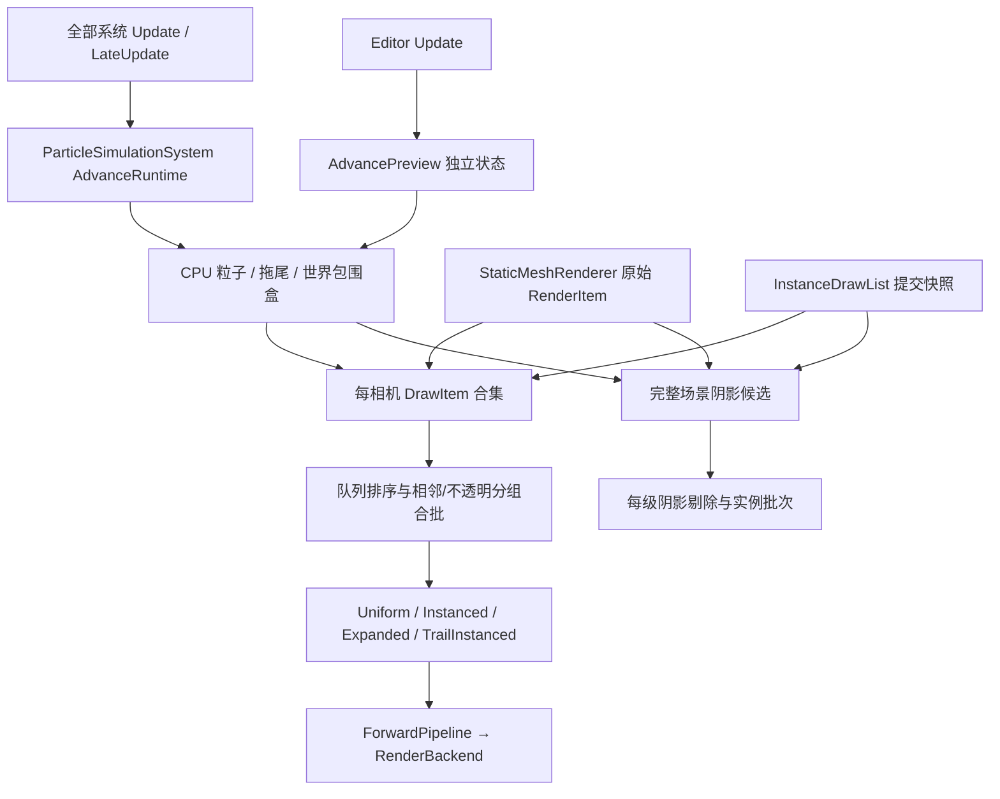

# GPU Instancing 与 CPU 粒子系统详细实施设计

日期：2026-09-27。状态：设计交付，尚未实施。

本文按本次读取的仓库编写；“现状依据”中的行号指设计时的代码。本文只新增设计文档，不代表其中声明的类型、接口、测试已经存在。实施者按章节定义实现，不把示例、验收场景或性能目标当成已完成结果。

> **被取代的部分：** [Standard 几何统一、绘制策略与 Ens Static 修改方案](StandardGeometryAndBatchingDesign.md) 删除 `Legacy` 契约并让 `Standard` 编译展开变体，因此本文中所有关于 `Legacy` 的条款（§3 的接入点表、§6.1 的契约与变体表、§16.2 的旧内容兼容、§19.2 的 GLSL 完整性）按新文档执行：未声明几何契约的 Shader 不再受支持，`Standard` 现在也编译 `Expanded`（可用 `expandedGeometry off` 关闭）。粒子与拖尾条款（`Particle` 契约、两种绘制路径、拖尾实例）继续有效。

## 1. 已确认范围与交付边界

本次交付包含：

1. `StaticMeshRenderer` 自动合批。同 Mesh、同子网格、同材质、同绘制状态的对象，由管线自动组成 GPU 实例批次。
2. C++ 与 C# 显式实例提交接口，供程序化场景提交连续实例数据。
3. CPU 粒子组件，模拟在 CPU 执行，组件可选 `DynamicBatch` 或 `Instanced`。前者 CPU 展开几何并合并动态顶点/索引缓冲；后者上传实例数据。Billboard、Mesh 粒子、拖尾全部实现两条路径。
4. 发射速率、Burst、寿命、初速、重力、阻力、尺寸曲线、旋转曲线、颜色渐变、Local/World 模拟空间、透明/加法混合、图集序列帧。
5. 世界碰撞、碰撞响应、Birth/Collision/Death 子发射器。
6. Inspector 模块配置、曲线/渐变编辑、编辑态播放/暂停/重置、Play 与 Player 运行、场景保存、复制、撤销、打包。

“自动合批”描述提交策略，“实例绘制”描述 GPU 执行方式：静态网格自动合批使用实例绘制；粒子的动态合批使用展开后的顶点。两者都有独立统计。静态网格不进行 CPU 几何拼接，不生成离线合并 Mesh。

以下技术边界固定：OpenGL 现有后端；单主线程模拟与提交；不新增 GPU 粒子模拟、Compute 剔除、Indirect Draw、OIT、粒子间碰撞、粒子刚体反作用力、软粒子深度淡化或粒子专用折射模块。粒子 Mesh 支持现有子网格和材质槽。粒子材质限 Opaque/Transparent；Refraction 材质仍能用于原有静态网格与显式实例提交，但粒子拒绝该队列。透明排序采用中心距离模型，不承诺解决相交透明三角形的逐像素顺序。

## 2. 已核实的现状与接入点

| 现状 | 文件与符号依据 | 对实施的约束 |
|---|---|---|
| 右手系、Forward=-Z、默认 CCW、矩阵列主序 | `Docs/ProjectConventions.md:9`；`OrbedenCore/Src/Rendering/RenderTypes.h:66` | 发射锥朝 -Z；Billboard 正面朝相机；不修改全局手性 |
| Object 派生类必须位于 Runtime/Object；工程列出源文件；生成物通过构建刷新 | `Docs/ProjectConventions.md:83`、`:216` | `ParticleSystem`、`InstanceDrawList` 放在该目录；纯数据与算法放 Runtime/Particles、Rendering |
| RenderSystem 按相机执行剔除、展开、排序 | `OrbedenCore/Src/Rendering/RenderSystem.cpp:339`、`:422` | 粒子模拟不能放在相机循环中 |
| RenderItem 直接保存 renderer、mesh、material、变换和阴影开关 | `OrbedenCore/Src/Rendering/RenderScene.h:74` | 保留原始 RenderItem 用于选中描边；新增统一提交项，不用粒子伪造 StaticMeshRenderer |
| 子网格材质空槽跳过；索引区间在展开时校验 | `OrbedenCore/Src/Rendering/RenderScene.cpp:285` | 新来源执行同样的空槽和区间规则 |
| 当前 Opaque 近到远，Transparent/Refraction 远到近 | `OrbedenCore/Src/Rendering/RenderItemSorter.cpp:16` | 新透明来源必须进入同一排序序列 |
| cameraDistance 为相机到对象位置的距离平方 | `OrbedenCore/Src/Rendering/SceneCuller.cpp:25` | 统一队列保持该度量，不混入另一种深度定义 |
| 每个对象内逐 Pass 设置 u_Model 再 DrawIndexed | `OrbedenCore/Src/Rendering/ForwardPipeline.cpp:267`、`:299`、`:374` | 多 Pass 顺序是兼容边界，不能无条件把对象优先改成 Pass 优先 |
| 透明之后复制场景纹理，再画折射 | `OrbedenCore/Src/Rendering/ForwardPipeline.cpp:231` | 粒子与拖尾在快照前完成；维持 Refraction 顺序 |
| 阴影从完整场景收集 caster，再逐级剔除 | `OrbedenCore/Src/Rendering/CascadedShadowMap.cpp:173`、`:220` | 阴影批次不能复用主相机可见集合 |
| 后端只有静态缓冲创建、固定 Mesh 顶点布局与 DrawIndexed | `OrbedenCore/Src/Rendering/Backend/RenderBackend.h:139`、`:184`；`OrbedenCore/Src/Rendering/Backend/OpenGLRenderBackend.cpp:278` | 增加流式更新、实例布局、扩展顶点布局、实例绘制 |
| 混合因子在初始化时固定为普通 Alpha | `OrbedenCore/Src/Rendering/Backend/OpenGLRenderBackend.cpp:151` | 加法混合需要独立状态与缓存，不能只 SetBlend(true) |
| 每个 Shader Pass 只缓存一个 program | `OrbedenCore/Src/Rendering/GpuResourceManager.h:37`；`.cpp:195` | 增加受控几何变体与释放路径 |
| Shader Pass 有状态解析和位置式 Cooked 读写 | `OrbedenCore/Src/Runtime/AssetPipeline.cpp:550`、`:575`；`OrbedenCore/Src/Runtime/CookedAssetSerializer.cpp:326` | 声明、导入、编译、Cooked 格式一起变更 |
| Update/LateUpdate 受 simulationEnabled 与 paused 控制 | `OrbedenCore/Src/Application.cpp:313` | 粒子在全部系统 LateUpdate 后统一推进；编辑预览独立调度 |
| PhysicsSystem 提供 SweepSphere，查询过滤器目前只过滤层 | `OrbedenCore/Src/Physics/PhysicsSystem.h:58`；`.cpp:199`、`:1516` | 增加粒子专用过滤描述，排除发射器自身与 Trigger |
| 物理同步与 simulate/fetch 当前在同一 FixedUpdate | `OrbedenCore/Src/Physics/PhysicsSystem.cpp:1323` | 编辑预览提供只同步查询场景的入口，不推进刚体 |
| MetaGen 绑定支持 record、数组、Span；持久化 FieldKind 不支持任意 record | `Tools/OrbedenMetaGen/BindingTypes.cs:33`、`:56`、`:72`；`Tools/OrbedenMetaGen/Program.cs:307` | 配置用强类型 Binding；场景以手工反射的 settings 字符串保存 |
| Core 私有字段也可能进入持久化；BIND_IGNORE 不禁止序列化 | `Tools/OrbedenMetaGen/Program.cs:61`、`:250`；`OrbedenCore/Src/Runtime/Native/BindingAnnotations.h:3` | 对新增运行时类型显式配置持久化白名单 |
| 手工字段表已用于物理；RegisterTypeFields 替换整张表 | `OrbedenCore/Src/Physics/PhysicsReflection.cpp:54`；`OrbedenCore/Src/Runtime/Reflection.cpp:542` | 粒子注册必须合并生成字段后一次替换，不能丢失资源引用字段 |
| WorldSerializer 支持 EnsId 数组重映射 | `OrbedenCore/Src/Runtime/WorldSerializer.cpp:341`、`:780`、`:1017` | 子发射器目标用固定16项的EnsId数组；配置中的targetSlot只引用该数组 |
| Editor 每帧顺序为 Tick → Editor Update → Render → GUI；空闲会等待事件 | `OrbedenEditor/Src/editor_main.cpp:92`、`:111` | 预览在 Editor Update 推进，运行预览加入连续重绘条件 |
| 自定义编辑器已有属性事务和多选目标；注册目前在游戏程序集加载流程 | `OrbedenEditor/Managed/Orbeden.Editor/ComponentEditor.cs:14`；`PropertyDocument.cs:30`；`Panels/InspectorPanel.cs:249` | 注册编辑器自带 ParticleSystemEditor；撤销走 PropertyDocument |
| 项目版本为 25，Cooked BlobFormatTag 为 2；升级保留 Content | `OrbedenCore/Src/Defines/Version.h:8`；`OrbedenCore/Src/Runtime/CookedAssetSerializer.cpp:23`；`OrbedenEditor/Src/Editor/ProjectUpgrader.cpp:96` | 本方案实施版本定为 26、BlobFormatTag 定为 3；不得覆盖用户 Shader |

## 3. 总体结构与数据所有权

职责固定如下：

| 类型 | 所有者 | 职责与寿命 |
|---|---|---|
| `ParticleSystem : Component` | World | 持久化配置、资源引用、控制方法；不持有 GPU 对象 |
| `ParticleSimulationSystem : IEngineSystem` | Application | 两套独立模拟上下文 runtime/preview；组件注册；事件派发；世界切换清理 |
| `ParticleSimulationContext` | ParticleSimulationSystem | 当前 World 指针、contentRevision、步进累积器、按组件 ObjectId 排序的状态表 |
| `ParticleEmitterState` | 对应 context | 紧凑粒子池、拖尾池、发射时间、随机流、包围盒、统计 |
| `ParticleRenderer` | RenderSystem | CPU 快照到逐相机 DrawItem、Billboard/Mesh/Trail 几何；不推进时间 |
| `InstanceDrawList : Object` | 创建它的 World 或孤立对象所有者 | 显式实例数据；Submit 时复制出一次 Render 快照 |
| `DrawBatchBuilder` | ForwardPipeline | 可绘制项排序后的批次构造；每相机重用临时容器 |
| `GpuDrawStream` | ForwardPipeline | 实例 VBO、动态 VBO/IBO、动态 VAO；阴影和主 Pass 共用，但逐批上传 |
| `GpuResourceManager` | RenderSystem | 静态 Mesh 的普通/实例 VAO、Shader 变体、材质缓存 |
| `ParticleSystemEditor` | CustomEditorRegistry | 模块 UI、图形曲线与渐变控件、预览按钮 |

组件、材质、Mesh 的长期引用使用 `Ref<T>` 或稳定 ObjectId；主线程内已验证且仅在一次 Render 内使用的指针可以放临时 DrawItem。`Ref<T>` 是软引用，不阻止销毁，依据 `Runtime/Object/Object.h:457`；提交快照在使用前重新解析引用。GPU 资源只能由渲染线程创建和销毁。

runtime 与 preview 不共享粒子数组、随机状态、发射时间、拖尾或事件。共享的是组件配置与资源。预览不改 Transform、序列化字段、World dirty 标记和物理速度。

## 4. 文件清单

以下 `.h/.cpp` 均成对新增；头文件使用 `#pragma once`。纯数据类型文件的 `.cpp` 承载校验和求值实现，不创建空实现文件。

| 新文件基名 | 主类型/命名空间 |
|---|---|
| `OrbedenCore/Src/Runtime/Object/ParticleSystem` | ParticleSystem |
| `OrbedenCore/Src/Runtime/Object/InstanceDrawList` | InstanceDrawList |
| `OrbedenCore/Src/Runtime/Particles/ParticleSettings` | ParticleSettings 及其模块值类型 |
| `OrbedenCore/Src/Runtime/Particles/ParticleSettingsCodec` | ParticleSettingsCodec |
| `OrbedenCore/Src/Runtime/Particles/ParticleReflection` | ParticleReflection |
| `OrbedenCore/Src/Runtime/Particles/ParticleSimulationSystem` | ParticleSimulationSystem |
| `OrbedenCore/Src/Runtime/Particles/ParticleSimulationContext` | ParticleSimulationContext、EmitterState、粒子/拖尾记录 |
| `OrbedenCore/Src/Rendering/InstanceDrawData` | MeshInstanceData、InstanceDrawOptions、提交快照 |
| `OrbedenCore/Src/Rendering/DrawBatchBuilder` | DrawItem、DrawBatchKey、DrawBatch、DrawBatchBuilder |
| `OrbedenCore/Src/Rendering/GpuDrawStream` | GpuDrawStream、GPU 布局结构 |
| `OrbedenCore/Src/Rendering/ParticleRenderer` | ParticleRenderer |
| `OrbedenCore/Src/Rendering/ShaderGeometryVariant` | ShaderGeometryVariant 源码生成函数 |
| `OrbedenEditor/Managed/Orbeden.Editor/ParticleSystemEditor.cs` | ParticleSystemEditor |
| `OrbedenEditor/Managed/Orbeden.Editor/ParticleCurveEditor.cs` | ParticleCurveEditor、ParticleGradientEditor |
| `OrbedenEditor/Templates/Builtin/geometry_input.orbinc` | 几何 ABI GLSL |
| `OrbedenEditor/Templates/Builtin/Shaders/particle_unlit.orbshader` | Billboard/Mesh 粒子 |
| `OrbedenEditor/Templates/Builtin/Shaders/particle_trail.orbshader` | 拖尾 |
| `OrbedenEditor/Templates/Builtin/Materials/particle_unlit.orbmat`、`particle_trail.orbmat` | 模板材质 |

修改文件包括：`Application.h/.cpp`、`RenderTypes.h`、`RenderSystem.h/.cpp`、`ForwardPipeline.h/.cpp`、`RenderScene.h/.cpp`、`CascadedShadowMap.h/.cpp`、`GpuResourceManager.h/.cpp`、`Backend/RenderBackend.h`、`Backend/OpenGLRenderBackend.h/.cpp`、`Runtime/Object/Shader.h/.cpp`、`Runtime/Object/StaticMeshRenderer.h`、`Runtime/AssetPipeline.cpp`、`Runtime/CookedAssetSerializer.cpp`、`Physics/PhysicsTypes.h`、`Physics/PhysicsSystem.h/.cpp`、`Tools/OrbedenMetaGen/Program.cs`、`Defines/Version.h`。

编辑器修改：`EditorSystem.h/.cpp`、`EditorGUI.h/.cpp`、`ManagedEditorBridge.cpp`、`EditorRuntime.cs`、`EditorApplication.cs`、`NativeEditorGUI.cs`、`CustomEditorRegistry.cs`、`PropertyDocument.cs`、`Panels/InspectorPanel.cs`、`Panels/RenderingPanel.cs`、`NewProjectTemplate.h/.cpp`。工程更新 Core/Editor 的 `.vcxproj` 与 `.vcxproj.filters`。C# 新文件由 SDK 项目 glob 收集，依据 `Orbeden.Editor.csproj:1`。

实施过程中的公开新函数使用简短中文 XML summary 注释，数值采用 `Defines/types.h` 别名。GPU 布局固定数组只用于内部类型，不能暴露为生成 Span 元素。

## 5. GPU 数据与后端接口

### 5.1 固定布局

所有偏移为字节，结构必须 `static_assert(sizeof(...))` 和 `offsetof` 校验。采用 32 位 float，不依赖 GLM/SIMD 结构对齐。

`GpuMeshInstance`，144 字节：

| 字段 | 类型 | 偏移 | attribute location |
|---|---|---:|---|
| model | `float32[16]`，列主序 | 0 | 5、6、7、8，每列 vec4 |
| normalColumns | `float32[12]`，三列补齐 vec4 | 64 | 9、10、11 |
| tint | `float32[4]`，线性 RGB、覆盖率 Alpha | 112 | 12 |
| uvRect | `float32[4]`，offsetU/offsetV/scaleU/scaleV | 128 | 13 |

`GpuExpandedVertex`，60 字节：position vec3@0、normal vec3@12、uv vec2@24、tangent vec3@32、tint vec4@44；location 依次为 0、1、2、3、4。已经是世界空间位置、法线和切线；UV 已完成图集变换。

`GpuTrailInstance`，112 字节：corners[4] 为四个补齐 vec4，偏移 0/16/32/48，location 5..8；startColor vec4@64 location9；endColor vec4@80 location10；uvRange vec4@96 location11，值为 `(u0,u1,0,1)`。corners 顺序 `startLeft,startRight,endRight,endLeft`。Mesh 普通顶点仍为现有 44 字节布局。

实例 attributes divisor 全部为 1，普通顶点 attributes divisor 为 0。初始化检查 `GL_MAX_VERTEX_ATTRIBS >= 14`，不足时实例能力为 false，自动合批走原始单绘制；显式实例提交与粒子 Instanced 返回可诊断失败，不能偷偷改为 DynamicBatch。

新增枚举，序号固定：

- `GpuVertexLayout : uint32 { Mesh=0, InstancedMesh=1, Expanded=2, InstancedTrail=3 }`。
- `GpuBufferUsage : uint32 { Static=0, Stream=1 }`。
- `BlendMode : uint32 { Alpha=0, Additive=1 }`。
- `GeometryMode : uint32 { Uniform=0, Instanced=1, Expanded=2, TrailInstanced=3 }`。

### 5.2 后端接口与实现步骤

`GpuBufferDesc` 新增 `GpuBufferUsage usage=Static`；`GpuVertexInputDesc` 新增 `GpuVertexLayout layout=Mesh`。不修改原字段默认行为。

新增 RenderBackend 虚函数，OpenGLRenderBackend 对应 override：

| 签名 | 实现契约 |
|---|---|
| `bool SupportsInstancing() const` | 返回初始化保存的能力，不在 Draw 时查询 GL |
| `bool UploadVertexBuffer(GpuVertexBufferID id, const void* data, usize size, usize capacity)` | 验证 id、size≤capacity、非零 size 的指针；用 GL_ARRAY_BUFFER 绑定、glBufferData(capacity,null,GL_STREAM_DRAW) orphan，再 glBufferSubData(0,size,data)；保留 handle |
| `bool UploadIndexBuffer(GpuIndexBufferID id, const uint32* data, uint32 count, uint32 capacity)` | 同样 orphan；用 GL_ARRAY_BUFFER 更新避免污染当前 VAO 的 EBO；更新 indexBufferCounts 与引用该 IBO 的 VAO 索引数量缓存 |
| `bool BindInstanceBuffer(GpuVertexBufferID id, usize byteOffset)` | 根据当前 VAO 的 InstancedMesh/InstancedTrail 布局设置 attribute 指针及 divisor；验证 offset 对齐和可读记录数；恢复 ARRAY_BUFFER 绑定缓存 |
| `void SetBlendMode(BlendMode mode)` | Alpha=`SRC_ALPHA, ONE_MINUS_SRC_ALPHA; ONE, ONE_MINUS_SRC_ALPHA`；Additive=`SRC_ALPHA, ONE; ZERO, ONE`，分号分隔 RGB/Alpha；缓存 mode，BeginFrame 重设基线 |
| `void DrawIndexedInstanced(uint32 indexStart, uint32 indexCount, uint32 instanceCount)` | 0 count 空操作；验证当前 VAO、program、索引范围、GLsizei 上界、实例缓冲范围；调用 glDrawElementsInstanced(GL_TRIANGLES, count, GL_UNSIGNED_INT, indexStart*4, instanceCount) |

创建流式缓冲允许非零 capacity + data=null。VAO 创建时 InstancedMesh/InstancedTrail 只建立网格顶点与 EBO，实例 attribute 在 BindInstanceBuffer 时设置。普通/实例 VAO 独立，禁止在普通 Mesh VAO 上切换 divisor。每个 GpuMesh 新增 `GpuVertexInputID instancedVertexInput`，上传时创建，释放时先释放两份 VAO 再释放 VBO/IBO。动态缓冲初始 IBO 至少分配 3 个 uint32，避免现有零索引数创建检查。

`GpuDrawStream` 公共接口：`Initialize(RenderBackend*)`、`UploadMeshInstances(std::span<const GpuMeshInstance>)`、`UploadTrailInstances(std::span<const GpuTrailInstance>)`、`UploadExpanded(std::span<const GpuExpandedVertex>, std::span<const uint32>)`、`Shutdown()`，三个 Upload 返回 bool；内部持有 instanceBuffer、expandedVertexBuffer、expandedIndexBuffer、expandedVertexInput 以及三个 byteCapacity。

每次上传写入 offset=0，一次上传之后完成该批绘制再进行下一次 orphan。OpenGL 负责在途旧存储的寿命；首版不实现映射环形缓冲、fence 等待或 glFinish。容量从 64 KiB 按 2 倍增长到所需大小，保留到缓存失效/Shutdown。单次 instanceCount≤65536；单次 expanded 顶点≤262144、索引≤786432。构建器在完整实例或完整三角形边界切批；一个巨大 Mesh 展开时逐三角形写入，不越限、不丢面。

失败时本批不画，记录一次带资源 ID 的错误与失败计数；当前帧继续执行其他批。默认状态恢复含 BlendMode::Alpha，避免加法污染天空盒、描边、输出和 GUI。

## 6. Shader 几何 ABI 与兼容行为

### 6.1 声明与变体

在显式 Pass 的首个 stage 之前新增 `Geometry Standard` 或 `Geometry Particle`，未声明为 `Geometry Legacy`。为单 Pass 简写增加顶层 `--------geometry Standard|Particle|Legacy`，作用于其唯一 Pass；显式 Pass 禁止混用顶层 geometry。重复声明、非法值、stage 后声明均导入报错。

新增 `ShaderGeometryContract : uint32 { Legacy=0, Standard=1, Particle=2 }`，`ShaderPass.geometryContract=Legacy`。Standard 编译 Uniform/Instanced；Particle 编译 Uniform/Instanced/Expanded/TrailInstanced。GpuShaderPass 保留 `shaderProgram` 作为 Uniform，新增 `instancedProgram`、`expandedProgram`、`trailInstancedProgram` 和 geometryContract；Legacy 只编译 Uniform。四个句柄分别拥有各自 program，不设置拥有型别名。所有声明支持的变体必须编译成功，任一失败让该 Shader 上传失败，释放已创建 program。错误含 shader key、Pass 名、GeometryMode 和编译日志。`GpuShader::IsValid` 按contract检查所需句柄，天空盒/描边原调用继续使用shaderProgram。

`ShaderGeometryVariant::BuildSource(const std::string& source, GeometryMode mode, std::string& output, std::string& error)`：定位唯一且位于第一条有效指令的 `#version`；在其换行后插入 `#define ORBEDEN_GEOMETRY_MODE N` 和恢复源行号的 `#line`；保留前面的 BOM/注释处理；没有合法 #version 则失败。不做 `u_Model` 字符串替换。顶点、片元阶段均注入同一宏。include 继续由资源导入展开，不在 OpenGL 后端查磁盘。

`geometry_input.orbinc` 提供：

- `mat4 OrbedenGetModel()`：Uniform 返回 u_Model；Instanced 从 locations5..8 构造；Expanded 返回单位矩阵。
- `mat3 OrbedenGetNormalMatrix()`：Uniform 为 transpose(inverse(mat3(u_Model)))；Instanced 读补齐三列；Expanded 返回单位矩阵。
- `vec4 OrbedenGetTint()`：Uniform 返回 u_InstanceTint；Instanced 返回 location12；Expanded 返回 location4。
- `vec2 OrbedenGetUv(vec2 uv)`：Uniform/Instanced 做 uv*scale+offset；Expanded 原样。
- `vec3 OrbedenGetTrailPosition(vec2 uv)`、`vec4 OrbedenGetTrailColor(vec2 uv)`：TrailInstanced 根据 quad 的 0/1 UV 选择/插值四角与两端颜色；Expanded 用世界坐标顶点及其颜色。

Uniform 的 u_InstanceTint 默认显式绑定白色，u_InstanceUvRect 绑定 `(0,0,1,1)`，不依赖 GL 默认 uniform=0。将这两个名称加入 `Shader.cpp` 的内置 uniform 排除表。颜色从 CPU 转线性一次；shader 不执行第二次 sRGB 解码。

内置 `blinn_phong`、`pbs_metallic`、`transparent` 改成 Standard；所有 u_Model 位置运算改用 OrbedenGetModel，UV 改用 OrbedenGetUv。PBS 法线使用 OrbedenGetNormalMatrix；Blinn/transparent 的原法线公式使用 mat3(OrbedenGetModel)，保持这次 instancing 的单绘制/实例绘制一致性，不顺带改变旧材质光照。新增粒子 unlit Shader 使用 Particle contract，并乘入每粒子 tint。拖尾 Shader 为 Particle contract，仅 Expanded/TrailInstanced 作为合法提交模式；其它已编译变体只用于编译契约校验。

`shadow_depth.orbshader` 转 Particle contract，世界坐标使用 OrbedenGetModel，以支持普通、实例、展开几何的阴影。没有升级的 Legacy shadow Shader 保持逐对象阴影绘制。已存在的 Refraction 自定义 Shader 不自动改写；作者显式采用 Standard 后才能实例化。

### 6.2 材质与多 Pass

批次必须引用同一个 Material 对象，不因数值相同合并两个 Material。材质 GPU 上传完成后才读取变体 program，GPU cache 刷新后不复用旧 program 指针。

自动合批只合并单 Pass、Standard 的静态几何。多 Pass Shader 保持每个对象依次完成全部 Pass，再进入下个对象。显式实例 API 拒绝多 Pass Shader；粒子与拖尾也拒绝多 Pass Shader。这是明确支持约束，Inspector 和 API 均返回错误，不悄悄改变 Pass 顺序。

自动不透明重排只允许最终状态 `DepthTest=On, DepthWrite=On, Blend=Off` 的单 Pass Standard 项。其他 Opaque 项成为排序屏障，屏障前后不合并。透明和折射仅合并全局排序后连续同 key 的项；加法项也服从该规则，防止改变与普通 Alpha 项的混合顺序。

## 7. 统一绘制项、自动合批和显式提交

### 7.1 类型定义

`DrawSource : uint32 { StaticMesh=0, ExplicitInstance=1, Particle=2, Trail=3 }`。`DrawGeometry : uint32 { Mesh=0, BillboardQuad=1, TrailQuad=2 }`。

`DrawItem` 字段：`DrawSource source`、`DrawGeometry geometry`、`EnsId owner`、`int32 sourceObjectId`、`uint64 elementId`、`uint32 subMeshIndex/indexStart/indexCount/drawLayer`、`Mesh* mesh`、`Material* material`、`DrawQueue queue`、`GeometryMode mode`、`BlendMode blendMode`、`matrix4x4 model`、`bounds3 worldBounds`、`float32 cameraDistance`、`color linearTint`、`color uvRect`、`bool castShadows/receiveShadows/reorderable`、`uint32 sourceIndex`。uvRect 使用 color 仅作为内部四浮点容器，禁止颜色空间转换。`sourceIndex` 指向当前帧的粒子或拖尾几何记录，不能跨 Render 保存。Quad来源mesh=null，geometry独立区分，不能把空指针交给GetMesh。

稳定顺序键为 `(source,owner.id,owner.version,sourceObjectId,elementId,subMeshIndex)`。静态 elementId=0；显式为提交序号高 32 位+实例索引低 32 位；粒子为 birthId；拖尾为 trailId 与 segmentIndex 的复合记录编号。相同稳定键仍相同顺序，用 stable_sort 保持输入顺序。

`DrawBatchKey` 字段：queue、mode、geometry、blendMode、mesh ObjectId、subMeshIndex、indexStart、indexCount、material ObjectId、Pass index、program ID、解析后的 depthTest/depthWrite/blend/cull、receiveShadows。Shadow key 不含 Material，只含 Mesh、区间、深度 program、mode；drawLayer 在剔除前使用，不影响最终渲染状态。DynamicBatch 的 key 不含 geometry/mesh/子网格/区间，因为几何已经展开；仍包含材质与全部状态。

`DrawBatch` 保存 key、连续输入索引列表 `List<uint32> items`、instanceCount、expandedVertexCount、expandedIndexCount。不得用 ObjectId 的大小代替完整 key 比较；hash 冲突时比较全部字段。

### 7.2 DrawBatchBuilder 函数

| 签名 | 实现步骤 |
|---|---|
| `void BuildCameraItems(const VisibleSet&, const List<InstanceSubmission>&, const ParticleFrameSnapshot&, List<DrawItem>&)` | 复制现有 RenderItem 到 DrawItem；解析显式快照资源并逐实例变换包围盒；追加逐粒子/逐拖尾段项；按相机 layer/frustum 过滤；距离采用世界中心距离平方；非法数值剔除并计数 |
| `void SortItems(List<DrawItem>&)` | 先队列；Transparent/Refraction 按距离降序和稳定键；Opaque 初始按距离升序与稳定键；仅在连续 reorderable 区间内按 key 分组，组顺序按组内最小距离再稳定键，组内距离升序 |
| `void BuildBatches(const List<DrawItem>&, List<DrawBatch>&)` | 按排序结果顺序扫描；同 key 连续项且满足容量时追加；不兼容立即结束当前批；自动来源同 key 数量≥2 才使用 Instanced，否则 Uniform；显式与粒子选 Instanced 时数量1也走实例绘制 |
| `void BuildShadowItems(const RenderScene&, const List<InstanceSubmission>&, const ParticleFrameSnapshot&, const RenderCamera&, const frustum&, List<DrawItem>&)` | 从完整静态场景、全部显式实例、全部 Opaque Mesh 粒子收集；筛 castShadows/layer/级联视锥；保留现有阴影区间校验；按 shadow key 分组；不调用 BuildCameraItems 的可见结果 |
| `void Clear()` | 清 size，保留 capacity；清本相机临时指针和错误去重集合；不释放 GPU |

`StaticMeshRenderer` 新增公开持久化 `bool enableInstancing=true`。false 始终生成 Uniform 屏障项。负尺度保持现有 CCW 与剔除语义，不调用 glFrontFace 修正；不同 determinant 符号可合批，因为每个实例的顶点绕序由其模型变换产生。所有位置和矩阵元素必须有限；需要逆矩阵且 `abs(det(mat3(model)))<1e-8` 的实例不提交，计数 `invalidTransforms`；自动来源保留旧 Uniform 行为并记录非实例化原因。

### 7.3 显式实例 API

`MeshInstanceData` 为可 Binding 的普通 struct：`vector3 position={0,0,0}`、`quaternion rotation={0,0,0,1}`、`vector3 scale={1,1,1}`、`color tint={1,1,1,1}`、`color uvRect={0,0,1,1}`。tint 输入是 sRGB，Alpha 原样。此 API 使用 TRS；父级/shear 不由该记录表达，静态 Renderer 仍上传完整世界矩阵。

`InstanceDrawOptions`：`uint32 drawLayer=1`、`bool castShadows=true`、`bool receiveShadows=true`、`EnsId camera`（默认空表示全部相机）。目标相机失效则该提交不画；camera 非空时只参与该相机主 Pass 和该相机阴影。

`InstanceDrawList` 位于 Runtime/Object，使用 OBJECT_TYPE_DECLARE，运行时对象，不是组件或资源。私有字段 `Ref<Mesh> mesh; Ref<Material> material; uint32 subMeshIndex; InstanceDrawOptions options; List<MeshInstanceData> instances;`；全部不序列化。

公开方法与语义：

| 方法 | 精确行为 |
|---|---|
| `bool Configure(Mesh* mesh, uint32 subMeshIndex, Material* material, const InstanceDrawOptions& options)` | 验证非空资源、有效区间、单 Pass Standard、选项；失败保留旧配置；成功只替换配置，不清实例 |
| `ORBEDEN_BIND_BUFFER(data,count) bool SetInstances(const MeshInstanceData* data, int32 count)` | count 范围 0..1,048,576；0 清列表；非零指针必须有效；全量验证有限数/非零 quaternion/非奇异 scale，归一化 quaternion；全部通过再复制，失败保留旧值 |
| `int32 GetInstanceCount() const` | 返回实例数 |
| `bool Submit()` | 查当前 RenderSystem 和调用对象所属 World；孤立对象采用 Application 当前 World；拒绝渲染读取期间调用、世界准备阶段、无后端/无实例能力；复制完整配置和实例到下一次 Render 的提交列表；返回是否接收 |
| `void Clear()` | 清对象内实例，不撤回此前 Submit 快照 |

C# 使用生成接口 `Object.CreateInstance<InstanceDrawList>()`、`SetInstances(ReadOnlySpan<MeshInstanceData>)`、`Submit()`，不增加手写函数表。方法大小写与原生声明一致；生成ReadOnlySpan的依据为 `Tools/OrbedenMetaGen/BindingGenerator.cs:311`。Submit 不创建 Ens，不进入选中描边。

`RenderSystem::SubmitInstances(World&, const InstanceDrawOptions&, Mesh*, uint32, Material*, std::span<const MeshInstanceData>)` 返回 bool，复制成 `InstanceSubmission`。快照字段为 sourceObjectId、World*、contentRevision、submissionId、options、Ref<Mesh>、Ref<Material>、subMeshIndex、instances。Render 开始交换 pending/active；所有相机共享 active；所有早退出口同样清 active；Render 结束清 active。帧前没有相机也消费提交。Submit 两次表示画两组，暂停时没有新 Submit 就不重复上一帧。

每次 Render 最多接收 1,048,576 个显式实例，超过时本次 Submit 整体失败，不接收前半段。实例容量上限与 GPU 单批 65536 不同，大提交按批切分。内容 revision、资源销毁和 Shader 热更在消费时重新验证。失效提交跳过并计数。

## 8. RenderSystem、ForwardPipeline 与阴影改造

`RenderSystem::Render` 的完整接入顺序：

1. 消费显式 pending 快照；释放已销毁 GPU 资源。
2. 执行原 scene.Update 与相机准备。ParticleSimulationSystem 只提供快照；本阶段不推进模拟。
3. ParticleRenderer 捕获当前使用的 runtime 或 preview 状态，读取本帧最新 Transform 构造世界包围盒。
4. scene.BeginRead 后逐相机执行原 culler.Cull、BuildRenderItems、sorter.Sort，保留该 VisibleSet 给描边。
5. ForwardPipeline 合并三种来源并生成 DrawItem/DrawBatch，依次执行阴影、天空盒、Opaque、Transparent、相机纹理复制、Refraction。
6. 原选择描边仍遍历静态 RenderItem；粒子选中反馈在编辑器画包围盒、发射形状、拖尾线框，不把每个粒子放进实体描边遮罩。
7. 原调试线和 OutputPass；所有相机结束后清 active 显式提交、粒子临时快照、DrawItem，配对 EndRead。

ForwardPipeline 新增 `DrawBatchBuilder batchBuilder; GpuDrawStream drawStream;`。将现有 RenderQueueItems 的公共 uniform、材质纹理绑定保留在 `BindDrawState(const DrawBatch&, const RenderCamera&, ...)` 中，新增 `ExecuteBatch(const DrawBatch&, ...)`：

- Uniform：使用原模型 uniform 和 DrawIndexed；多 Pass 来源仍在这一分支逐对象执行。
- Instanced：构造 GpuMeshInstance 数组，UploadMeshInstances，绑定 instancedVertexInput/实例 buffer，DrawIndexedInstanced。
- Expanded：取得 ParticleRenderer 生成的世界顶点/索引，UploadExpanded，绑定动态 VAO，DrawIndexed。
- TrailInstanced：构造 GpuTrailInstance，上传，共享 quad 的 InstancedTrail VAO，DrawIndexedInstanced(0,6,count)。

`BindDrawState` 每次切换 program 使用实际 program ID 做配置缓存；不能把 Uniform 已设置的相机 uniform 当成 Instanced 已设置。设置 BlendMode 后再 SetBlend。所有模式显式设置 u_ReceiveShadows、u_InstanceTint、u_InstanceUvRect。现有阴影纹理、相机纹理、环境反射纹理槽位关系保留，依据 `ForwardPipeline.cpp:356`。

`CascadedShadowMap::Render` 增加完整 InstanceSubmission 和 ParticleFrameSnapshot 只读参数，以及 GpuDrawStream 引用。保持分区计算、atlas、SDSM 历史逻辑；把逐 renderer 绘制部分替换为 BuildShadowItems→批次执行。Legacy depth Shader 的 Mesh 阴影以 Uniform 逐实例画。DynamicBatch Mesh 粒子阴影使用 Expanded 顶点 + 扩展阴影变体，Expanded 时直接 lightVP*worldPosition；Legacy depth Shader 缺少该变体时，用源 Mesh 与粒子模型矩阵逐个绘制阴影，主 Pass 仍保持 DynamicBatch。

仅 Mesh、Opaque、castShadows=true 的粒子投射阴影；Billboard 和 Trail 的 castShadows 无效并在 UI 禁用。无材质 alpha/displacement ShadowCaster 契约仍按几何轮廓投影，与既有阴影边界一致。新增功能不扩大这项既有承诺。

`InvalidateResourceCaches` 与 `Shutdown` 释放 drawStream、ParticleRenderer 的 quad、所有额外 VAO/变体；CPU 粒子在单纯 GPU cache 失效时保留。World 替换、离开 Play、关闭项目清模拟；同项目 Shader 重导入只清 GPU 资源，不重置粒子时间。

## 9. 粒子配置类型、默认值与校验

### 9.1 值类型

全部配置类型位于 `Runtime/Particles/ParticleSettings.h`，字段公开，按下表顺序声明。它们不是 Object，不能放进 Runtime/Object。所有枚举底层 `uint32`，下面列举顺序从 0 递增。

| 枚举 | 枚举项 |
|---|---|
| ParticleSimulationSpace | World, Local |
| ParticleRenderPath | DynamicBatch, Instanced |
| ParticleRenderMode | Billboard, Mesh |
| ParticleShape | Point, Sphere, Cone, Box |
| ParticleCurveInterpolation | Linear, Cubic, Constant |
| ParticleCollisionResponse | Bounce, Kill |
| ParticleSubEmitterEvent | Birth, Collision, Death |
| ParticlePlaybackState | Stopped, Playing, Paused, Draining |
| ParticlePreviewAction | Play, Pause, Reset, Stop |

基础结构：

- `ParticleFloatRange { float32 min=1; float32 max=1; }`，有限且 min≤max。
- `ParticleCurveKey { float32 time=0; float32 value=1; float32 inTangent=0; float32 outTangent=0; ParticleCurveInterpolation interpolation=Linear; }`。
- `ParticleCurve { List<ParticleCurveKey> keys; }`，默认两个 key 为 `(0,1,0,0,Linear)`、`(1,1,0,0,Linear)`。
- `ParticleGradientKey { float32 time=0; color value={1,1,1,1}; }`。
- `ParticleGradient { List<ParticleGradientKey> keys; }`，默认 time0/time1 两个白色 key。
- `ParticleBurst { float32 time=0; uint32 count=10; uint32 cycles=1; float32 interval=0.1; float32 probability=1; }`。
- `ParticleSubEmitterRule { uint32 targetSlot=0; ParticleSubEmitterEvent event=Birth; uint32 count=1; float32 probability=1; bool inheritVelocity=false; bool inheritColor=false; bool inheritSize=false; }`。

### 9.2 模块与完整字段

`ParticleMainSettings`：

| 字段 | 类型/默认值 | 合法范围与语义 |
|---|---|---|
| maxParticles | uint32 / 4096 | 1..65536，活粒子硬上限 |
| duration | float32 / 5 | 0.01..3600 秒，单个发射循环长度 |
| looping | bool / true | 控制时间线重复 |
| playOnAwake | bool / true | 激活后首次 runtime Advance 自动播放 |
| startDelay | float32 / 0 | 0..3600 秒；仅 Play 后首次延迟，循环不重复延迟 |
| simulationSpace | ParticleSimulationSpace / World | 粒子位置/速度的存储空间 |
| randomSeed | uint32 / 1 | 固定种子；0 规范化为 1；无隐式时间随机种子 |
| startLifetime | ParticleFloatRange / 2..2 | 0.001..3600 秒 |
| startSpeed | ParticleFloatRange / 1..1 | 0..100000 世界单位/秒 |
| startSize | ParticleFloatRange / 1..1 | 0.0001..100000；Billboard 边长，Mesh 均匀尺度 |
| startRotation | ParticleFloatRange / 0..0 | -360000..360000 度，绕局部 +Z |
| startColor | color / 白色 | RGB 0..1，Alpha 0..1，配置是 sRGB |

`ParticleEmissionSettings`：`bool enabled=true; float32 rateOverTime=10; List<ParticleBurst> bursts;`。rate 范围 0..100000/s；bursts≤64；count≤65536、cycles1..1024、probability0..1；time 在 `[0,duration)`；cycles>1 时 interval>0，最后一次时间必须 `<duration`。Burst 顺序保持用户数组顺序，用数组索引打破同时间平局。

`ParticleShapeSettings`：`ParticleShape shape=Point; float32 radius=0.5; vector3 boxExtents={0.5,0.5,0.5}; float32 coneAngle=25; bool surfaceOnly=false;`。radius/每个 extents 为 0..100000；coneAngle 为 0..89 度。Point 忽略尺寸；Sphere 的 surfaceOnly 选择球壳/球体；Box 选择表面/体积；Cone 在局部 XY 圆盘出生，surfaceOnly 选择圆周/圆盘，方向沿 -Z 锥体。

`ParticleMotionSettings`：`float32 gravityMultiplier=0; vector3 acceleration={0,0,0}; float32 drag=0; ParticleCurve sizeOverLifetime; ParticleCurve angularVelocityOverLifetime; ParticleGradient colorOverLifetime;`。gravityMultiplier -100..100；acceleration 每轴 -100000..100000，世界空间；drag0..1000/s。angularVelocityOverLifetime 默认两个 value=0 的 key，单位度/秒；sizeOverLifetime 默认1，求值结果小于0时取0。颜色求值结果乘 startColor，颜色 Alpha 不受 sRGB 转换。

`ParticleCollisionSettings`：`bool enabled=false; uint32 layerMask=0xFFFFFFFFu; float32 radiusScale=0.5; float32 restitution=0.5; float32 friction=0; float32 lifetimeLoss=0; ParticleCollisionResponse response=Bounce;`。radiusScale0.0001..1000；restitution/friction/lifetimeLoss0..1；采用世界球体 sweep；不与粒子相撞；不对刚体施力。

`ParticleTrailSettings`：`bool enabled=false; float32 lifetime=0.5; float32 minimumVertexDistance=0.05; float32 maximumVertexInterval=0.05; uint32 maxPointsPerTrail=32; uint32 maxTrails=4096; float32 width=0.2; ParticleCurve widthOverLength; ParticleGradient colorOverLength; bool dieWithParticle=false; float32 textureTileLength=1;`。lifetime0.001..60；minimumVertexDistance0..100000；maximumVertexInterval1/240..1 秒；maxPointsPerTrail2..64；maxTrails1..65536 且 `maxTrails*maxPointsPerTrail≤1,048,576`；width0..100000；textureTileLength0.0001..100000。widthOverLength 默认1；colorOverLength 默认白色。拖尾随组件的 renderPath 选择动态展开或段实例，不提供隐式独立回退。

`ParticleRenderSettings`：`ParticleRenderPath path=Instanced; ParticleRenderMode mode=Billboard; BlendMode blendMode=Alpha; uint32 tilesX=1; uint32 tilesY=1; float32 animationCycles=1; bool randomStartFrame=false;`。tilesX/tilesY1..256，总格≤65536；animationCycles0..1000。图集行从图像上方开始，具体 UV 见第 13 节。

`ParticleSettings` 字段顺序固定：`ParticleMainSettings main; ParticleEmissionSettings emission; ParticleShapeSettings shape; ParticleMotionSettings motion; ParticleCollisionSettings collision; ParticleTrailSettings trails; ParticleRenderSettings rendering; List<ParticleSubEmitterRule> subEmitters;`。subEmitters≤16，count1..65536、probability0..1，targetSlot<16；是否存在目标槽位在运行时解析，不影响延迟场景引用恢复。

### 9.3 曲线、渐变与验证算法

曲线 key 数 2..64，time 必须在0..1，排序后严格递增，首尾必须为0/1；重复 time 拒绝，不替用户合并；value/tangent 必须有限，绝对值≤1e6。用于长度/寿命归一化时 clamp t 到0..1。线性使用两值 lerp；Constant 使用左 key 的 value；Cubic 使用 Hermite：`h00*v0+h10*dt*outTangent0+h01*v1+h11*dt*inTangent1`，dt 是两 key 的归一化时间差。段模式取左 key 的 interpolation。t=1 返回末 key value。

渐变 key2..64，同样严格首尾0/1、time递增。RGB/Alpha 范围0..1；先将每个 RGB key 转为线性，再按归一化时间线性插值；Alpha 单独线性插值。startColor 同样出生时转线性，再与渐变相乘。

`ParticleSettings::Validate(const ParticleSettings&, std::string& error)` 返回 bool，按本文字段顺序检查，第一项失败返回字段路径，例如 `motion.sizeOverLifetime.keys[2].time`。不把 NaN clamp 成0；非法配置整体拒绝。`Normalize` 只排序 keys、将 seed0改1、规范化负零、消除表示差异，不改变超界值；验证之前不提交任何状态。

`EvaluateCurve(const ParticleCurve&, float32 t)`、`EvaluateGradient(const ParticleGradient&, float32 t)` 使用 upper_bound 找右端点并按上述公式求值；`SampleRange(const ParticleFloatRange&, uint32& randomState)` 用下一次随机数做 lerp。这三个函数在 ParticleSettings.cpp，读取配置，不写共享 key。

## 10. ParticleSystem 的持久化与公开 API

### 10.1 组件字段

`ParticleSystem : Component` 使用 OBJECT_TYPE_DECLARE、ORBEDEN_COMPONENT_UNIQUE。

公开持久化字段：`Ref<Mesh> mesh; List<Ref<Material>> materials; Ref<Material> trailMaterial; std::array<EnsId,16> subEmitterTargets{}; uint32 drawLayer=1; bool castShadows=false; bool receiveShadows=false;`。Mesh 模式逐子网格取 materials；Billboard 只读 materials[0]。空材质不画，但继续模拟；trailMaterial 空时不画拖尾。新加组件保持空资源，不在构造函数同步加载资源；材质由使用者在 Inspector 里赋值（原先计划的“使用内置粒子材质”按钮已删除，内置资源统一走 DevPanel 的 Reset Builtin）。

资源、目标列表、drawLayer、shadow 字段均加 `ORBEDEN_BIND_CHANGED(OnConfigurationChanged)`。private：`bool enabled=true; ParticleSettings settings; uint64 configurationRevision=1;`。settings 仅通过 Get/Set 修改。运行时粒子不放在组件字段中。

`ParticleReflection::Register()` 在 Application::Initialize 的生成反射与 PhysicsReflection 之后执行，生成已有7个公开字段的表，拷贝该表并追加：

- `enabled`：Bool，持久化；读 GetEnabled，写 SetEnabled。
- `settings`：String，持久化；读 Encode(GetSettings())，写 Decode→SetSettings；typed getter/setter 都使用 Reflection::Value string。

整张表一次 RegisterTypeFields。`MetaGen/Program.cs::IsPersistentField` 对 ParticleSystem 白名单只有上述7个公开字段，enabled/settings 由手工表管理；对 InstanceDrawList 返回 false。`configurationRevision` 不持久化，不能只加 BIND_IGNORE。

**仿真产生的数据一律不落盘**：粒子、拖尾、随机流、发射计时与统计只活在 ParticleSimulationSystem 的 runtime / preview 两套上下文里，组件上没有任何一处能写进 `.world`，`WorldSerializer` 也不引用粒子系统；存档无论何时执行都只写上面那9个配置字段。往组件加字段前先确认它不是运行时状态，模拟侧新增状态不要挂到组件上。

资源和目标不埋在 settings 字符串里，从而让 WorldSerializer 预加载资源、重映射 Prefab/复制中的 EnsId。subEmitterTargets 固定16槽且槽号稳定；规则通过 targetSlot 定位。新增规则占用最小未使用槽；删除规则时仅在无其它规则引用该槽时清空目标，绝不移动其它槽。UI把规则与目标画在同一行，隐藏底层槽号；数组仍利用现有fixedSize元数据、EnsId编辑与场景重映射。

### 10.2 配置编码

`ParticleSettingsCodec` 定义 `Encode(const ParticleSettings&) -> std::string`、`Decode(const std::string&, ParticleSettings&, std::string& error) -> bool`。保存值为 `Reflection::FormatArrayValues` 的递归长度前缀数组，现有格式依据 `Reflection.cpp:407`。最外层9项：文本 `ParticleSettings:1`、main、emission、shape、motion、collision、trails、rendering、subEmitters。每个模块按第9节声明顺序编码；结构体递归为数组；List 是数组；vector3/color 为3/4项数组。整数与枚举十进制；bool0/1；float 用 `to_chars` general、max_digits10=9，不依赖 locale。解码 `from_chars` 必须消费完整输入，拒绝非有限数、非法枚举、项数不符、重复数据或尾随数据；文本总长度≤1 MiB，嵌套深度≤8。

Decode 在局部临时对象完成全部解析、Normalize、Validate，成功才赋值输出。未知 schema version 拒绝；空 settings 字段按默认配置处理，但重新保存必须写完整 v1。World XML 自己负责外层 XML escaping，codec 不二次转义。配置字符串只属于存储协议，不在 Inspector 展示。

### 10.3 方法与状态语义

| 方法 | 实现步骤 |
|---|---|
| `ParticleSettings GetSettings() const` | 返回值拷贝，不暴露内部引用 |
| `bool SetSettings(const ParticleSettings& value)` | Normalize→Validate；失败旧值不变且保存 error；成功替换并递增 revision。仅 rendering 改动保留模拟；其它模块改动使两 context 的该发射器重置，保留重置前 Playing/Paused/Stopped 意图；首次未建状态不启动预览 |
| `static ParticleSettingsParseResult ParseSettings(const std::string& text)` | 返回 `{bool success; ParticleSettings settings; std::string error;}`，不访问 World |
| `static std::string FormatSettings(const ParticleSettings& value)` | 合法配置输出 canonical 文本；非法配置返回空并记录错误；供 Editor 复用 codec |
| `bool GetEnabled() const; void SetEnabled(bool value)` | 变更 enabled 后递增 revision；false 立即清两 context 状态与待派发事件；true 在下次 runtime Advance 按 playOnAwake 决定启动；不自动重启编辑预览 |
| `void OnConfigurationChanged()` | 递增 revision；资源/层/阴影不清粒子；目标图在下一模拟步重新验证 |
| `void OnAttach()` | 将 Ref<ParticleSystem> 注册到当前匹配 World 的系统；准备中的 World 不启动；不在构造函数注册 |
| `void OnDetach()` | 注销并删除两个 context 中的状态、拖尾和事件；不触发 Death 子发射器 |
| `void OnWorldActiveChanged(bool active)` | false 同禁用清理；true 与 enable 后规则一致 |
| `void Play(bool restart=true)` | runtime 状态不存在则建立；restart=true 清粒子/尾迹/事件、时间与随机数重置，开始延迟；false 从 Paused 恢复原状态，从 Stopped 重启，从 Draining 恢复发射并保留活粒子；Playing 不变 |
| `void Pause()` | 保存 Playing 或 Draining 为 resumeState，改 Paused；Stopped 不变 |
| `void Stop(bool clear=true)` | clear=true 清粒子/尾迹/事件并 Stopped；false 停止发射转 Draining，活粒子和尾迹继续；最后一个消失后 Stopped |
| `void Clear()` | 只清粒子、尾迹与未派发事件；不改当前播放状态、时间、随机状态、发射相位 |
| `uint32 Emit(uint32 count)` | runtime 手工出生，跳过速率/Burst 时间线；最多接受剩余容量与65536上限，返回接收数；Stopped 转 Draining，Paused 允许生成但不推进；禁用/未激活/世界准备阶段返回0；Birth 子发射器排队到下一步 |
| `ParticlePlaybackInfo GetPlaybackInfo() const` | 返回 runtime `{state, float32 time, uint32 aliveCount, uint32 trailCount, uint64 emittedCount, uint64 rejectedCount}` 快照 |
| `std::string GetLastError() const` | 返回配置、资源和引用图最新诊断；成功 SetSettings 清对应配置错误 |

控制 API 主线程执行。Play/Pause/Stop/Clear 不标记场景 dirty。SetSettings 与持久化字段编辑标脏所属 World，遵守现有 dirty suppression；Editor Play 状态由已有规则抑制保存。

## 11. CPU 模拟、寿命与发射算法

### 11.1 状态容器

`ParticleSimulationContext` 字段：`World* world=nullptr; uint64 contentRevision=0; float64 accumulator=0; uint64 stepIndex=0; List<ParticleEmitterState> emitters; List<ParticleEvent> events; List<int32> previewRoots;`。emitters 按组件 ObjectId 升序，查找用 lower_bound；不保存失效裸组件指针。context 区分 runtime/preview 的枚举由系统调用入口传入。

`ParticleEmitterState` 字段：`Ref<ParticleSystem> source; uint64 appliedRevision; ParticleSettings validatedSettings; ParticlePlaybackState state/resumeState; float64 elapsed, simulationTime, rateAccumulator; uint64 loopIndex,nextBirthId,nextTrailId; uint32 randomState,eventRandomState; bool initialized; List<ParticleRecord> particles; List<ParticleTrailRecord> trails; List<ParticleTrailPoint> trailPoints; List<uint32> freeTrailSlots; List<ParticleScheduledBirth> births; bounds3 worldBounds; ParticleSimulationStats stats;`。elapsed 从 Play 时为0，包含 startDelay；simulationTime是该Emitter活跃模拟时间，暂停不增加，供trail过期使用；rateAccumulator 为不足1个粒子的相位；初始化时 reserve maxParticles；draining 仍更新时间与尾迹。

`ParticleRecord`：`uint64 birthId; vector3 position,velocity; quaternion rotation; float32 age,lifetime,startSize,startAngle,angle; color startLinearColor; uint32 startFrame; uint32 trailSlot=UINT32_MAX; uint32 generation=0; float32 inheritedSize=1; color inheritedColor={1,1,1,1};`。position/velocity 处于所选模拟空间，rotation 是该空间下的 Mesh 朝向。size/颜色由保存的出生值与归一化寿命求值，不把每帧结果乘回出生值。

死亡采用 swap-remove；birthId 单调增长，与数组槽位无关。需要稳定顺序的碰撞/事件阶段先生成索引数组按 birthId 排序，不让 swap-remove 改变随机数消费或事件次序。外部不持有粒子裸指针。不会给每粒子创建 Ens、Transform、Component 或 Object。

`ParticleTrailRecord` 字段：`uint64 trailId,particleBirthId; bool attached; uint32 pointStart,head,count; float64 lastSampleTime;`。pointStart=trailSlot*maxPointsPerTrail，索引Emitter拥有的平铺trailPoints，环形覆盖最旧点。启用trails时一次分配maxTrails条record和maxTrails*maxPointsPerTrail个point；不为每条尾迹单独分配List。`ParticleTrailPoint {vector3 position; float64 time; float32 width; color linearColor; float32 accumulatedLength;}`，位置与粒子一致为 Local 或 World，time取所属Emitter.simulationTime。

`ParticleEvent` 字段：`uint64 stepIndex; float64 eventTime; int32 sourceObjectId; uint64 birthId; ParticleSubEmitterEvent type; vector3 worldPosition,worldVelocity; quaternion worldRotation; color linearColor; float32 size; uint32 generation; uint32 ruleIndex;`。排队存值，不保留 ParticleRecord 引用，eventTime使用context的stepIndex*h加本步偏移，不用于trail过期。

### 11.2 调度与时间

Application::Initialize 创建 ParticleSimulationSystem。它的 Update/FixedUpdate/LateUpdate override 不执行模拟。在 `Application::Tick` 的全部 LateUpdate 循环之后、runSimulation 分支内显式调用 `AdvanceRuntime(world,deltaTime)`，保证脚本最后一次 LateUpdate 的发射器位姿已提交。编辑预览在 EditorSystem::Update 中调用 `AdvancePreview(world,deltaTime)`。

两入口均使用固定粒子步长 `float64 h=1.0/60.0 秒`、每次最多8步。deltaTime 非有限或负值视为0；进入累积器的 dt=min(deltaTime,0.25)，大于0.25的差值立即加入droppedSimulationSeconds。执行 `floor((accumulator+1e-9)/h)` 的前8步；超过8步的完整 h 丢弃并统计 droppedSimulationSeconds，保留不足h的余数，浮点误差造成的-1e-9以内余数取0。停止/暂停整个应用不调用 runtime 入口，不积压补帧。状态切换后的首步消费命令，Render 次数不影响 accumulator。时间线端点比较容差1e-9；每条已处理Burst保存循环号与事件索引，不能因容差重复触发。

每个 Step 顺序：更新世界/引用有效性→更新 TransformCache→同步配置/状态→按组件 ObjectId 生成出生时间表→对已有粒子积分并产生碰撞/死亡事件→按时间表出生并只积分本步剩余时间→更新拖尾→处理子发射器事件→重建世界 bounds→递增 stepIndex。出生/事件顺序由时间、ObjectId、birthId、event、ruleIndex确定。发射器变换以本 Step 开始的快照为准，不在一个 Step 内插值父物体运动。

`AdvanceRuntime` 在首次绑定或 World contentRevision 改变时清 context、ForEachComponent<ParticleSystem> 收集一次；后续 attach/detach 通知维护注册。组件 disabled/worldInactive 时立即清该状态。不得仅比较 World 地址，场景原地替换会复用地址，依据 `World.h:89`。

### 11.3 随机数

每发射器独立 xorshift32：依次 `x ^= x<<13; x ^= x>>17; x ^= x<<5;`，0种子初始化1；返回 `float32(x>>8)/16777216`，范围[0,1)。Play(restart)重置为 randomSeed。每个候选出生，无论容量是否满，都固定消费16个随机样本，按序用于 shape0..5、lifetime6、speed7、size8、rotation9、startFrame10、保留11..15；保留样本仍消费，避免模块开关改变其它随机项。Burst 概率与子发射器概率使用独立 `eventRandomState=seed XOR 0x9E3779B9`（结果为0改1），加到 EmitterState 字段；每个计划 Burst/规则均消费一个事件样本，包括容量已满的事件。

在相同配置、种子、固定步数、命令时序、变换输入和碰撞返回值下，模拟顺序可重复。浮点与 PhysX 不承诺跨平台 bitwise 一致。

### 11.4 速率与 Burst

发射时间 `t=elapsed-startDelay`；t<0不发射。非循环只允许0≤t<duration；循环按 duration 分段。一个 Step 跨 delay/循环边界时切成子区间，不把所有出生堆到步末。

连续速率：区间长度d、速率r、旧相位a。数量=floor(a+r*d)，第k个（k从1）出生时刻偏移 `(k-a)/r`；r=0无出生；新相位=a+r*d-数量。循环边界保留速率小数相位；Stop/Play(restart)清相位。配置 emission.enabled=false 时不生成速率或 Burst。

Burst：每循环内每条 Burst 的 `time + cycleIndex*interval` 为事件时刻。事件区间使用 `(oldTime,newTime]`；Play 后单独执行 t=0 事件一次；跨循环时新循环0事件执行一次，旧循环duration不允许定义事件。每个事件先掷概率，成功生成count个同时间候选。速率与 Burst 同刻时 Burst 先，Burst数组索引升序，随后速率。

容量满时拒绝新粒子，不替换已有粒子，不保留发射债务。每Emitter每步实际尝试出生最多65536个，超出部分只推进birthId、候选计数与随机序列，增加rejectedCapacity。新增 `AdvanceRandomState(uint32& state,uint64 sampleCount)`：把xorshift32表示为32列GF(2)线性变换，预计算64个平方幂；按sampleCount置位的幂依次作用于state，复杂度O(64×32)，跳过16*N样本，与逐样本消费结果一致。所有计数使用uint64检测溢出，birthId溢出时该Emitter停止并报错。非循环发射时间到duration后转Draining；没有活粒子/尾迹且没有已排队出生时转Stopped。

### 11.5 出生位置与方向

Point：位置0，方向(0,0,-1)。Sphere：z=1-2u0、phi=2πu1，单位方向 `(sqrt(1-z²)*cos(phi),sqrt(1-z²)*sin(phi),z)`；半径 surfaceOnly?radius:radius*cbrt(u2)，位置=方向*半径。

Cone：phi=2πu0，径向比例surfaceOnly?1:sqrt(u1)，位置=`radius*ratio*(cos(phi),sin(phi),0)`；theta=coneAngle*ratio，方向=`(sin(theta)*cos(phi),sin(theta)*sin(phi),-cos(theta))`。

Box 体积：每轴 `(2*u-1)*extent`，方向 -Z。表面：按三组面的面积比例选轴，再选择正/负面；其它两轴均匀采样；面积总和为0时退回Point；方向仍 -Z。

World 模拟：出生位置乘发射器完整世界矩阵；方向仅乘世界 rotation 并归一化，不让非均匀缩放改变 speed；出生 size 乘世界矩阵三基向量长度最大值。Local 模拟：保存局部位置/速度；出生 size 不乘父尺度。Mesh rotation 取发射器旋转对应空间后，再绕局部+Z施加 startRotation；Billboard 只使用 angle，不把发射方向当朝向。

### 11.6 积分与寿命

对时长d积分：先取剩余寿命 `dAlive=min(d,lifetime-age)`；世界加速度 `g*gravityMultiplier + acceleration`，g 来自 PhysicsSystem::GetGravity；物理系统不可用则 g=(0,-9.81,0)。Local 用 emitter inverse 3×3 将加速度变换到 Local。`velocity += acceleration*dAlive; velocity *= exp(-drag*dAlive); proposed=position+velocity*dAlive`；随后执行碰撞。

angle 增量取本积分段中点归一化寿命的 angularVelocityCurve*dAlive。最后 age+=dAlive，age≥lifetime死亡；死亡位置为最后一次有效积分位置。lifetimeLoss 碰撞扣寿命通过 `age += lifetime*lifetimeLoss`，发生即满足死亡条件时同时产生 Collision 和 Death 事件，顺序 Collision→Death。

尺寸=`startSize*inheritedSize*max(0,sizeCurve(age/lifetime))`；线性颜色=`startLinearColor*inheritedColor*gradient(age/lifetime)`。尺寸为0仍模拟，不提交渲染与非零半径碰撞。

Local 发射器矩阵非有限或奇异时，整个发射器本步冻结时间、积分、出生和事件，保留状态，报一次错误直到恢复；不能用 RenderMath::Inverse 的单位阵失败值继续模拟。World 已出生粒子不依赖当前发射器逆矩阵，发射器非法仅暂停新出生。

## 12. 世界碰撞、拖尾与子发射器

### 12.1 物理查询扩展

新增 `PhysicsQueryFilter { uint32 layerMask=0xFFFFFFFFu; EnsId ignoredEns; bool includeTriggers=false; }`，增加 `SweepSphereFiltered(origin,radius,direction,distance,hit,const PhysicsQueryFilter&) const`。保留旧 SweepSphere 签名与旧行为。

过滤器先执行 layerMask；actor 转 EnsId 等于 ignoredEns 时排除；includeTriggers=false 时排除 `PxShapeFlag::eTRIGGER_SHAPE`。原查询 LayerQueryFilter 增加可选过滤描述，不改变旧构造路径。主线程调用，PxScene 已 fetchResults 后不并发 simulate。hit.distance、position、normal 必须有限，normal 长度>1e-6；无效 hit 当未命中并计数。

新增 `PhysicsSystem::SynchronizeQueries(World&)`：Initialize→设置 impl.world→LayerSettings::Refresh→impl.transformCache.Update→SyncBodies(world,true)→SyncControllers→scene.flushQueryUpdates。给Impl::SyncBodies和SyncBodyPoseAndVelocity增加 `bool queryOnly=false`；true时对Static/Dynamic/Kinematic都直接setGlobalPose，更新缓存后返回，不设置kinematicTarget、不写速度、不施力、不清pendingForce/pendingTorque。新建Body后的同步也传递queryOnly。原FixedUpdate继续使用false。必须做这项拆分，因为现有 `PhysicsSystem.cpp:1016` 会消费累积力。不得调用 SyncWheels、simulate、fetchResults、WriteDynamicPoses，不清事件、不写 World Transform 或 RigidBody velocity。只用于编辑态预览，不插进 runtime 的每粒子更新。EnterPlay 和离开预览场景复用既有 ResetWorld，再由物理固定步重建。

碰撞半径为 `max(1e-4, evaluatedSize*radiusScale)`；Local 再乘当前世界矩阵最大基长度。为保守处理拖尾之外的 Mesh 形状，radiusScale 是美术配置，不从 Mesh 三角形生成刚体。源发射器所属 Ens 作为 ignoredEns，不自动排除整棵子树。

每粒子每步最多2次 sweep。起点为旧世界中心，终点为 proposed 世界中心；位移长度≤1e-6不查。命中：中心=`origin+direction*hit.distance+normal*skin`，skin=max(1e-4,radius*0.001)，不能直接使用表面 hit.position 作为球心。Bounce 对入射 vn=dot(v,n)<0 执行：切向 `(v-vn*n)*(1-friction)`，法向 `-vn*restitution*n`；剩余时间按已走距离比例继续第二次 sweep。初始重叠 distance=0时沿normal推出skin、移除入射法向速度，本步终止位移，避免零距离循环。第二次命中后停止剩余位移，保持响应后的速度供下一步。

Kill 响应在接触中心死亡。Collision 每个实际 hit 产生一次；同粒子每步最多2个。碰撞系统没有查询预算导致的随机漏碰：所有符合条件的粒子均查询；性能通过 maxParticles 与关闭 collision 控制。碰撞发生在两个物理固定步之间时读取最近已同步的世界，运动刚体时间精度受物理步长约束。

### 12.2 拖尾采样与释放

粒子出生时申请空闲 trailSlot，满池不影响粒子出生，增加 rejectedTrails。写首点。每个粒子积分后，当与最近点距离≥minimumVertexDistance，或时间差≥maximumVertexInterval，写新点；环形满时丢最旧点。即使不写新点，渲染时追加一个临时当前粒子端点，不污染持久采样。点 age≥trailLifetime 出队。

死亡时若 dieWithParticle=true 立即释放 trailSlot；否则 detached=true，保留所有点，最后写入死亡位置与时间。孤立尾迹按模拟时间继续过期，无剩余点或少于2点且已脱离时释放。尾迹池中的 particleBirthId 不可复用为新粒子的连接依据。

width 点值来自 `trails.width * evaluatedSize`，color 点值来自粒子当时线性颜色；沿总有效弧长归一化s，绘制 width*=max(0,widthOverLength(s))，颜色乘 colorOverLength(s)，Alpha再乘 clamp(1-pointAge/trailLifetime,0,1)。Local 尾迹随当前发射器变换，World 尾迹留在世界。粒子停止发射但仍有 detached 尾迹时状态保持 Draining。

### 12.3 子发射器目标与事件

目标为 subEmitterTargets[rule.targetSlot] 所指 Ens 上的 ParticleSystem。引用必须属于同一 World、存在、enabled、worldActive；自身目标禁用。规则不创建新实体、不复制组件、不改目标 Transform。一次事件向目标已有粒子池注入count个粒子，位置以事件世界位置为发射器原点；目标 shape 仍采样，方向以事件 worldRotation 旋转；目标的自动时间线不因此 Play/restart，Stopped 目标转 Draining。

inheritVelocity=true 时目标出生世界速度加事件速度；inheritColor=true 时出生颜色乘事件线性颜色；inheritSize=true 时出生size乘事件size。World/Local 目标都先算世界出生结果，Local 再乘目标当前逆矩阵保存。目标自动发射使用目标自身 Transform，子发射不永久改它。引用缺失、目标奇异、容量满均拒绝该次出生并计数，不崩溃、不找同名对象替代。

每次配置 revision/目标列表变化后重建有向规则图：按 source ObjectId、ruleIndex 升序 DFS；发现 back edge 就禁用该边并输出完整循环路径，继续检查其它边。运行时每颗粒子记录 generation；根为0，子为parent+1；generation>4不生成。每 context 每步最多处理4096条事件、最多出生16384个子粒子；超过上限直接丢弃本步剩余事件并计数，不能结转形成永久队列。

Step 结束按 `(eventTime,sourceObjectId,birthId,event序号,ruleIndex)` 派发，Birth=0、Collision=1、Death=2。子粒子本步创建为age0，下步才积分；新Birth事件以breadth-first进入同一派发队列，受generation和事件/出生双预算限制。同一步里自然死亡使用准确死亡偏移。事件进入队列前按匹配rule展开，一条队列记录只执行一条规则；这样4096预算以实际规则派发为单位，不会被规则扇出绕过。

禁用、删除、Clear、Stop(clear)、世界替换造成的清理不产生 Death 事件。仅模拟寿命结束和碰撞 Kill/lifetimeLoss 产生 Death。概率判定在源 emitter 的 eventRandomState 上，目标 seed 控制目标形状和出生属性。

## 13. 粒子几何、序列帧和透明排序

### 13.1 快照与剔除

`ParticleFrameSnapshot` 保存 World/revision、context kind、`List<ParticleRenderRecord>`、`List<ParticleTrailRenderRecord>`。ParticleRenderRecord 含 sourceObjectId、EnsId owner、birthId、worldPosition、worldRotation、size、angle、linearColor、uvRect、worldModel、worldBounds、Ref<Mesh>、材质引用快照、drawLayer、cast/receiveShadows、renderPath、renderMode、blendMode。ParticleTrailRenderRecord 含 owner/sourceObjectId/trailId、世界空间点及已求值width/color/length、材质、路径、层。尾迹Alpha过期值用所属Emitter.simulationTime求出后放快照，暂停Emitter不会因其它Emitter推进而失去尾迹。所有数据仅在本次 Render 内有效。

`ParticleRenderer::CaptureFrame(World&, const ParticleSimulationContext&, const TransformCache&, ParticleFrameSnapshot&)`：解析有效组件、求最终颜色尺寸/图集、把Local转World、复制资源引用、生成保守bounds；不改变 age 或随机数。先以发射器合并 AABB 粗剔除，再逐粒子/段剔除。隐藏或离屏仍模拟碰撞、寿命与子发射器，不用可见性暂停状态。

Billboard bounds 为中心±半径，半径=`sqrt(2)*size/2`，Local size乘发射器世界最大基长度。Mesh bounds 为源 localBounds 经完整worldModel变换。Trail 每段AABB包住两端并向每轴扩展最大半宽。无粒子也无尾迹时bounds.valid=false。非有限bounds不提交，错误计数。

### 13.2 Billboard

共享 quad 局部顶点 `(-.5,-.5,0),(.5,-.5,0),(.5,.5,0),(-.5,.5,0)`，UV `(0,0),(1,0),(1,1),(0,1)`，索引 `[0,1,2,0,2,3]`。相机 right=归一化camera.worldMatrix第一列，up=第二列经正交化归一化，backward=cross(right,up)。相机朝 -Z，因此 backward 朝向观察者；quad 正面为+Z。

旋转后的 right=`right*cos(angle)+up*sin(angle)`，up=`-rightOriginal*sin(angle)+upOriginal*cos(angle)`。model三列为 right*size、up*size、backward，第四列为中心。DynamicBatch 把四顶点乘model并写入最终uv/tint；Instanced 上传同一个model、normal matrix、uvRect、tint。两条路径使用同一 CPU 值和 shader 混合公式。

### 13.3 Mesh 粒子

Mesh 模式使用组件 mesh 和 materials。worldModel：World 为 TRS(worldPosition, worldRotation*ZRotation(angle-startAngle),size)；Local 为 emitterWorld * TRS(localPosition,localRotation*ZRotation(angle-startAngle),localSize)。angle初值startAngle已经进入初始rotation，避免重复旋转。源 Mesh normals/tangents/UV 缺项时填零向量，保持 `GpuResourceManager.cpp:146` 的默认值；索引指向不存在的position时拒绝整个子网格。零长度normal/tangent不执行除法，保留零向量。

DynamicBatch 按子网格有效索引展开为世界顶点；同材质相邻粒子即使来自不同 Mesh 也可拼到同一批。法线 inverse-transpose，切线先线性变换再与法线Gram-Schmidt正交化；奇异模型跳过。Instanced 使用相同公式的 shader。使用 Particle contract 的 Mesh 材质才能选择这两条路径；普通 Legacy/Standard 材质在 Inspector 显示不兼容，不提交该子网格。

### 13.4 拖尾动态与实例路径

每条尾迹按点生成方向tangent：内部点 normalize(next-prev)，端点使用相邻差；重复点跳过。viewDirection 透视取 normalize(camera.position-point)，正交取camera backward；side=normalize(cross(tangent,viewDirection))，长度不足1e-6时投影camera.right到垂直tangent平面，再失败用camera.up。每个点的左右位置=point±side*width/2。相邻段复用同一端点side，保证接缝一致。

段四角取 startLeft/startRight/endRight/endLeft。DynamicBatch 写4顶点6索引，顶点颜色按端点设置，沿长度UV=`accumulatedWorldLength/textureTileLength`，横向0/1；Instanced 上传相同四角、两端颜色、u0/u1。shader 在quad UV=0/1处选对应角，片元插值结果与展开路径相同。每段为一个透明排序项，距离取段中心到相机距离平方，不把整条长尾迹用一个中心排序。

Trail 使用 unlit、Cull=None、DepthTest=On、DepthWrite=Off；Alpha/Additive 取组件 blendMode。主粒子与拖尾用独立 Material，自然形成独立批次，排序过程中不会强行保持“先画粒子再画尾迹”。

### 13.5 序列帧

`frameCount=tilesX*tilesY`，startFrame 在出生时随机样本10取 floor(u*frameCount) 或0。`frame=(startFrame+floor(clamp(age/lifetime,0,1-1e-7)*animationCycles*frameCount)) % frameCount`；animationCycles=0 固定startFrame。col=frame%tilesX、row=frame/tilesX。scaleU=1/tilesX、scaleV=1/tilesY；offsetU=col*scaleU、offsetV=1-(row+1)*scaleV。源UV先乘scale再加offset；贴图本身使用资源导入已有方向，不在shader再次翻转。

### 13.6 材质输出

particle_unlit Shader 提供 `u_DiffuseTexture`、`u_HasDiffuseTexture`、`u_DiffuseColor`、`u_Intensity`。结果RGB=`sample.rgb*materialLinearColor.rgb*particleLinearTint.rgb*max(0,intensity)`，Alpha=`sample.a*materialColor.a*particleTint.a`；无贴图sample=白色；straight Alpha输出，禁止提前预乘后再SRC_ALPHA二次乘。Alpha透明与Additive都DepthWrite=Off，Opaque粒子DepthWrite=On并Blend=Off。用户Pass显式状态与这些约束冲突时该粒子材质验证失败，不能偷偷覆盖。

粒子颜色进入现有 RGBA16F 场景目标，由OutputPass统一曝光/映射/编码。u_Intensity默认1、允许HDR大于1，粒子顶点颜色不是直接sRGB输出。依据 `ColorSpace.h:12`、`GpuResourceManager.cpp:532` 保持现有颜色路径。

## 14. 模拟系统逐函数实施表

`ParticleSimulationSystem` 除 OnInitialize/OnShutdown 外不自动重写各 Update 阶段；下面为完整新增入口。主算法拆在 context 内，不抽取只有一次调用的短判定函数。

| 函数 | 实现顺序 |
|---|---|
| `bool OnInitialize(Application&)` | 保存app，建立Current指针，contexts置空；不创建GPU资源 |
| `void OnShutdown()` | ResetContexts→解除Current→清app；不能在组件析构期间重新创建系统 |
| `static ParticleSimulationSystem* Current()` | 返回现有指针，无lazy初始化 |
| `void Register(ParticleSystem&)` | 保存Ref到注册队列；同ObjectId幂等；准备World不激活 |
| `void Unregister(ParticleSystem&)` | 两context按ObjectId清理；删除源/目标引用事件和previewRoots；不解引用已删除对象 |
| `void AdvanceRuntime(World&, float32)` | EnsureWorld→同步注册与配置→RefreshGraph→context.Advance；Application显式调用 |
| `void AdvancePreview(World&, float32)` | EnsureWorld→只选previewRoots与其有效子发射器闭包→同步查询场景一次→context.Advance；不跑ScriptSystem |
| `bool ControlRuntime(ParticleSystem&, ParticleControl, bool)` | 验证归属，创建/查状态，执行第10节控制；ParticleControl枚举 Play/Pause/Stop/Clear，与bool参数分别表示restart/clear |
| `uint32 EmitRuntime(ParticleSystem&, uint32)` | 建状态→按出生算法生成→排队Birth→返回接收数 |
| `bool ControlPreview(int32 objectId, ParticlePreviewAction)` | 验证当前编辑World与组件；Play加入root并从Paused恢复或从Stopped重启；Pause冻结；Reset清root可达状态后从0保持原暂停/播放意图；Stop删root并回收不再由其它root可达的状态 |
| `ParticlePlaybackInfo GetPlaybackInfo(int32 objectId, bool preview) const` | 找context/state；不存在返回Stopped零统计 |
| `bool HasRunningPreview() const` | 有Playing/Draining的预览状态且根集合非空；Paused为false |
| `const ParticleSimulationContext& GetRenderContext(bool preview) const` | 返回指定context只读引用 |
| `void ResetContexts()` | 清所有池、注册待处理项、根、事件、时间与World绑定 |

`ParticleSimulationContext` 函数：

- `EnsureWorld(World&)`：比较指针与contentRevision；变更则Reset，绑定并收集该World的ParticleSystem；已有World在析构前显式ResetContexts，不能等到下帧检查悬空World。
- `SynchronizeEmitters()`：合并注册变化；Ref.Get无效移除；处理enable/worldActive/configurationRevision；配置纯render变更保留池；其它变更按第10节重置；稳定排序ObjectId。
- `Advance(float32)`：执行第11.2节累积/丢时逻辑；完全没有Playing/Draining时accumulator清0，避免恢复后补暂停时间。
- `Step(float32)`：严格按第11.2节顺序执行并清本步事件预算。
- `ScheduleBirths(ParticleEmitterState&, float32)`：按第11.4节切时间区间、算速率/Burst，输出ParticleScheduledBirth `{float32 offset; uint32 count; uint32 burstIndex; bool isBurst;}`，按offset/Burst优先排序。
- `SpawnParticle(ParticleEmitterState&, float32 remainingStep, const ParticleEvent* parent)`：消费固定16随机数→验证容量→采样形状/出生属性→空间转换→申请trail→写Birth事件→对根出生积分remainingStep；子事件出生remainingStep=0。
- `IntegrateParticle(ParticleEmitterState&, uint32 denseIndex, float32)`：加速度/阻力→sweep/response→年龄与旋转→事件快照；返回bool存活，外层swap-remove。
- `UpdateTrails(ParticleEmitterState&, float32)`：第12.2节采样、过期、归还slot；不混用WallClock与simulationTime。
- `RefreshSubEmitterGraph()`：重建有效边/DFS检查；只在配置、注册、目标存活状态变动时执行，缓存rule启用位。
- `DispatchEvents()`：稳定排序根事件→breadth-first→概率→目标解析→生成子粒子，严格预算与generation限制。
- `RebuildBounds(ParticleEmitterState&)`：遍历活粒子和有效尾迹，union保守worldAABB；坐标转换读取本步Transform快照。
- `ResetEmitter(ParticleEmitterState&, bool keepPlaybackIntent)`：清池size、时间、birthId、randomState、计数；保留capacity；paused重置后resumeState=Playing、state=Paused；Draining重置后Stopped；Playing重启；Stopped保持。
- `Reset()`：释放所有上下文记录与绑定；用于World/Play生命周期，不只clear指针。

Render路径的CPU数据快照不反向写state。EnsureWorld对preview只建立Stopped状态，不能依据playOnAwake启动全部Emitter；preview的自主发射资格只由root集合决定。

## 15. Inspector、曲线编辑器与预览

### 15.1 编辑器注册与界面顺序

`ParticleSystemEditor : ComponentEditor` 标记 `[CustomEditor(typeof(Orbeden.ParticleSystem))]`。新增 `CustomEditorRegistry.RegisterBuiltins()`，只调用 `Register(typeof(ParticleSystemEditor).Assembly)`；注册以Assembly+EditorType去重。EditorRuntime.Initialize初始化成功后调用一次；InspectorPanel.UnloadReflectionAssembly中Clear之后再调用RegisterBuiltins，保证没有游戏程序集或游戏脚本编译失败时仍有内置编辑器；真正Editor shutdown只Clear，不重建。

OnDrawInspector顺序固定：

1. enabled与播放状态，错误说明。
2. 编辑态Preview Play/Pause/Reset/Stop，Play态显示runtime Play/Pause/Stop与计数。
3. Main：容量、时长、循环、延迟、空间、seed、出生范围与颜色。
4. Emission：开关、速率、Burst表格。
5. Shape：类型与对应尺寸，Cone角度，surfaceOnly。
6. Motion：重力、世界加速度、阻力、尺寸曲线、角速度曲线、颜色渐变。
7. Collision：开关、layerMask、半径、反弹/摩擦/寿命损失、响应。
8. Trails：开关、寿命、采样间隔/距离、点数/尾迹容量、宽度、长度曲线/渐变、随粒子死亡、UV长度、trailMaterial。
9. Rendering：路径DynamicBatch/Instanced、Billboard/Mesh、Mesh资源与材质槽、混合、drawLayer、阴影、图集格数/循环/随机起帧。
10. Sub Emitters：逐行事件、目标Ens、数量、概率、三项继承。

模块折叠只影响UI，不改变模块enabled。混合选中的字段显示Mixed，编辑某个叶字段只更改该字段，不能用第一个组件完整settings覆盖其他组件。超过限制的输入保留编辑文本并显示具体错误，提交前Validate失败不修改原生配置。路径切换属于rendering-only修改，正在播放的粒子数量、age、随机流保持。

新增 `PropertyTargetWrite`（PropertyDocument.cs内部record，字段Target、Name、Value）与 `PropertyDocument.ApplyTargetChanges(string undoLabel, IReadOnlyList<PropertyTargetWrite> writes, bool merge=false)`：检查目标属于当前document→全部Refresh/Validate/保存旧值→依次Set→失败逆序回滚→MarkDirty→PushAction→Update。撤销/重做复用现有ApplyHistory算法，源码依据 `PropertyDocument.cs:330`。普通ApplyChanges改为构造writes后调用这条公共内部执行路径，保持其原merge=true行为。

ParticleSystemEditor每次提交读取各目标自己的settings文本，经ParticleSystem.ParseSettings得到配置，修改用户正在编辑的叶字段，再FormatSettings；构造每目标自己的String InteropValue写入settings。sub-emitter编辑在同一writes中写settings与`subEmitterTargets[index]`，原生setter允许暂时无效目标，下一Step才刷新图。资源字段使用现有PropertyDocument原子提交。新增/删除Burst或规则一次写回整个settings，生成一条撤销历史。

### 15.2 曲线控件

新增 `ParticleCurveEditor.Draw(string id, ParticleCurve value, bool mixed, out ParticleCurve edited)`，返回 `ParticleCurveEditResult { None, Preview, Commit, Cancel }`。内部状态按 `(目标ObjectId集合,字段路径)` 定位，记录开始快照、工作副本、选中key、拖动对象Key/InTangent/OutTangent、初始鼠标与数据范围。目标变更、撤销导致源文本变更、程序集卸载时取消工作副本。

画布高度180逻辑像素，宽度为可用宽度且至少240；上下左右padding12。X固定0..1；Y取keys与129个曲线采样值的min/max，再上下扩展10%，跨度<1e-4时以中心±0.5。拖动开始后冻结Y范围，避免鼠标移动同时重标尺。显示0、0.25、0.5、0.75、1竖网格和5条水平网格。绘制129点折线及6×6像素key标记，选中key用主题强调色。

交互：左键选最近距离≤8像素key；拖动改time/value，首尾key的time锁0/1；内部key时间限制在前后key±1e-4；双击曲线空白新增key，value取鼠标映射值，Linear且tangents0；新增时达到64个则不接受；Delete按钮删除选中内部key，首尾不可删。旁边数字输入time/value/inTangent/outTangent与Interpolation下拉，提交一个字段就是一次事务。Cubic左右切线手柄X距离固定0.08归一化时间，拖动Y更新对应斜率；手柄不得跨越相邻key。

拖动期间返回Preview，只画临时曲线，不写配置或脏标记；释放鼠标返回Commit，生成一次ApplyTargetChanges(merge=false)；取消按钮返回Cancel。预览粒子在提交后按模拟配置变更规则重置，拖动本身不反复重启系统。

`ParticleGradientEditor.Draw(string id, ParticleGradient value, bool mixed, out ParticleGradient edited)` 同样四种返回值。画布高度96，横轴time；用128个矩形显示渐变（显示前把线性RGB编码到sRGB）；下方三角/矩形标记key；点击/拖动只改time，颜色通过现有color字段控件数值编辑；双击新增key颜色取该时刻渐变反算sRGB；首尾锁定；最大64；删除/提交事务规则与曲线一致。

无需引入第三方UI库。NativeEditorGUI新增3个函数槽，追加在原GUI表末尾：

| C ABI函数 | 实现 |
|---|---|
| `void DrawPolyline(const vector2* points,int32 count,const color* tint,float32 thickness,const vector2* clipMin,const vector2* clipMax)` | count2..4096且非空；ImGui当前draw list PushClipRect→AddPolyline→PopClipRect；输入颜色是UI显示色 |
| `uint8 IsItemActive()` | ImGui::IsItemActive，供画布InvisibleButton捕获拖动 |
| `uint8 IsMouseDown(int32 button)` | button只接受0..2；ImGui::IsMouseDown |

C#封装为同名internal方法，DrawPolyline接受ReadOnlySpan<vector2>并固定内存；GUI draw回调期间使用，原生不保留指针。已有GetMousePos/InvisibleButton/DrawRects/IsItemDoubleClicked继续复用，依据 `NativeEditorGUI.cs:67`。

### 15.3 编辑态模拟入口

EditorApplicationNativeApi末尾追加：

- `uint8 ControlParticlePreview(void* context,int32 objectId,uint32 action)`：Editor必须有项目且不在Play；转ParticlePreviewAction并调用simulation.ControlPreview；成功后RequestRepaint。
- `uint8 GetParticlePreviewInfo(void* context,int32 objectId,ParticlePreviewInfoAbi* output)`：验证输出指针与组件；返回state/time/计数，不启动模拟。

`ParticlePreviewInfoAbi` 固定32字节，Pack=8：`uint32 state@0, aliveCount@4, trailCount@8; float32 time@12; uint64 emittedCount@16,rejectedCount@24`。C++/C# static_assert/ValidateSize同步。invalid object返回0并清output。诊断文本由生成的ParticleSystem.GetLastError读取，不在ABI返回临时string指针。

Application表在这两个preview槽之后还追加第19节的InstallParticleBuiltins、GetParticleRenderingStats两个槽。最终GUI表78→81槽，Application表13→17槽，EditorManagedApi155→162槽；C++宏和C#ValidateFunctionTable一起更新。总表槽偏移：engineApi0、gui1、application82、gizmo99、panels104、assets106、components125、log149、profiler154。依据 `ManagedEditorBridge.cpp:217` 的原偏移结构逐项替换，不能只改总大小。

EditorSystem::NeedsContinuousRepaint返回原条件 OR simulation.HasRunningPreview。EditorSystem::Update仅在非Play调用AdvancePreview，并在预览仍运行时RequestRepaint。暂停预览停止连续帧请求；窗口遮挡并不取消预览状态，渲染零尺寸时仍遵守模拟更新。Inspector关闭或取消选择不停止已经播放的预览，避免窗口生命周期影响特效。

预览root规则：Play启动所选发射器及其子发射器可达闭包，只有root自身按playOnAwake/速率/Burst自主发射，闭包内非root仅接受子事件；一个组件被直接Play后升级为root。Stop删除root，重新计算闭包；失去所有root可达性的状态清理，仍可达状态保留。共享子发射器收到任一未暂停root事件时保持Draining；Pause暂停所选root自身模拟，其已产生的共享子粒子继续模拟；UI文案明确“暂停此发射器”，不承诺冻结整个共享图。Reset清该root独占可达状态；共享目标保留，避免重置另一root特效；按规则删除该root未派发事件。

EnterPlay前ResetContexts与PhysicsSystem::ResetWorld；进入Play从runtime默认配置重新起步。StopPlay在恢复编辑World之前ResetContexts，恢复后没有自动启动的preview。打开/重载/关闭World、关闭项目、删除组件、World contentRevision变化都清对应状态。普通游戏程序集重载清preview以释放编辑器引用；native runtime在退出Play时已清。保存World只能保存settings与资源，不能把预览时间、粒子、计数写盘。

### 15.4 Scene Gizmos

OnSceneGui在选中时用已有Gizmos线段API画发射形状、当前worldBounds与碰撞半径示意；不创建临时Mesh组件。Point画三轴短线；Sphere画XY/XZ/YZ各32段圆；Cone画32段底圆、4条朝-Z方向的母线，母线长度=max(radius,1)；Box画12条边。preview/runtime每粒子最多显示前128个birthId的碰撞球，避免编辑器线段无限增长；这个上限不影响模拟。

## 16. 资源、版本与发布链路

### 16.1 Shader解析和Cooked

AssetPipeline增加 `ParseShaderGeometryContract`，大小写不敏感，只接受Legacy/Standard/Particle；IsShaderPassStateLine识别geometry，解析Pass时重置geometry声明标志。顶层geometry与queue的先后允许互换，但必须位于pass/stage之前。未声明Legacy，原Shader语法继续有效。

Cooked WriteShader在每个Pass的cull之后、vertexSource之前写入uint32 geometryContract；ReadShader同位置读取并校验≤2。BlobFormatTag从2变3；旧tag拒绝并要求重新导入/Build Player，不能把旧布局当新布局读取。shaderProgram和其它GPU句柄不写Cooked，只写源码与契约。ResourceCache导入失效依赖该format tag，不依赖当前头部中仅预留的importerVersion，依据 `CookedAssetSerializer.cpp:634`。

GpuResourceManager的UploadShader按契约编译，删除函数遍历四个具名program句柄；Shader::ReplacePasses/MarkDirty、源include依赖改变、内容根切换都触发全部变体失效。shader->passes和gpuShader->passes同步数量/顺序；Legacy资源的IsValid不要求不存在的变体。

### 16.2 内置资源与旧项目

新增两份.orbmat：drawqueue Auto，shader分别指向 `Builtin/Shaders/particle_unlit.orbshader` 和 `Builtin/Shaders/particle_trail.orbshader`；color u_DiffuseColor为白色，float u_Intensity为1。不附带外部图片，默认白色采样；用户赋贴图后启用采样。

新增粒子Shader和geometry_input.orbinc放进当前Builtin模板；新项目复制流程由 `NewProjectTemplate.cpp:357` 的现有目录复制带入。

**本次整改删除（原设计）：** 原计划新增 `NewProjectTemplate::InstallParticleBuiltinFiles` 与粒子 Inspector 上的「使用内置粒子材质」按钮，只补缺失的 5 个文件（geometry_input.orbinc、两份粒子 Shader、两份粒子 Material）且不覆盖已有文件。实施后项目决定**内置资源的同步只保留一个入口**：一律用 DevPanel 的 `Reset Builtin (template -> project)`（`MirrorTree`，模板 → 项目镜像）。因此该函数、按钮与 `InstallParticleBuiltins` 函数槽一并删除。注意两者语义不同：镜像会覆盖内容不同的同名文件，并删除项目里模板没有的文件（自定义 Shader 会被删掉），同步前先确认 Builtin 目录里没有只存在于项目侧的文件。

该项目操作原计划使用第19节定义的独立InstallParticleBuiltins函数槽；该槽与按钮已随本次整改删除，内置资源改由 DevPanel 的 Reset Builtin 同步。

旧Content中的blinn_phong、pbs、transparent、shadow_depth不自动覆盖。旧项目引擎升级后仍能用Legacy逐绘制；要启用静态自动合批，由使用者同步当前Builtin Shader或为自定义Shader接入Standard。Dev的Reset Builtin具有原有覆盖语义，本功能按钮不调用它。版本26记录须明确这点，以及重新生成SDK/绑定、重建Editor/游戏原生模块/脚本和重新Build Player。

### 16.3 资源引用、场景和绑定

所有ParticleSystem资源均保留为独立反射字段，.world仍为XML，PlayerCooker原样复制World的依据为 `PlayerContentCooker.cpp:17`；Shader与Material沿既有资产管线cook。子发射器目标数组在复制Prefab/Ens时由WorldSerializer重映射，不把编辑器ObjectId写入资产。

MetaGen扫描新Object类型生成C++/C#绑定；`GetSettings/SetSettings/ParseSettings`采用现有record编码。InstanceDrawList的TRS数组用ORBEDEN_BIND_BUFFER生成ReadOnlySpan，指针只在调用期间有效，原生复制后返回。所有新增.generated文件、Bindings.Manifest.json、SDK头文件由实施阶段构建生成，本设计阶段不写它们。

将 `OrbedenProjectVersion` 改26，`Docs/BuildAndPackaging.md` 增加26行，`Docs/ProjectConventions.md` 不重写既有规则，只增加指向本文的渲染扩展说明链接。如果实施前权威版本已经大于25，采用当时当前版本+1，并同步本文版本表；这是版本冲突处理规则，不允许覆盖别人的版本增长。（**注**：项目版本机制与其版本记录表此后已整体删除，本节仅作当时的实施记录。）

## 17. 统计、内存与故障行为

`RenderBatchStats` 固定字段全部uint64：`sourceItems,visibleItems,ordinaryDraws,instancedDraws,dynamicBatchDraws,submittedInstances,expandedVertices,expandedIndices,uploadedBytes,shadowDraws,invalidTransforms,invalidResources,failedUploads,legacyShaderItems,multiPassItems,transparentBatchBreaks`。RenderSystem每次Render开始清零，主/阴影实际Draw调用处累加；sourceItems/visibleItems只统计主相机来源，shadowDraws单列。提供 `const RenderBatchStats& GetBatchStats() const` 给C++诊断；Editor Rendering面板读取通过第19节诊断槽，不改Profiler历史二进制布局。

`ParticleSimulationStats` 全部uint64计数：`aliveParticles,activeTrails,emittedParticles,rejectedCapacity,rejectedTrails,collisionQueries,collisionHits,subEmitterEvents,droppedSubEmitterEvents,invalidTargets,invalidTransforms`；另 `float64 droppedSimulationSeconds`。各Emitter统计由context合计；存活类为当前值，其它为自上次Reset累计值。`ParticlePlaybackInfo`只取用户常用子集。

PROFILE区域固定名称：`Render/BuildBatches`、`Render/UploadInstances`、`Render/ExpandParticles`、`Render/DrawBatches`、`Render/ParticleSimulation`、`Render/ParticleCollision`、`Editor/ParticlePreview`。现有Profiler按前缀分类，依据 `Profiler/Profiler.h:165`；本次不新增category，以免改动固定6分类数组的ABI。

每发射器粒子数组按maxParticles保留容量；trails.enabled=true时按maxTrails*maxPointsPerTrail一次分配平铺point池，false不分配。修改容量配置会重置该Emitter并重建容量；Render稳态scratch只clear不shrink。拒绝场景总预留粒子超过1,048,576或总预留拖尾点超过4,194,304的新状态分配，显示容量错误；所有计数和字节乘法使用uint64/usize并检查溢出。runtime和preview分别计限；不在粒子出生或池满时触发每粒子heap分配。

每个FrameSnapshot仅保留当前Render资源Ref；后台不持有World指针。Shutdown顺序：停止提交与preview→清simulation contexts→清active/pending draw→释放ParticleRenderer quad与GpuDrawStream→GpuResourceManager→backend。软资源失效时模拟继续，渲染跳过；重新赋有效资源后下一Render恢复。

每种错误以 `(sourceObjectId,configurationRevision,errorCode)` 去重，后续帧只累计统计，不每粒子刷日志。配置错误不吞掉：Inspector展示，API返回false或0，最近error可读。显式GPU实例路径不支持时返回错误，不隐式改为动态展开；StaticMeshRenderer自动优化失败则保持原始单绘制。

## 18. 实施顺序与每阶段完成条件

| 阶段 | 实施内容 | 完成条件 |
|---|---|---|
| P1 后端与布局 | 流式buffer更新、三种新增layout、BlendMode、实例draw、GPU结构断言 | 隐藏GL上下文能画2个不同变换实例；普通Mesh之后状态不污染；缓冲越界请求被拒绝 |
| P2 Shader链路 | geometry语法、include、变体缓存、Builtin改造、Cooked tag3 | Legacy/Standard/Particle导入与Cooked往返成功；任一变体失败不泄漏已编译program |
| P3 静态自动合批 | DrawItem/Key/Builder、Forward执行、原始描边保留 | 10000同材质网格主Pass降为1实例draw；关闭enableInstancing逐对象画面一致 |
| P4 显式与阴影 | InstanceDrawList、Submit快照、完整阴影候选、每cascade批次 | C++/C#连续数据可提交；画外caster、不同相机、无相机消费正确 |
| P5 粒子配置与基础模拟 | Settings/Codec/Reflection、生命周期、固定步、Burst/shape/curves | 无GPU测试精确覆盖时间线、容量、重播与持久化；无每粒子Object |
| P6 两种粒子绘制 | Billboard/Mesh/序列帧、动态展开、实例提交、透明全集排序 | 相同模拟快照两路径像素通过阈值；跨发射器交错深度正确；切路径不重播 |
| P7 完整特效 | Filtered sweep、只同步查询场景、trail两路径、子发射器图 | 碰撞/自排除/Trigger排除；拖尾消亡；循环规则诊断；预算不形成积压 |
| P8 编辑器 | 内置CustomEditor、曲线/渐变、事务、多选、preview/重绘/ABI | 无游戏程序集也能编辑；单拖动一条Undo；preview不改场景/物理状态；Play隔离 |
| P9 发布与回归 | 版本26、模板安装、示例、工程/SDK/绑定刷新 | 新项目、旧项目Legacy、Editor CLR、Player AOT均完成第20节验收 |

每阶段都提交可工作的完整纵向路径；不能在P3先移除普通绘制再到P8补Legacy。P5纯CPU实现不调用后端。P8不能通过开启Application全局simulation来实现预览。

## 19. 实现接口补全与一致性规则

### 19.1 渲染辅助函数

`ParticleRenderer` 完整公开接口：

| 方法 | 行为 |
|---|---|
| `bool Initialize(RenderBackend*)` | 保存backend；quad延迟创建 |
| `bool PrepareQuad()` | 按第13.2节CPU固定4顶点6索引上传44字节Mesh布局；创建普通、InstancedMesh、InstancedTrail三份VAO共享一份VBO/IBO；失败释放本次已创建资源 |
| `void CaptureFrame(World&, const ParticleSimulationContext&, const TransformCache&, ParticleFrameSnapshot&)` | 第13.1节快照；无模拟写入 |
| `void AppendCameraItems(const ParticleFrameSnapshot&, const RenderCamera&, List<DrawItem>&)` | 按bounds/layer过滤；Billboard按相机建立model；Mesh逐子网格；trail逐段建立角点/距离；追加而不清原列表 |
| `void BuildMeshInstances(const DrawBatch&, const List<DrawItem>&, List<GpuMeshInstance>&)` | 从有序items复制model；CPU求逆转置normal；写线性tint与UV；结果顺序严格对应透明序列 |
| `void BuildTrailInstances(const DrawBatch&, const List<DrawItem>&, List<GpuTrailInstance>&)` | 从该相机trail角点快照写112字节记录；不重新计算另一套side |
| `void ExpandBatch(const DrawBatch&, const List<DrawItem>&, List<ExpandedGeometryChunk>&)` | 遍历有序items；读取源顶点或quad/段；按世界变换、颜色、UV写入；每批索引从0重新偏移；按第5节限制切输出chunk |
| `GpuVertexInputID GetQuadVertexInput(GeometryMode) const` | Uniform/Instanced/TrailInstanced各返回对应VAO；Expanded由GpuDrawStream提供 |
| `void InvalidateResourceCaches()` | 释放quad三份VAO再VBO/IBO，清camera scratch；不碰simulation |
| `void Shutdown()` | Invalidate后清backend |

`ExpandedGeometryChunk { List<GpuExpandedVertex> vertices; List<uint32> indices; }`；ExecuteBatch依次上传并画每个chunk，统计actualDraw次数。一个源三角形必须完整进入一个chunk。DynamicBatch不同mesh的geometry成员不参与key，但源indices必须在CPU校验。

`DrawBatchBuilder::BuildCameraItems` 的粒子追加由上面的AppendCameraItems完成，builder持有非拥有型ParticleRenderer*，ForwardPipeline初始化时注入，避免再写第二份Billboard算法。`ParticleRenderer::BuildMeshInstances` 也处理静态/显式DrawItem，名字表示GPU结构，不限制来源。

新增 `ForwardPipeline::BindDrawState(const DrawBatch&, const RenderScene&, const RenderCamera&, const RenderDirectionalLight*, bool cameraTexturesReady)` 和 `ExecuteBatch(const DrawBatch&, const List<DrawItem>&, GpuResourceManager&)`。原公共uniform逻辑迁入BindDrawState。ForwardPipeline保存当前相机环境/阴影上下文，只在一次Render内有效。CascadedShadowMap使用相同stream和BuildMeshInstances，但绑定自身深度program，不调用主Pass的BindDrawState。

### 19.2 GLSL函数完整性

geometry_input按宏分支声明attributes；同一location在不同变体不重复声明。Uniform与Instanced模式没有a_Color时不能读取location4。TrailInstanced模式的OrbedenGetModel/GetNormalMatrix返回单位阵，OrbedenGetTint返回白色，OrbedenGetUv返回输入；只有OrbedenGetTrailPosition/Color读取角点与颜色。Uniform/Instanced的TrailPosition使用模型变换普通a_Position、TrailColor使用OrbedenGetTint；这样所有声明变体都能编译，执行路径仍受DrawGeometry约束。

particle_unlit顶点的Mesh/Billboard分支产生worldPosition、最终UV和tint；Expanded不二次乘model、不二次UV变换。particle_trail顶点TrailInstanced分支用uv.y选择起终点、uv.x选择左右：uv(0,0)→startLeft、(1,0)→startRight、(1,1)→endRight、(0,1)→endLeft；最终纹理UV=`(mix(u0,u1,uv.y),uv.x)`。Expanded已经写好相同UV，直接使用。阴影Shader的TrailInstanced变体可正常编译，但永不收到Trail draw。

所有按法线求逆变体，Uniform/Instanced调用之前由CPU排除奇异模型；Legacy单绘制继续既有行为。Standard静态Shader读取实例tint后应乘到材质输出，但默认白色不改变旧画面。保证Builtin PBS/Blinn/Transparent和ExplicitInstance.tint一致；Standard自定义Shader不调用OrbedenGetTint时，接口文档明确该Shader忽略实例tint，而非管线强行改其片元源码。

### 19.3 安装与统计ABI

新增Application函数表第三、第四个追加槽：

- `uint8 InstallParticleBuiltins(void* context,uint8* errorText,int32 errorCapacity)`：非Play且有项目；NewProjectTemplate安装5文件；刷新资源目录/导入；errorCapacity>0时UTF-8写入至capacity-1并补0；成功返回1、清error；失败0，保留已有文件和字段。C#传4096字节缓冲，错误明确展示。
- `uint8 GetParticleRenderingStats(void* context,RenderBatchStatsAbi* render,ParticleSimulationStatsAbi* simulation)`：复制当前RenderSystem统计和当前渲染context统计；任一输出null返回0；尚未初始化时输出零并返回1。

RenderBatchStatsAbi完全按第17节16项uint64顺序，128字节；ParticleSimulationStatsAbi按11项uint64再double droppedSimulationSeconds，96字节。C#Pack=8，C++static_assert字段offsetof，EditorRuntime增加128/96字节校验。RenderingPanel新增“批次/粒子”折叠区显示普通draw、实例draw、动态draw、上传字节、活粒子、尾迹、碰撞查询、拒绝数和丢弃模拟时间。统计读取不能主动推进模拟或提交Render。

**本次整改删除：**上面两个槽位都被删除，Application 表 17→15 槽，其后各表偏移整体前移两格；原生结构、C# 包装与 `EditorRuntime` 的槽数校验同步更新。

- `GetParticleRenderingStats`：槽位与托管包装始终没有调用方，RenderingPanel 的统计区也从未落地，按“删除空接口”处理——原生槽、两个 ABI 结构与 `TryGetRenderingStats` 一并删除。`RenderBatchStats` / `ParticleSimulationStats` 本身仍由 C++ 侧累计，只是不再经编辑器 ABI 暴露。
- `InstallParticleBuiltins`：项目决定内置资源的同步只保留 DevPanel 一个入口（见 16.2），按钮、槽位与 `NewProjectTemplate::InstallParticleBuiltinFiles` 一并删除。

### 19.4 初始化、关闭与资源安全点

Application现有系统创建顺序中，ParticleSimulationSystem放在PhysicsSystem之后、RenderSystem之前；初始化不查询RenderSystem，避免循环GetSystem。模拟推进仍使用Tick末尾显式调用，不依赖创建顺序实现LateUpdate排序。RenderSystem初始化时从现有系统取得simulation指针；World读取/提交前调用ResetContexts，World退出与Application关闭前先解除其TransformCache监听。

模拟系统拥有独立TransformCache；preview和runtime复用该cache监听当前World，两个context只读其结果。Shader或Mesh热更不得持有跨帧GpuMesh/GpuMaterial/GpuShader裸指针。单Render中资源解析和GPU上传先于批次key构造；绘制期间不触发资产重导入。资源失效事件在Render安全点处理。

RenderSystem对Submit使用 `bool readingDrawSubmissions`，从消费active到EndFrame为true；开始消费前把pending.swap(active)，清新的pending。各早退出路径使用局部scope guard，清active并重置bool；拒绝期间Submit返回false。NoWindow/未初始化Render也消费并清pending，不积压实例到下一个项目。

## 20. 验证设计与验收阈值

本节为实施阶段必须新增并执行的检查。本次仅写方案，未构建、未运行测试。

### 20.1 测试工程与运行入口

新增 `Build/Tests/GpuInstancing.cpp`、`CpuParticles.cpp`、`ParticlePersistence.cpp`，各配套同名.vcxproj；新增 `Build/TestGpuInstancing.ps1`、`TestCpuParticles.ps1`、`TestParticlePersistence.ps1`。脚本按 `Build/TestEnvironmentReflection.ps1:1` 的MSBuild发现/工作目录/PATH恢复流程编写，输出分别到Log/GpuInstancing、Log/CpuParticles、Log/ParticlePersistence；测试失败返回非零，脚本不吞异常。隐藏OpenGL上下文创建入口采用 `Build/Tests/EnvironmentReflection.cpp:91` 的窗口配置流程，不弹可见窗口。

另新增 `Build/TestParticleEditor.ps1`：构建Core与Editor托管程序集后启动编辑器测试入口，检查自定义编辑器注册、PropertyDocument事务、ABI size、preview命令；不靠人工点击来验证数据事务。增加 `OrbedenEditor/Managed/Orbeden.Editor/ParticleEditorChecks.cs` 内部测试入口，公开给测试程序的执行入口使用现有Editor加载流程，不放入游戏SDK API。

### 20.2 GPU Instancing 必测

| 编号 | 输入/操作 | 通过条件 |
|---|---|---|
| G01 | 同Mesh/Material的10000个Opaque对象，无阴影单相机 | eligibleSources=10000，实际主几何instancedDraws=1，普通几何draw=0；与禁用实例图像一致 |
| G02 | 65536/65537实例，1个子网格 | 实际draw分别1/2，所有实例出现，无范围越界 |
| G03 | 两个材质对象参数相同；相同材质两种子网格区间 | 不跨Material对象、不跨区间合并；DynamicBatch仅按本文去除mesh键 |
| G04 | receiveShadows不同、不同blend、不同显式Pass状态 | key正确拆分，不发生uniform继承错误 |
| G05 | Legacy与两Pass Shader夹在可合批Opaque项中 | 两者逐对象绘制；屏障不被跨越；Pass顺序与原始一致 |
| G06 | 缩放(2,1,.5)、负scale、奇异scale、非法矩阵 | 非均匀法线与单绘制一致；负scale保持既有cull语义；奇异/非法按契约拒绝或保持原Uniform |
| G07 | 交错深度的透明A、B材质与粒子 | 顺序与关闭合批一致，不能排序成所有A后所有B |
| G08 | 镜头外Opaque caster投影进入镜头；4级CSM | 阴影仍存在；各级从完整候选独立剔除；Draw计数按级统计 |
| G09 | 两个相机位置/层/目标不同 | 每相机独立剔除排序；粒子age不翻倍；显式camera过滤有效 |
| G10 | Shader重载、Mesh更新、资源销毁后重新创建 | 没有旧program/VAO引用；附加VAO随Mesh失效；GPU对象数量回到基线 |
| G11 | 提交后修改源Span/再次SetInstances；无相机Render | 快照不变；无相机帧消费提交；下一帧不重复绘制 |
| G12 | Additive后紧接Alpha、描边、Skybox和OutputPass | 混合状态恢复；RGBA结果符合第5节混合公式 |

G01计数中的天空盒、OutputPass、描边不是source geometry，必须用实际几何统计字段或分Pass日志隔离；不得用窗口总DrawCalls冒充实例合批结果。

### 20.3 CPU 模拟必测

| 编号 | 输入 | 精确断言 |
|---|---|---|
| C01 | rate=60、寿命10、max=4096、无Burst，推进60步 | emitted=60，age分布按出生偏移计算；120次h/2与60次h结果在1e-5内一致 |
| C02 | Burst time0/count10，duration1/loop=true，推进1秒 | 开始与下一循环0各触发一次，累计20；再一次Render不增发 |
| C03 | maxParticles=2，一次Emit(10)，寿命1 | 接收2拒绝8，不在下一步自动补8；固定随机消费可重播 |
| C04 | startDelay跨步、Burst同刻、duration跨步 | 不漏发、不重复；同刻Burst按索引且先于速率 |
| C05 | Play/Pause/Play(false)/Stop(false)/Clear | Pause不变age；恢复无暂停补帧；Draining粒子/尾迹耗尽后Stopped；Clear不重置时钟 |
| C06 | seed相同重播，切渲染path、增加相机 | birth属性相同；路径/相机不影响模拟记录 |
| C07 | Local/World发射后平移、旋转、非均匀缩放父Ens | World旧粒子留在原世界轨迹；Local随父变换；碰撞球使用世界尺度 |
| C08 | dt负/NaN/Inf、dt=1秒 | 非法时间不推进；大dt最多8步，丢时统计包含截断0.75秒与多余完整步 |
| C09 | Hermite/Linear/Constant端点与渐变 | 按第9节公式，端点精确；中间RGB在线性空间插值；Alpha不gamma |
| C10 | 球扫平面、高速粒子、双面拐角、起始重叠 | 最多2次查询；球心使用travel距离；不会跳到hit表面点；不产生NaN |
| C11 | Trigger、自Ens collider、layerMask不匹配 | 不命中；另一Ens普通Collider正常命中 |
| C12 | Collision+寿命损失触发死亡 | 同时且只产生对应Collision与Death；Kill不再积分剩余时间 |
| C13 | 拖尾环满、池满、dieWithParticle两模式 | 无数组越界；满池不拒绝主粒子；孤立尾迹按时间释放，槽复用不串线 |
| C14 | A→B→C，A→A，A→B→A，generation5 | 链式事件正确；循环边禁用并报告路径；generation>4无出生 |
| C15 | 事件超过4096或子出生超过16384 | 精确截断且有计数，下步没有旧事件债务 |
| C16 | 同World地址替换内容、删除Emitter、清World | contexts不保留旧Ref/事件；没有析构后访问；无清理Death事件 |
| C17 | Editor query-only同步有pendingForce/kinematic body | pendingForce/Torque与组件速度不变，query看到编辑后位置，无刚体simulate |

### 20.4 两种粒子路径与编辑器

P01：同一固定seed模拟快照分别画DynamicBatch和Instanced，覆盖Billboard、旋转Billboard、Mesh两个submesh、4×4图集、弯折/渐隐拖尾。对最终RGBA8离屏图逐通道比较，至少99.9%像素差≤2/255，其余边缘像素差≤8/255；失败输出两图与差分图到对应Log目录。另比较DrawItem排序键和CPU四角，防止以颜色误差掩盖顺序错误。

P02：使用无纹理、相同材质的10000粒子，单相机，关闭trail/collision，容量足够。Instanced主粒子draw=1，上传1,440,000字节实例；DynamicBatch主粒子draw=1，上传40,000×60+60,000×4=2,640,000字节；GPU缓冲capacity增长后100帧无VBO/VAO新建。FrameSnapshot/排序scratch完成warmup后不因粒子逐个出生分配Object。

P03：在透明静态网格前后各放两个发射器并交错粒子位置，拖尾穿过网格。排序日志必须是逐粒子/逐段与普通RenderItem混合的全序列；不能先画完一个发射器。两种路径相同序列。

E01：不加载游戏程序集时添加ParticleSystem，所有模块正常编辑；缺Builtin时按钮安装5文件且不覆盖同名已有内容。失败显示具体key，不默默换Shader。

E02：拖动曲线key100个鼠标事件，释放后Undo历史只增1；Undo/Redo恢复canonical settings文本；时间端点、64key上限、NaN输入校验有效。多选两个不同lifetime组件改size曲线后，两者lifetime分别保留。

E03：新增/删除子规则与目标Ens同一事务撤销；复制含父子发射器的Prefab后目标指向复制件，不指向源Ens。保存重开后settings canonical相同、预览计数为0。

E04：Preview Play后连续重绘，Pause后停止额外连续重绘；Inspector关闭仍播放；Reset不污染World dirty；EnterPlay使用干净runtime状态，StopPlay后preview不自动复活。

E05：移动编辑态碰撞体，预览下一步碰撞位置更新；RigidBody Transform/速度/pending force保持；编辑态不会运行Script.Update或Physics simulate。

E06：原生/托管ABI槽数和偏移全部断言，四个新增Application入口返回约定值；删除选中组件、加载失败、退出项目时无悬空Editor目标。

### 20.5 发布回归与性能记录

在Editor CLR、Debug Player、Release Player AOT各跑相同粒子示例；运行中禁用/启用Ens、切换World、资源卸载/重载、窗口resize/离屏相机必须完成。重跑既有CookedAssetRoundTrip、EnvironmentReflection、ProjectTemplates、HeightFieldPersistence检查，确保Shader载荷与渲染输入扩展未破坏现有流程。

性能记录固定场景：10000静态网格、10000 Billboard、10000 Mesh粒子、2000启碰撞粒子、1000粒子×32拖尾点；分别1/2相机、DynamicBatch/Instanced；warmup120帧，采样600帧，记录CPU模拟/剔除排序/展开上传P50/P95、draw数、上传量、进程内存、GPU型号/驱动/分辨率。验收硬门槛是正确性、draw数量和稳态资源数；不同硬件不预先承诺毫秒数。保存基线与新结果，要求Instanced几何CPU提交P95不高于同场景逐对象基线，若不满足先定位上传次数/材质验证/排序开销后再交付。

## 21. 完成定义

交付必须同时满足：静态自动合批、C++/C#显式提交、完整CPU粒子模块、Billboard/Mesh/Trail双绘制路径、统一透明排序、独立级联阴影候选、持久化/Prefab重映射、曲线/渐变事务编辑、隔离预览、资源失效清理、模板与Player打包、全部验收用例。

不得以只有glDrawElementsInstanced调用、只有Billboard、拖尾强制另一条路径、子发射器只发固定演示、编辑态开启全局模拟、未验证AOT绑定、只有漂亮截图来替代本设计的交付条件。
