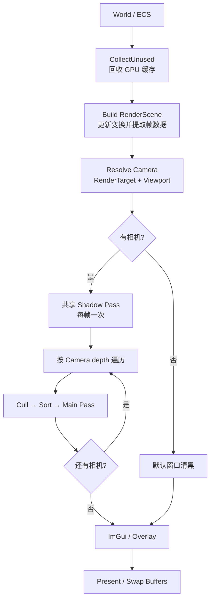
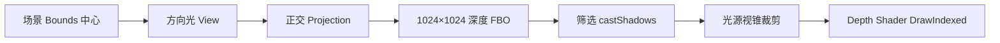
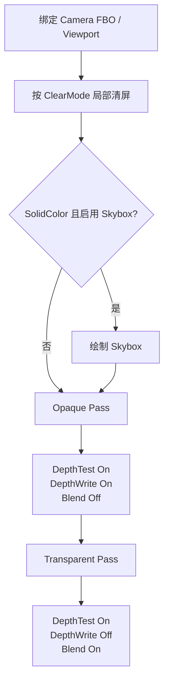

# Orbeden 渲染管线概览

Orbeden 当前使用单线程、立即提交式的 OpenGL Forward Renderer。每帧先从 `World` 提取渲染快照，再为各相机执行裁剪、排序和绘制。

## 核心模块

| 模块 | 职责 |
| --- | --- |
| `RenderSystem` | 初始化、帧调度、多相机、Viewport、RenderTarget、Overlay |
| `SpaceCache` | 按脏节点更新实体世界变换 |
| `RenderSceneBuilder` | 从 World 提取 Camera、Light、RenderItem |
| `SceneCuller` | Layer Mask 与视锥裁剪 |
| `RenderItemSorter` | 不透明/透明队列排序 |
| `ForwardPipeline` | 阴影、天空盒、Forward Main Pass |
| `GpuResourceManager` | GPU 资源按需上传、缓存和释放 |
| `OpenGLRenderBackend` | OpenGL Pass、状态、Uniform 和 Draw 调用 |

## 单帧总流程

### 1. 构建帧场景

`RenderSceneBuilder` 每帧重建逻辑数据：

- `SpaceCache` 检测 position、rotation、scale、parent 变化，只递归更新脏子树。
- Camera 生成 View、Projection、ViewProjection 和视锥快照，并按 `depth` 升序排列。
- DirectionalLight 复制光照与阴影参数。
- StaticMeshRenderer 按 SubMesh 生成 `RenderItem`。
- Mesh 本地 AABB 按 Mesh revision 缓存，再转换为世界 AABB。

### 2. Viewport 与 RenderTarget

Camera 使用归一化 Viewport，默认 `(0, 0, 1, 1)`。RenderSystem 根据窗口或离屏目标尺寸换算为像素区域，并重新计算相机宽高比和视锥。

- `renderTargetId = 0`：绘制到窗口。
- 有效非零 ID：绘制到离屏 FBO。
- 无效 ID 或零尺寸 Viewport：跳过该相机。

普通 RenderTarget 由颜色纹理、深度纹理和 FBO 组成；创建、Resize、项目 Reload 和 Shutdown 都由 RenderSystem 统一管理。

### 3. 共享阴影 Pass

Forward Pipeline 选择第一个开启阴影的方向光，每帧生成一次共享阴影图：

阴影 Pass 只写深度，不创建颜色附件；生成的阴影图供所有相机共享。

### 4. 每相机裁剪与排序

裁剪规则：

1. `item.drawLayer & camera.drawLayerMask` 必须非零。
2. 世界 AABB 必须与相机视锥相交。
3. 可见集只保存 `itemIndex + cameraDistance`，不复制完整 RenderItem。

排序规则：

- Opaque：Material → Mesh → 近到远。
- Transparent：远到近。

### 5. Forward Main Pass

`ClearMode` 含义：

- `SolidColor`：清颜色和深度，并允许绘制天空盒。
- `DepthOnly`：只清深度，保留前一相机颜色。
- `None`：完全保留目标内容。

清屏使用 Scissor 限制在当前 Viewport，因此分屏相机不会互相清除画面。

绘制时，同一 Shader Program 的相机/灯光 Uniform 每个相机只设置一次；Material 未变化时不重复绑定材质参数和纹理。

## GPU 资源缓存

Mesh、Texture、Skybox、Shader、Material 在第一次使用时上传到 GPU。

缓存有效时直接返回；无缓存或版本变化时创建/刷新 GPU 对象。每帧开头的 `CollectUnused` 检查 CPU 对象是否仍存活，不再存活时删除 GPU 对象和缓存项。

Backend 还会缓存 Program、VAO、Texture Slot、Depth/Blend 状态和 Uniform Location，避免重复 OpenGL 调用。

## 当前边界

- 当前只有 OpenGL Backend。
- 实际只使用一个主方向光和一张共享阴影图。
- 阴影图固定为 `1024 × 1024`，尚未实现 CSM。
- 相机裁剪仍为线性扫描，没有 BVH 或 GPU Culling。
- 每个可见 SubMesh 对应一次 `DrawIndexed`，尚未实现 Instancing/Indirect Draw。
- RenderScene 在同一线程构建并立即消费。

## 主要源码

- 总调度：`OrbedenCore/Src/Rendering/RenderSystem.cpp`
- 场景提取：`OrbedenCore/Src/Rendering/RenderSceneBuilder.cpp`
- 阴影与主 Pass：`OrbedenCore/Src/Rendering/ForwardPipeline.cpp`
- GPU 缓存：`OrbedenCore/Src/Rendering/GpuResourceManager.cpp`
- OpenGL Backend：`OrbedenCore/Src/Rendering/Backend/OpenGLRenderBackend.cpp`
