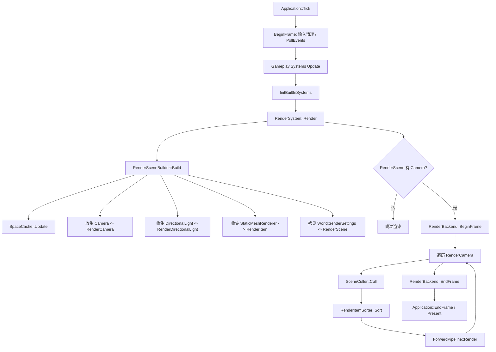
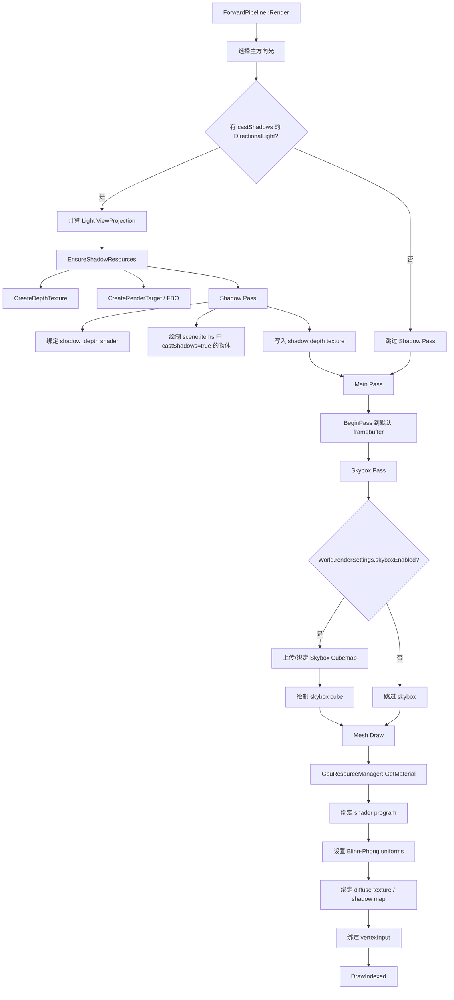
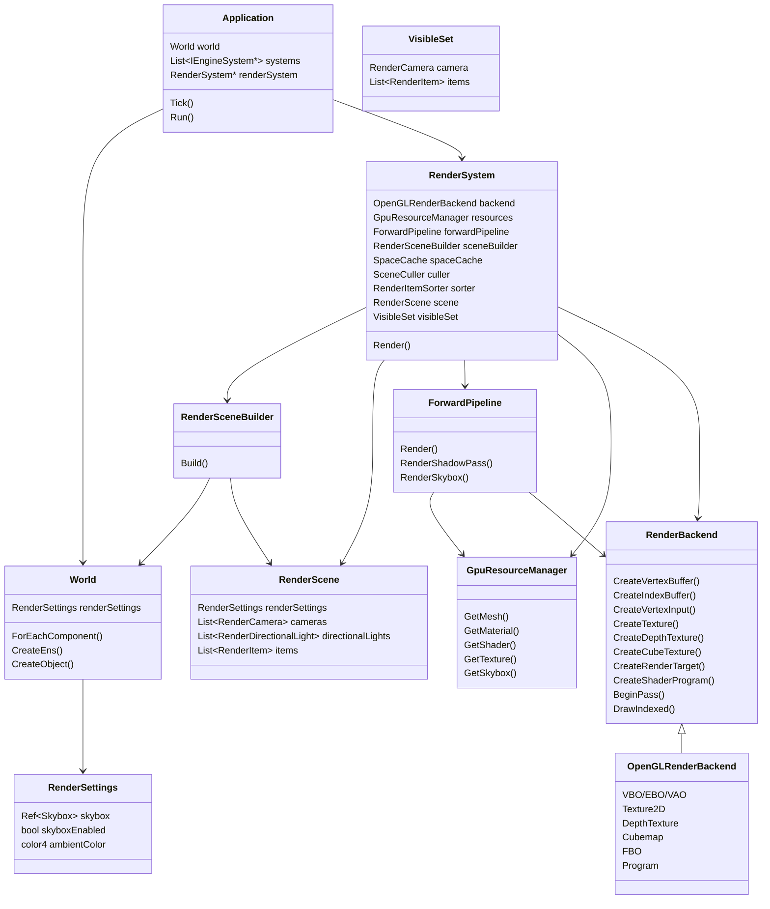
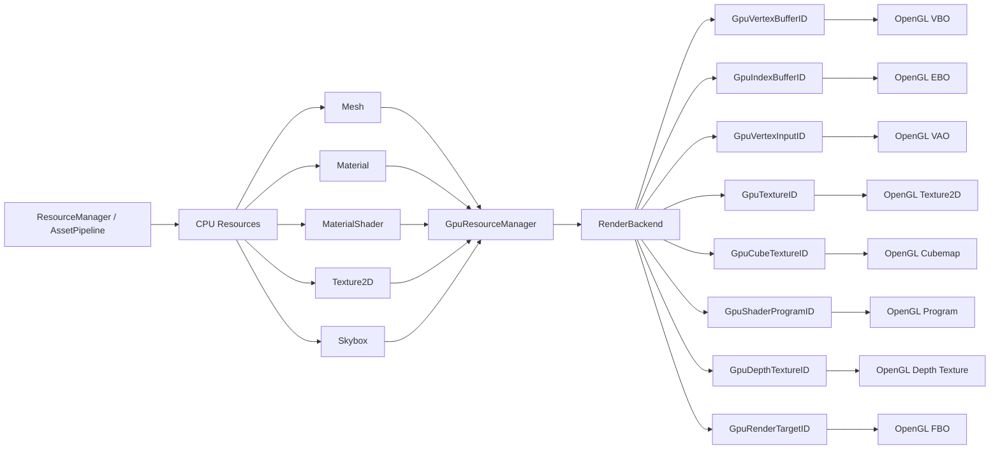

# Rendering Pipeline

本文档描述当前渲染系统的每帧流程、ForwardPipeline 内部 pass、核心类关系，以及 CPU 资源到 GPU 对象的上传关系。

## 每帧渲染流程

## ForwardPipeline Pass 流程

## 核心类关系

## 资源上传关系

## 一句话总结

`World` 保存组件和全局环境，`RenderSceneBuilder` 将其整理成每帧 `RenderScene`，`SceneCuller` 和 `RenderItemSorter` 得到当前相机的 `VisibleSet`，`ForwardPipeline` 执行 shadow / skybox / main pass，`GpuResourceManager` 缓存 CPU 资源到 GPU ID 的上传结果，最终由 `RenderBackend` 抽象落到具体图形 API。

